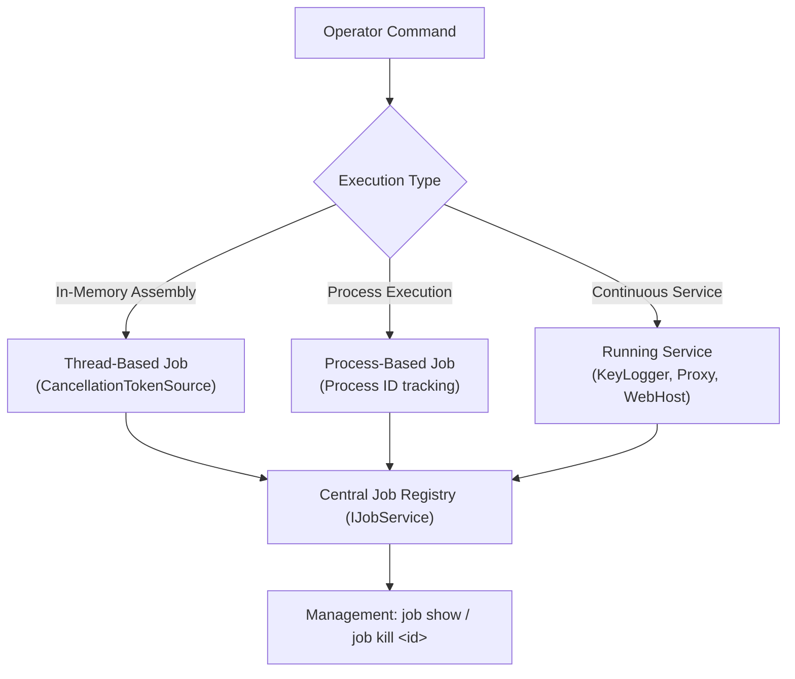

# Background Jobs & Services

## Purpose & Business Value

In realistic operations, many tasks cannot finish instantaneously:
- An in-memory .NET assembly (such as a port scanner, AD enumerator, or password sprayer) may take several minutes to run.
- Long-running commands like `ping -t`, custom binaries, or sacrificial processes need to run without freezing the Agent.
- Persistent monitoring services (such as keystroke loggers, web hosting services, and network proxies) must execute continuously in the background.

If an implant ran all tasks synchronously on its primary thread, the Agent would become unresponsive and unable to process subsequent commands or report status.

The **Background Jobs & Services** module provides asynchronous process management, allowing tasks to execute concurrently in isolated threads or child processes, report incremental progress, and be terminated safely on demand.

---

## Job Classification & Lifecycle

---

## Supported Job Categories

| Job Type | Trigger Command | Execution Model | Cancellation Method |
| :--- | :--- | :--- | :--- |
| **Inline Assembly** | `assembly` | Thread inside Agent process | CancellationToken cancellation + `Thread.Abort()` fallback |
| **Shell Process** | `shell` | Sacrificial `cmd.exe` process | Process termination via `taskkill /F /T /PID` |
| **Fork and Run** | `fork-and-run` | Sacrificial spawned process (e.g., `dllhost.exe`) | Process termination via Win32 process kill |
| **Key Logger** | `keylog start` | Continuous polling worker thread | Service stop + Token cancellation |

---

## Job Management Commands

### 1. `job show`
- **Purpose**: Displays a list of all active background operations.
- **Output Properties**:
  - **Job ID**: Integer identifier (e.g., `0`, `1`, `2`).
  - **Job Type**: Category (`InlineAssembly`, `Shell`, `ForkAndRun`, `KeyLog`).
  - **Name**: Description or binary name (e.g., `Seatbelt.exe`, `dir /s`).
  - **Process ID**: Associated host process ID (if applicable).
  - **Task ID**: Correlating C2 task identifier.

### 2. `job kill <id>`
- **Purpose**: Aborts an executing job immediately.
- **Behavior**:
  - If the job tracks an external process ID, the Agent executes a forced process tree termination (`taskkill /F /T /PID <pid>`), ensuring no orphan processes remain running.
  - If the job is backed by a managed thread, the Agent triggers the job's `CancellationTokenSource`.
  - Cleans up handles and removes the job from active memory.

---

## Composite & Chained Commands (`composite`)

The Agent includes a composite task runner (`CompositeCommand`) that accepts a sequence of subtasks and executes them sequentially within a single parent task envelope:
- **Use Case**: Multi-stage staging scripts (e.g., download a file, verify registry key, execute binary, clean up).
- **Error Handling**: If any intermediate subtask encounters an error, execution stops immediately to avoid unintended state changes.
- **Result Bundling**: Intermediate outputs are transmitted back to the operator as each subtask finishes.

---

## Business Rules & Constraints

1. **Automatic Completion Cleanup**: When a job terminates naturally (e.g., an assembly finishes execution), it is automatically deregistered from the job table without operator intervention.
2. **Periodic Output Flushing**: While a job is running, output accumulated in anonymous pipes or hijacked console streams is flushed back to the TeamServer at configurable intervals (`JobResultDelay`, default: 5 seconds).
3. **Graceful Agent Exit**: If the Agent receives an `exit` command, it signals cancellation to all active jobs before shutting down.

---

## Dependencies & Cross-References

- **Functional Dependencies**:
  - [Command Execution & Injection](./command-execution-and-injection.md): Assembly execution and shell commands register as jobs.
  - [Reconnaissance & Surveillance](./recon-and-surveillance.md): Keylogger registers as a background running service.
- **Technical Reference**:
  - [Services & Background Tasks Implementation](../../Technical/Agent/services-and-background-tasks.md)
  - [Command Dispatch & Execution](../../Technical/Agent/command-dispatch-and-execution.md)
