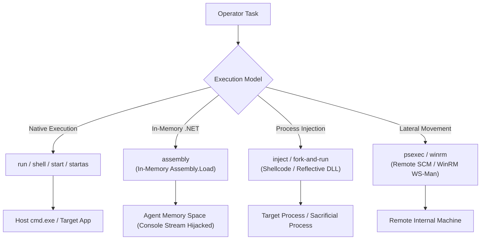
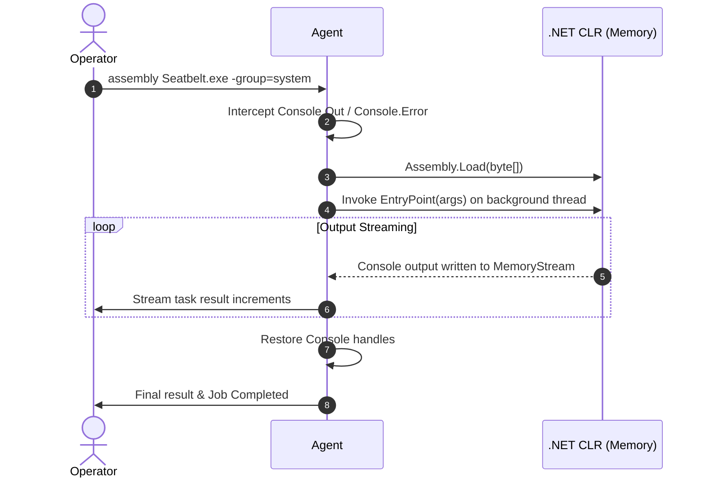

# Command Execution & Injection

## Purpose & Business Value

Executing operational actions on compromised machines is the central purpose of an implant. However, modern endpoint security solutions (EDR, Antivirus) actively monitor process creation, command-line telemetry, and suspicious binaries written to disk.

The **Command Execution & Injection** capability provides operators with multiple execution strategies tailored to varying levels of detection risk:
- **Direct System Execution**: Running native utilities when transparency is acceptable.
- **In-Memory .NET Assembly Execution**: Executing arbitrary post-exploitation tools (e.g., Seatbelt, SharpHound, Rubeus) directly in memory without writing files to disk.
- **Remote Process Injection & Fork-and-Run**: Executing raw shellcode or reflective DLLs in sacrificial or existing target processes to protect the core Agent process.
- **Lateral Execution**: Spawning tasks remotely across network boundaries using Windows Services (PsExec) or Windows Remote Management (WinRM).

---

## Execution Modes & Capabilities

---

## Detailed Command Matrix

| Command | Category | Description | Disk Footprint | Output Handling |
| :--- | :--- | :--- | :--- | :--- |
| `run <cmd>` | Native | Spawns a process directly via native Win32 API. | Zero (binary must exist on host) | Synchronously read via anonymous pipe. |
| `shell <cmd>` | Native | Spawns `cmd.exe /c <cmd>`. | Spawns standard `cmd.exe` | Captured via background job and streamed. |
| `start <cmd>` | Native | Starts a background process without waiting for output. | Spawns specified binary | Fire-and-forget (no output). |
| `startas <cmd>` | Native | Starts a process under alternative user credentials. | Spawns specified binary | Optional pipe redirection. |
| `assembly <bin>` | In-Memory | Loads and executes a .NET binary in-memory. | **Zero** (Assembly loaded from byte array) | Console.Out/Error hijacked and streamed back. |
| `inject <pid>` | Injection | Injects shellcode/reflective DLL into an existing process. | **Zero** | Executes in remote process. |
| `fork-and-run` | Injection | Spawns a sacrificial process (e.g., `dllhost.exe`), injects shellcode, and captures output. | **Zero** | Intercepts output from sacrificial process pipe. |
| `psexec` | Lateral | Creates and starts a Windows Service on a remote host. | Service binary copied to remote share | Starts service demand-load, then removes it. |
| `winrm` | Lateral | Executes PowerShell script blocks over WS-Management. | **Zero** | PowerShell results formatted and returned. |

---

## Main Workflows

### 1. In-Memory Assembly Execution (`assembly`)
1. Operator uploads a compiled .NET binary (e.g., triage tool or custom capability) through the TeamServer.
2. The Agent receives the binary payload as an in-memory byte array along with execution arguments.
3. The Agent temporarily redirects `Console.Out` and `Console.Error` to an internal memory buffer.
4. The binary is loaded into the current AppDomain via `System.Reflection.Assembly.Load`.
5. The entry point is invoked on a separate worker thread.
6. A background timer captures and periodically transmits console output back to the TeamServer without blocking the Agent.
7. Upon completion, standard console handles are restored and the job is marked complete.

### 2. Fork-and-Run Pattern (`fork-and-run`)
1. The operator issues `fork-and-run` with raw shellcode.
2. The Agent reads its configured sacrificial application path (default: `C:\Windows\System32\dllhost.exe`).
3. The Agent creates the target process in a suspended state (`CreateSuspended = true`, `CreateNoWindow = true`) with anonymous pipe redirection.
4. Using low-level process injection (via DInvoke or P/Invoke), the Agent allocates memory, writes the shellcode, and triggers execution (via `CreateRemoteThread` or APC queuing).
5. The Agent reads execution output from the pipe until process exit or timeout.
6. If the injected code crashes or is terminated by EDR, the core Agent process remains unaffected.

---

## Business Rules, Constraints & Edge Cases

1. **Active Impersonation**: If an operator has previously impersonated another user via `steal-token` or `make-token`, native commands (`run`, `shell`, `startas`, `fork-and-run`) automatically execute within the security context of that impersonated token.
2. **Crash Isolation**: In-memory assemblies run within the Agent's existing .NET CLR process. Unhandled exceptions within poorly written third-party assemblies can terminate the Agent. For untrusted or unstable payloads, `fork-and-run` is recommended for process-level fault isolation.
3. **Reflective DLLs**: When injecting DLL payloads with `inject`, the Agent automatically locates exported entry points (such as `ReflectiveDllMain`) by parsing PE headers in memory, calculating the raw file offset without touching disk.

---

## Dependencies & Cross-References

- **Functional Dependencies**:
  - [Token Manipulation & Privilege](./token-manipulation-and-privilege.md): Dictates the credentials and security token applied to spawned processes.
  - [Background Jobs & Services](./background-jobs-and-services.md): Long-running assemblies and commands register as trackable, cancellable jobs.
- **Technical Reference**:
  - [Command Dispatch & Execution Implementation](../../Technical/Agent/command-dispatch-and-execution.md)
  - [WinAPI & Native Subsystem](../../Technical/Agent/winapi-and-native-subsystem.md)
