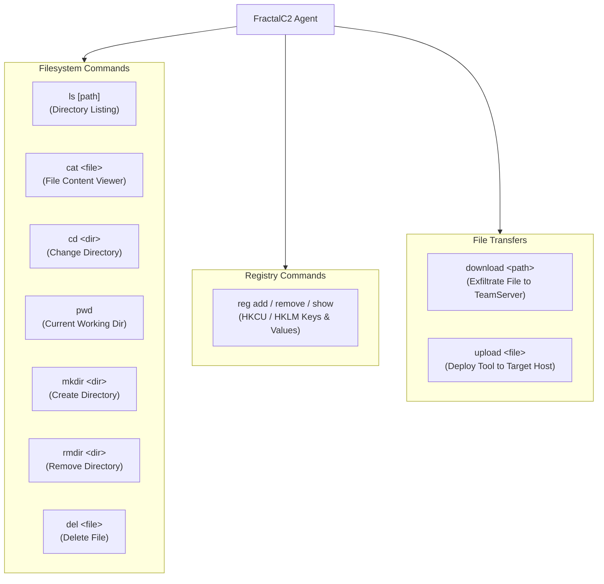
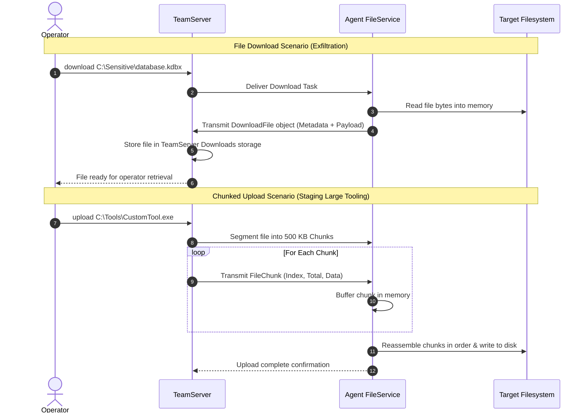

# File Management & Transfer

## Purpose & Business Value

Exfiltrating intellectual property, downloading configuration files, inspecting log files, staging tooling binaries, and manipulating local system configurations are standard red team activities.

The **File Management & Transfer** module provides comprehensive remote filesystem and registry manipulation capabilities, alongside a high-performance, segmented file transfer pipeline designed for reliability across intermittent or bandwidth-constrained network links.

---

## File System & Registry Capabilities

---

## Command Reference

| Command | Syntax | Description |
| :--- | :--- | :--- |
| `ls` | `ls [path]` | Lists all files and subdirectories with sizes and file/folder flags. If no path is given, lists the current working directory. |
| `pwd` | `pwd` | Displays the current process working directory path. |
| `cd` | `cd <path>` | Changes the active working directory of the Agent. |
| `cat` | `cat <path>` | Reads and displays the text content of a local file. |
| `mkdir` | `mkdir <path>` | Creates a new directory on the target filesystem. |
| `rmdir` | `rmdir <path>` | Removes an existing directory. |
| `del` | `del <path>` | Deletes a specified file from disk. |
| `reg show` | `reg show -path <key> -key <val>` | Reads a registry value from `HKCU` or `HKLM`. |
| `reg add` | `reg add -path <key> -key <val> -value <str>` | Creates or sets a registry string value. |
| `reg remove` | `reg remove -path <key> -key <val>` | Deletes a registry subkey tree. |
| `download` | `download <path>` | Downloads a file from target machine to TeamServer. |
| `upload` | `upload <name> <file>` | Writes binary or text file to the target filesystem. |

---

## File Transfer Architecture

Large files transferred across high-latency C2 channels (such as sleeping HTTP beacons or multi-hop Named Pipe chains) face risks of timeouts or network drops. The Agent implements a chunked file service:

---

## Business Rules & Constraints

1. **Chunk Sizing**: The chunking pipeline partitions files into standard `500,000-byte` (~500 KB) segments to ensure steady throughput without exceeding HTTP request size ceilings.
2. **Registry Roots**: The `reg` command family explicitly supports both `HKCU\` (`HKEY_CURRENT_USER`) and `HKLM\` (`HKEY_LOCAL_MACHINE`). Accessing `HKLM` requires elevated administrator privileges.
3. **Impersonation Scope**: File and directory operations execute within the active security context (either the startup user or the currently impersonated token).

---

## Dependencies & Cross-References

- **Functional Dependencies**:
  - [Lifecycle & Connectivity](./lifecycle-and-connectivity.md): Transferred files travel through the egress network channel.
  - [Token Manipulation & Privilege](./token-manipulation-and-privilege.md): Dictates NTFS file permissions accessible to the Agent.
- **Technical Reference**:
  - [Services & Background Tasks Implementation](../../Technical/Agent/services-and-background-tasks.md)
