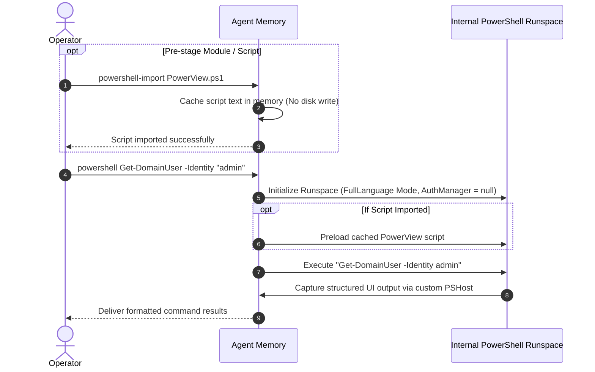

# In-Memory PowerShell Automation

## Purpose & Business Value

PowerShell is an indispensable management tool on Windows systems, offering comprehensive access to Active Directory, WMI, CIM, and system internals. However, spawning `powershell.exe` generates distinct process creation events, parent-child process anomalies (e.g., suspicious process spawning PowerShell), and exposes scripts to Antimalware Scan Interface (AMSI) detection and Constrained Language Mode (CLM) restrictions.

The **In-Memory PowerShell** capability allows the Agent to execute complex PowerShell scripts and cmdlets directly inside the Agent's own process by hosting an unmanaged PowerShell Runspace. This bypasses `powershell.exe` process execution monitoring and circumvents traditional system-wide AppLocker / Constrained Language Mode limits.

---

## Actors & Triggers

| Actor | Action / Trigger |
| :--- | :--- |
| **Operator** | Issues `powershell-import <script-path>` to stage a script into the Agent's session. |
| **Operator** | Issues `powershell <command-or-expression>` to execute cmdlets or functions. |

---

## Capabilities & Feature Workflow

---

## Inputs & Outputs

### Inputs
- **`powershell-import`**: PowerShell script content (e.g., BloodHound collectors, PowerView, PowerUp, custom reconnaissance scripts).
- **`powershell`**: PowerShell expression, pipeline, or function call.

### Outputs
- Text-formatted console output containing cmdlet results, error messages, and verbose output captured directly from the internal runspace interface.

---

## Key Benefits & Operating Rules

1. **No `powershell.exe` Process**: No child process is created. The execution occurs purely within the Agent's existing hosting thread, defeating rules looking for `cmd.exe -> powershell.exe` or `rundll32.exe -> powershell.exe`.
2. **Full Language Mode Enforcement**: When initializing the runspace state, the Agent explicitly forces `PSLanguageMode.FullLanguage` and nulls out the `AuthorizationManager`. This neutralizes environment constraints that otherwise restrict PowerShell scripts on locked-down systems.
3. **Session Persistence**: Scripts loaded via `powershell-import` remain active in memory for the life of the Agent session, allowing operators to import large modules once and execute functions repeatedly.
4. **Interactive Prompt Prevention**: The custom runspace host automatically suppresses interactive credential or confirmation prompts to avoid blocking the unattended background session.

---

## Business Rules & Edge Cases

- **Memory Consumption**: Importing very large scripts (e.g., massive monolithic post-exploitation frameworks) increases the Agent's memory footprint. Once imported, scripts reside in RAM until the Agent restarts.
- **Error Capture**: Errors, warnings, and verbose streams are merged into the standard output buffer so operators receive complete diagnostic feedback in their command console.

---

## Dependencies & Cross-References

- **Functional Dependencies**:
  - [Command Execution & Injection](./command-execution-and-injection.md): Serves as the specialized execution branch for PowerShell scripting tasks.
- **Technical Reference**:
  - [PowerShell Engine Implementation](../../Technical/Agent/powershell-engine.md)
