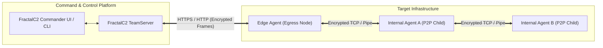

# FractalC2 Agent — Functional Documentation

## Overview

The **FractalC2 Agent** is a lightweight, remote management implant designed to operate on target Windows endpoints within authorized red teaming, penetration testing, and adversary simulation exercises. As the frontline component of the **FractalC2** platform, the Agent establishes a secure, persistent command-and-control channel between managed target systems and central operators.

The primary mission of the Agent is to provide operators with full administrative oversight, intelligence gathering capabilities, remote task execution, and internal network traversal—all while minimizing operational friction and footprint on the host system.

---

## Core Capabilities & Functional Areas

The functional capabilities of the Agent are organized into the following specialized modules:

| Functional Area | Description | Documentation | Technical Reference |
| :--- | :--- | :--- | :--- |
| **Lifecycle & Connectivity** | Agent identity generation, system fingerprinting, check-in, heartbeat timing with jitter, and controlled shutdown. | [Read Feature Guide](./lifecycle-and-connectivity.md) | [Technical Implementation](../../Technical/Agent/agent-core-and-lifecycle.md) |
| **Pivoting & Mesh Routing** | Peer-to-peer daisy-chaining over TCP and Named Pipes to reach egress-restricted network zones. | [Read Feature Guide](./pivoting-and-mesh-routing.md) | [Communication Subsystem](../../Technical/Agent/communication-subsystem.md) |
| **Command Execution & Injection** | Native command execution, in-memory .NET assembly execution, process injection, and lateral execution (PsExec, WinRM). | [Read Feature Guide](./command-execution-and-injection.md) | [Command Dispatch](../../Technical/Agent/command-dispatch-and-execution.md) |
| **In-Memory PowerShell** | Unmanaged PowerShell automation executed entirely in-memory without invoking `powershell.exe`. | [Read Feature Guide](./in-memory-powershell.md) | [PowerShell Engine](../../Technical/Agent/powershell-engine.md) |
| **Token Manipulation & Privilege** | Impersonation, token theft from existing processes, and synthetic token creation for credential pivoting. | [Read Feature Guide](./token-manipulation-and-privilege.md) | [WinAPI Subsystem](../../Technical/Agent/winapi-and-native-subsystem.md) |
| **Network Tunneling & Pivoting** | On-demand SOCKS4 proxy routing and reverse port forwarding to bridge operator tools into target networks. | [Read Feature Guide](./network-tunneling-and-pivoting.md) | [Pivoting & Tunneling](../../Technical/Agent/pivoting-and-tunneling.md) |
| **Reconnaissance & Surveillance** | Process discovery, real-time multi-monitor desktop capture, user idle detection, and background keystroke logging. | [Read Feature Guide](./recon-and-surveillance.md) | [Services & Tasks](../../Technical/Agent/services-and-background-tasks.md) |
| **File Management & Transfer** | File browsing, directory manipulation, registry key querying/updating, and reliable bidirectional file transfers. | [Read Feature Guide](./file-management-and-transfer.md) | [Services & Tasks](../../Technical/Agent/services-and-background-tasks.md) |
| **Background Jobs & Services** | Asynchronous execution of long-running operations, background jobs lifecycle, and task cancellation. | [Read Feature Guide](./background-jobs-and-services.md) | [Services & Tasks](../../Technical/Agent/services-and-background-tasks.md) |

---

## Target Audience & Operational Context

- **Product Owners & Test Directors**: Understand operational scope, feature coverage, safety boundaries, and reporting data.
- **Red Team Operators & Analysts**: Learn command triggers, prerequisites, telemetry outputs, and expected behavior during engagements.
- **Blue Teamers & Threat Analysts**: Gain insights into implant behaviors, persistence mechanisms, and communication artifacts to build detection rules.

For lower-level source code architecture, class design, data structures, and native Win32 API interactions, see the [Technical Documentation Index](../../Technical/Agent/index.md).
