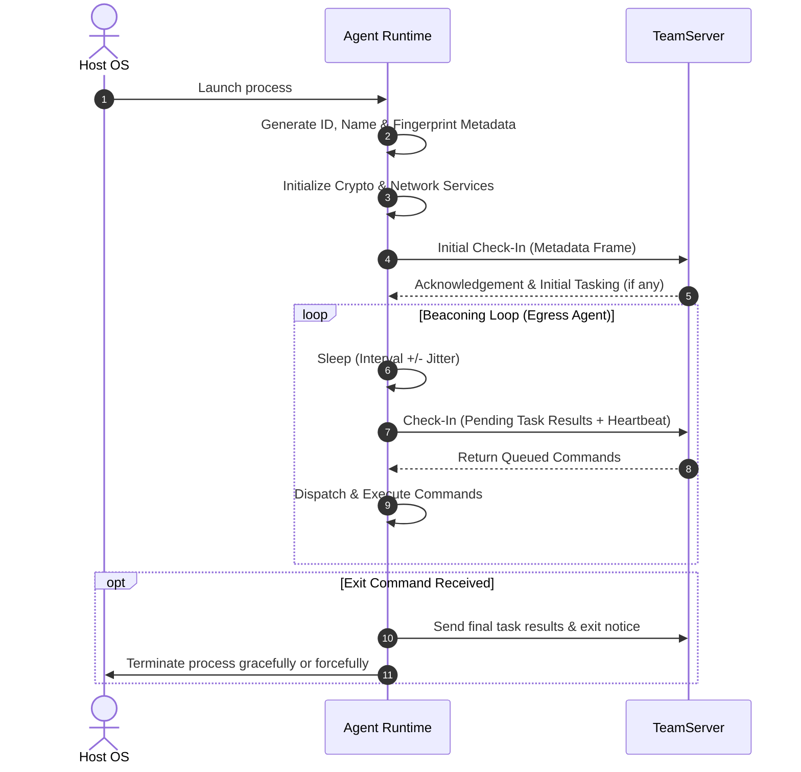

# Agent Lifecycle & Connectivity

## Purpose & Business Value

In simulated adversary engagements and remote endpoint management, an implant must securely report its existence, identify its environment, remain resilient against network disruptions, and follow strict operational timing rules. 

The **Lifecycle & Connectivity** subsystem handles the initialization, identity establishment, periodic check-in (beaconing), sleep cycle pacing, and graceful departure of the Agent. By providing configurable sleep intervals with randomized jitter, the Agent mimics natural network activity and avoids predictable polling patterns.

---

## Actors & Triggers

| Actor | Action / Trigger |
| :--- | :--- |
| **Operating System / Launcher** | Starts the Agent process (executable, injected thread, service, or script). |
| **Agent Internal Loop** | Periodically wakes up, flushes pending results, and queries the TeamServer for new tasks. |
| **TeamServer Operator** | Issues `sleep` or `exit` commands to change timing parameters or terminate the session. |

---

## Inputs & Outputs

### Inputs
- **Connection URL**: The designated endpoint URI (e.g., `http://10.10.10.5:8080`, `https://c2.domain.com:443`).
- **Cryptographic Key**: Base64-encoded pre-shared encryption key used to encrypt and authenticate all transmissions.
- **Operator Commands**:
  - `sleep <delay> [jitter]`: Updates beacon interval in seconds and jitter percentage (0–99%).
  - `exit [force]`: Commands the Agent to stop communication and exit.

### Outputs
- **Agent Identity & Fingerprint**:
  - **Unique ID**: 22-character URL-safe identifier (e.g., `s_4Gz9V_1kW...`).
  - **Human-Readable Name**: Random animal/quality pairing (e.g., `Brave-Falcon`, `Creative-Lion`).
  - **Environment Metadata**: Hostname, active username, process ID, process name, process architecture (`x86` vs `x64`), operating system type, and integrity level (`Medium`, `High`, `System`).
- **Heartbeat Status**: Confirmation of active connection and synchronization with the TeamServer.

---

## Workflow & Lifecycle Steps

### Step-by-Step Narrative
1. **Startup & Configuration**: The Agent parses its connection endpoint and symmetric encryption key (either embedded within compiled resources or provided via arguments in debug mode).
2. **Environmental Fingerprinting**: The Agent inspects its host environment:
   - Queries DNS for local IP addresses and machine hostname.
   - Reads the executing process ID and process name.
   - Determines Windows integrity level by checking identity tokens (`Medium` for standard user, `High` for elevated administrator, `System` for NT AUTHORITY\SYSTEM).
   - Generates a human-friendly moniker (e.g., `Kind-Dolphin`) and a short UUID.
3. **Session Registration (Initial Check-In)**: The Agent builds a `CheckIn` network frame containing serialized metadata, encrypts it, and posts it to the TeamServer.
4. **Scheduled Beaconing**: For HTTP/HTTPS egress connections, the Agent enters an asynchronous loop:
   - Calculates wait duration: `SleepTime = Interval ± (Interval * Jitter / 100)`.
   - Sends pending responses and fetches pending tasks from the TeamServer.
5. **Termination**: When an operator issues the `exit` command:
   - Standard exit flushes all pending task results back to the server before stopping threads.
   - Force exit immediately aborts the runtime via `Environment.Exit(0)`.

---

## Business Rules, Constraints & Edge Cases

1. **Jitter Bounds**: Jitter percentage must strictly be between `0%` and `99%`. Setting jitter to 0 results in fixed periodic intervals; setting jitter higher provides randomized distribution to blend with normal traffic.
2. **Pivoting Agents Do Not Sleep**: When an Agent operates as a peer-to-peer child over TCP or Named Pipes, sleep delays are disabled (`SleepInterval = 0`). Peer-to-peer links require continuous duplex message routing.
3. **Failed Check-In Recovery**: If an HTTP request fails due to temporary network failure or server reset, the Agent retains its outgoing messages in memory queues and retries during the subsequent beacon. Upon re-establishing communication, the Agent automatically retransmits its metadata and active peer relays.
4. **Self-Contained Footprint**: No configuration files are written to disk; configuration lives entirely in memory.

---

## Dependencies & Cross-References

- **Functional Dependencies**:
  - [Command Execution & Injection](./command-execution-and-injection.md): Tasks received during check-ins are forwarded to the command dispatcher.
  - [Pivoting & Mesh Routing](./pivoting-and-mesh-routing.md): P2P agents rely on the egress agent's check-in loop to relay their messages to the TeamServer.
- **Technical Reference**:
  - [Agent Core & Lifecycle Implementation](../../Technical/Agent/agent-core-and-lifecycle.md)
  - [Communication Subsystem](../../Technical/Agent/communication-subsystem.md)
