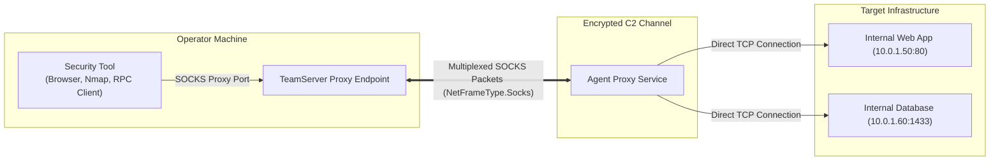

# Network Tunneling & Pivoting

## Purpose & Business Value

Gaining a foothold on an internal machine is only the first phase of an engagement. The ultimate objective often lies within isolated internal subnets, database servers, web portals, or administrative management consoles inaccessible from the public internet.

The **Network Tunneling & Pivoting** module transforms the Agent into a dynamic, multiplexed network bridge:
- **SOCKS4 Proxy Pivoting**: Allows operators to route arbitrary external security tools (e.g., Nmap, Metasploit, web browsers, crackmapexec) through the Agent into internal target networks.
- **Reverse Port Forwarding (`rportfwd`)**: Binds an internal port on the target machine and forwards incoming connections back through the C2 channel to an operator-controlled server or listener.

---

## Architecture & Tunneling Modes

---

## Feature Capabilities

### 1. SOCKS4 Dynamic Proxying
- **Trigger**: Initiated by operator traffic entering the TeamServer's SOCKS proxy port.
- **Workflow**:
  1. Operator launches a tool configured to use the TeamServer SOCKS proxy (e.g., `proxychains nmap -sT 10.0.1.50`).
  2. The TeamServer serializes the connection request into a `Socks4ConnectRequest` frame and delivers it to the Agent.
  3. The Agent resolves internal hostnames/IPs and establishes a local TCP connection to the target host.
  4. The Agent acknowledges the connection, then continuously streams data bidirectionally between the internal socket and the C2 frame pipeline.
  5. When either party disconnects, the Agent cleanly tears down the TCP socket.

### 2. Reverse Port Forwarding (`rportfwd`)
- **Trigger**: Issued via `rportfwd start <port> <dest_host> <dest_port>`.
- **Workflow**:
  1. The Agent starts an asynchronous `TcpListener` on the target machine binding to `<port>`.
  2. Whenever a local or remote internal client connects to that port, the Agent accepts the socket.
  3. A `ReversePortForwardPacket` of type `CONNECT` is sent through the C2 channel to the TeamServer.
  4. Inbound and outbound traffic between the connected socket and the TeamServer is multiplexed over the C2 channel.
  5. Can be inspected or stopped anytime with `rportfwd show` or `rportfwd stop <port>`.

---

## Inputs & Outputs

### SOCKS Proxy
- **Inputs**: Automated stream of `Socks4Packet` frames (Connect, Data, Disconnect) from TeamServer.
- **Outputs**: Bidirectional raw socket payload forwarded into the internal target network.

### Reverse Port Forwarding
- **Inputs**:
  - `port`: Local port number to bind on the target machine (e.g., `8080`).
  - `dest_host`: Remote address on the operator/team server side to forward to.
  - `dest_port`: Remote port on the operator side.
- **Outputs**:
  - Structured list of running listeners via `rportfwd show` (local port, destination host, destination port).

---

## Business Rules & Constraints

1. **Multiplexing over Single Beacon**: Multiple concurrent TCP sessions (hundreds of parallel SOCKS connections) are multiplexed over the single encrypted C2 beacon without interfering with command tasks.
2. **Asynchronous Socket Pumps**: SOCKS and reverse port forwarding sockets use non-blocking asynchronous socket callbacks to guarantee that slow or stalled network connections do not freeze the main Agent loop.
3. **No External Port Forwarding Required on Perimeter**: Because all traffic is tunneled through the outbound beacon, no inbound ports need to be opened on perimeter firewalls.

---

## Dependencies & Cross-References

- **Functional Dependencies**:
  - [Lifecycle & Connectivity](./lifecycle-and-connectivity.md): Tunnels rely on active framing channels.
  - [Pivoting & Mesh Routing](./pivoting-and-mesh-routing.md): Tunnels can traverse daisy-chained child agents to reach deep subnets.
- **Technical Reference**:
  - [Pivoting & Tunneling Implementation](../../Technical/Agent/pivoting-and-tunneling.md)
  - [Network Framing & Cryptography](../../Technical/Agent/network-framing-and-crypto.md)
