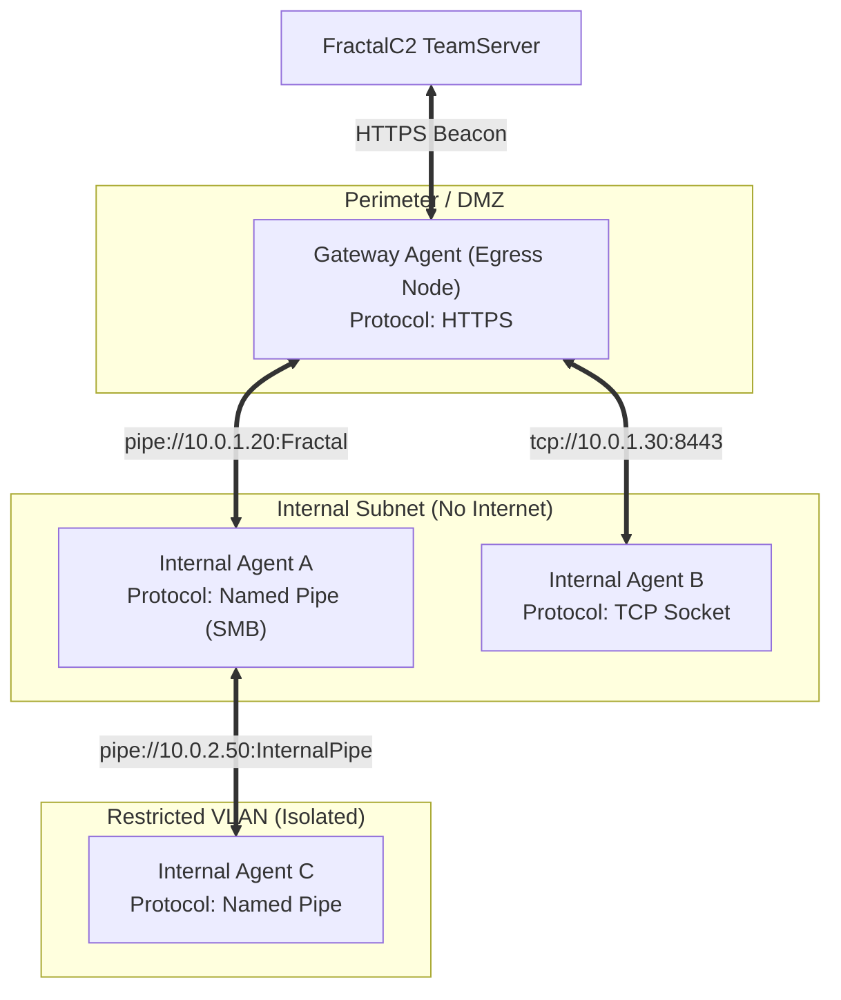
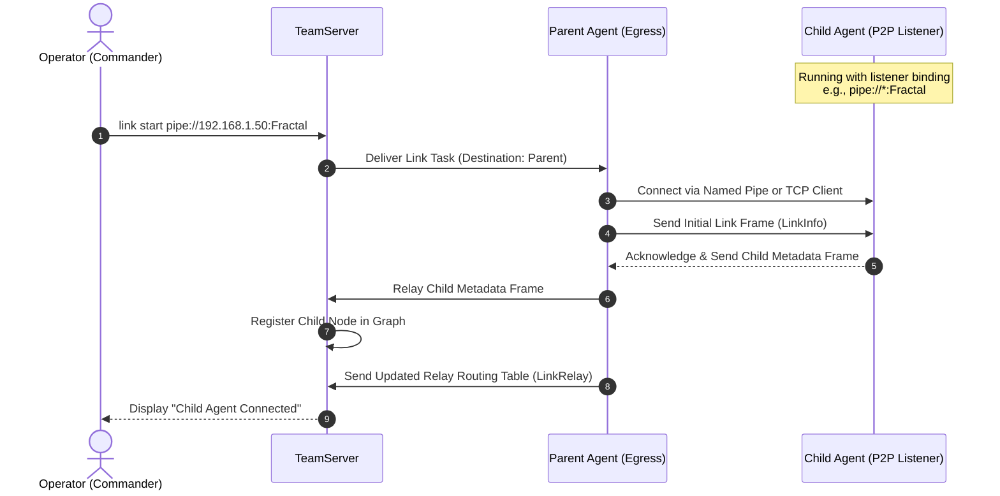

# Pivoting & Mesh Routing

## Purpose & Business Value

In corporate enterprise environments, critical servers (e.g., domain controllers, database clusters, internal workstations) often reside in segmented subnets without direct access to the Internet. Standard egress beacons cannot reach the external TeamServer from these restricted enclaves.

The **Pivoting & Mesh Routing** capability allows any compromised machine with egress access (the "Gateway" or "Parent" Agent) to establish encrypted point-to-point (P2P) communication links with isolated internal systems ("Child" Agents). By daisy-chaining multiple Agents, operators can penetrate deep into multi-tiered network architectures through a single outward-facing channel.

---

## Supported Transport Protocols

1. **Named Pipes (`pipe://`)**:
   - Leverages Windows Server Message Block (SMB) Named Pipes.
   - Operates across standard SMB port 445 or locally on a single machine.
   - Authenticated and routed natively by Windows, bypassing host-based firewall port blocks.
2. **Raw TCP Sockets (`tcp://`)**:
   - Establishes direct TCP socket connections across arbitrary internal ports.
   - Useful for high-throughput traffic and environments where SMB traffic is inspected or restricted.

---

## Actors & Triggers

| Actor | Action / Trigger |
| :--- | :--- |
| **Operator** | Issues `link start <binding>` to connect a parent agent to an awaiting child agent. |
| **Operator** | Issues `link stop <binding>` to disconnect a peer link. |
| **Operator** | Issues `link show` to view active direct and indirect child connections. |
| **Child Agent** | Starts up in Listener mode, waiting for an inbound Named Pipe or TCP connection. |

---

## Inputs & Outputs

### Inputs
- **Binding String**: URI specifying protocol, target address/host, and identifier:
  - `pipe://192.168.1.15:MyPipe` (Named Pipe client connection to remote host)
  - `tcp://192.168.1.25:9090` (Direct TCP connection to target port)
  - `pipe://*:MyPipe` / `tcp://*:9090` (Listener mode configured on child agent)

### Outputs
- **Link Status**: Confirmation that the peer-to-peer session is established or severed.
- **Topology Telemetry**: The TeamServer automatically registers new child nodes, updates routing tables, and exposes child agents in the management console.

---

## Main Workflow: Linking to a Child Agent

### Steps:
1. **Child Launch**: The operator deploys a payload on the target internal machine configured with a listener endpoint (e.g., `pipe://*:FractalPipe`).
2. **Link Execution**: From the parent agent session, the operator issues `link start pipe://<internal-ip>:FractalPipe`.
3. **P2P Handshake**: The parent agent initiates an asynchronous pipe or TCP client connection. Once connected:
   - The parent transmits a `Link` frame notifying the child of its assigned relationship.
   - The child responds with its own identity metadata.
4. **Relay Registration**: The parent updates its internal routing table mapping the child's Agent ID to the active communication module, and notifies the TeamServer of all reachable relays.
5. **Transparent Message Routing**: All subsequent commands destined for the child agent are wrapped by the TeamServer, received by the parent, and relayed directly down the P2P pipe. Child responses travel back up the chain through the parent's egress beacon.

---

## Business Rules & Edge Cases

1. **Nested Relays (Multi-hop)**: Links can be chained indefinitely (Parent -> Child 1 -> Child 2 -> Child 3). When Child 2 connects to Child 1, Child 1 broadcasts an updated `LinkRelay` list upstream to Parent, which passes it to the TeamServer.
2. **Orphan Handling & Link Disconnection**:
   - If a peer connection breaks (e.g., target reboot or network drop), the parent detects the disconnection, removes the child and all transitive downstream relays from its routing table, and emits an `Unlink` frame to the TeamServer.
   - The TeamServer marks downstream agents as disconnected or lost.
3. **No External Traces for Children**: Child agents running in P2P mode do not make any outbound DNS queries or direct Internet connections. Their network footprint is entirely contained within legitimate internal host-to-host channels.

---

## Dependencies & Cross-References

- **Functional Dependencies**:
  - [Lifecycle & Connectivity](./lifecycle-and-connectivity.md): The parent Agent's check-in loop acts as the carrier for all child traffic.
  - [Command Execution & Injection](./command-execution-and-injection.md): Lateral movement tools like PsExec or WinRM are typically used to launch the child implant.
- **Technical Reference**:
  - [Communication Subsystem](../../Technical/Agent/communication-subsystem.md)
  - [Network Framing & Cryptography](../../Technical/Agent/network-framing-and-crypto.md)
