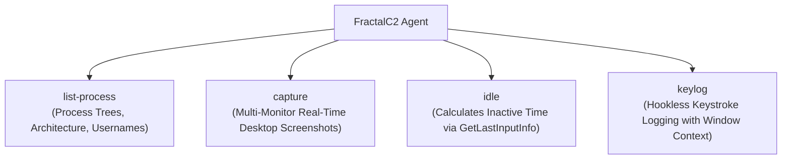

# Reconnaissance & Surveillance

## Purpose & Business Value

Situational awareness is critical to the success and safety of security assessments. Operators need to know who is actively using the system, what security tools and monitoring agents are installed, whether a human defender or user is currently sitting at the keyboard, and what data is visible on screen.

The **Reconnaissance & Surveillance** capabilities equip the Agent with passive and active intelligence gathering tools:
- **Process Enumeration (`list-process`)**: Detailed process discovery with parent-child relationships, architecture, session IDs, and owner accounts.
- **Desktop Screen Capture (`capture`)**: Multi-monitor screenshots captured and compressed on the fly.
- **User Activity Detection (`idle`)**: Quantifies user inactivity to identify safe maintenance windows when users are away.
- **Keystroke Logging (`keylog`)**: Background keylogger tracking active foreground windows and typed text.

---

## Capabilities Overview

---

## Detailed Feature Matrix

### 1. Process Enumeration (`list-process [filter]`)
- **Purpose**: Maps all running software on the host. Enables identification of EDR/AV processes, administrative tools, and potential injection candidates.
- **Capabilities**:
  - Automatically activates `SeDebugPrivilege` to inspect system-level processes.
  - Queries low-level NT system information (`NtQuerySystemInformation` / `SystemProcessInformation`).
  - Resolves process path, parent process ID (PPID), architecture (`x86` vs `x64`), and owner domain\username for every process.
  - Supports optional name filtering (e.g., `list-process edr`).

### 2. Multi-Monitor Screen Capture (`capture`)
- **Purpose**: Visual reconnaissance of open applications, email clients, chat windows, and confidential documents.
- **Capabilities**:
  - Iterates over all attached physical displays (`Screen.AllScreens`).
  - Captures full 32-bit ARGB raster images from the desktop graphics context.
  - Encodes images to PNG format in memory.
  - Returns captured files to the TeamServer tagged with display number and unique identifier.

### 3. User Idle Time Detection (`idle`)
- **Purpose**: Determines whether a human user is actively interacting with the keyboard or mouse.
- **Capabilities**:
  - Queries Windows user subsystem (`GetLastInputInfo`).
  - Calculates exact idle duration: `Duration = CurrentTime - LastInputTime`.
  - Output format: `Idle for HH:MM:SS`.
  - Used by operators to schedule high-risk actions (e.g., credential dumping, process injection) when the operator knows the user has stepped away.

### 4. Background Keystroke Logging (`keylog`)
- **Purpose**: Captures user credentials, search queries, and sensitive data typed into web browsers, login dialogs, or internal software.
- **Subcommands**:
  - `keylog start`: Launches keylogger background service.
  - `keylog show`: Displays keystrokes collected so far.
  - `keylog stop`: Halts logging service and returns complete capture buffer.
- **Key Features**:
  - **Hookless Architecture**: Uses periodic low-overhead polling (`GetAsyncKeyState`) rather than intrusive global Windows hooks (`SetWindowsHookEx`), minimizing heuristic detection risk.
  - **Active Window Context Tracking**: Detects when the user switches applications (`GetForegroundWindow`) and logs the active application name as section headers (e.g., `[--chrome--]`, `[--keepass--]`).

---

## Business Rules & Constraints

1. **Screen Resolution & Bandwidth**: Multi-monitor captures on high-resolution displays (4K) generate substantial image data (several megabytes). Screen captures are buffered and transferred as serialized file objects.
2. **Session Context for Screenshots**: Screen captures require the Agent to be running in an active interactive user desktop session (Session 1+). If running as a background service in Session 0, desktop screenshots return blank screens.
3. **French Keyboard Layout Support**: The keystroke decoding table in `KeyLogService` includes character mapping for standard AZERTY and extended symbols commonly used in European enterprise environments.

---

## Dependencies & Cross-References

- **Functional Dependencies**:
  - [Background Jobs & Services](./background-jobs-and-services.md): Keylogging runs as a managed continuous background service.
  - [Token Manipulation & Privilege](./token-manipulation-and-privilege.md): Process owner discovery in `list-process` guides token theft decisions.
- **Technical Reference**:
  - [Services & Background Tasks Implementation](../../Technical/Agent/services-and-background-tasks.md)
  - [WinAPI & Native Subsystem](../../Technical/Agent/winapi-and-native-subsystem.md)
