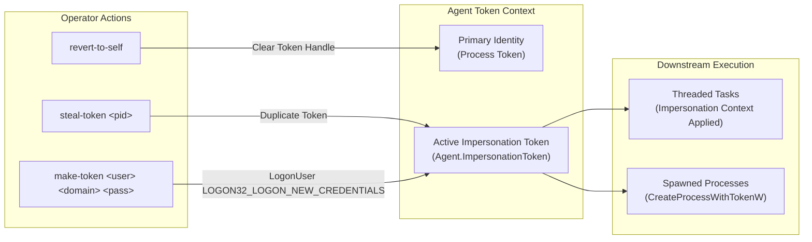

# Token Manipulation & Privilege Escalation

## Purpose & Business Value

In Windows environments, every process and thread operates within a security context defined by an **Access Token**. Tokens dictate what local files, registry keys, network shares, and domain resources a user can access. 

Rather than harvesting passwords or relying on persistent account modifications, red teams and security testers manipulate tokens dynamically:
- Stealing tokens from high-privilege processes (e.g., Domain Admin sessions, SYSTEM processes).
- Generating synthetic logon tokens with known credentials without logging onto the interactive desktop.
- Switching between different user contexts on the fly to access privileged resources, and reverting cleanly when finished.

The **Token Manipulation & Privilege** module gives operators surgical control over the Agent's identity tokens.

---

## Actors & Triggers

| Actor | Action / Trigger |
| :--- | :--- |
| **Operator** | Issues `steal-token <pid>` to duplicate a token from a target process. |
| **Operator** | Issues `make-token <domain> <user> <password>` to create a network-only credential token. |
| **Operator** | Issues `revert-to-self` to drop impersonation and return to the primary process identity. |
| **Operator** | Issues `whoami` to verify the current thread security context. |

---

## Capabilities & Commands

### Detailed Functional Descriptions

### 1. `steal-token <pid>`
- **Objective**: Hijack the identity of another user logged onto the same machine (e.g., a Domain Administrator managing a server).
- **Mechanism**:
  1. The Agent automatically enables `SeDebugPrivilege` if running with local administrator rights.
  2. Opens the target process with `PROCESS_QUERY_INFORMATION`.
  3. Extracts the primary or impersonation token via `OpenProcessToken`.
  4. Duplicates the token to create an impersonation token (`DuplicateTokenEx`).
  5. Stores the duplicated token handle as the Agent's active identity.
- **Outcome**: Subsequent commands, network requests, and spawned processes inherit this token.

### 2. `make-token <domain> <username> <password>`
- **Objective**: Access network shares or remote domain systems using known plaintext credentials without altering the local user session.
- **Mechanism**:
  - Invokes `LogonUser` with logon type `LOGON32_LOGON_NEW_CREDENTIALS` (Type 9).
  - Creates a token that acts as the local user locally, but presents the specified network credentials when connecting to external SMB shares, RPC endpoints, or Active Directory.
- **Outcome**: Enables lateral movement without leaving interactive logon footprints on the host.

### 3. `revert-to-self`
- **Objective**: Drop all active impersonation contexts and restore the Agent's original identity.
- **Mechanism**:
  - Closes the active token handle.
  - Resets `Agent.ImpersonationToken` to `IntPtr.Zero`.
- **Outcome**: Returns the Agent immediately to its startup security context (e.g., standard user or SYSTEM).

---

## Business Rules & Constraints

1. **Automatic Thread Propagation**: When an impersonation token is active, every newly spawned command thread automatically runs within an `identity.Impersonate()` scope.
2. **Process Spawning Integration**: When native commands (`run`, `shell`, `fork-and-run`) spawn new processes while a token is active, the Agent uses `CreateProcessWithTokenW` instead of standard process creation, ensuring the child process begins directly in the impersonated security context.
3. **Privilege Requirements**: `steal-token` against processes owned by other users requires administrative privileges (`High` or `System` integrity) and `SeDebugPrivilege`. Stealing a token from a process in the same user session requires only standard user rights.

---

## Dependencies & Cross-References

- **Functional Dependencies**:
  - [Command Execution & Injection](./command-execution-and-injection.md): Inherits the impersonated token for all spawned processes.
  - [Reconnaissance & Surveillance](./recon-and-surveillance.md): `list-process` displays process owners, helping operators identify high-value target PIDs for token theft.
- **Technical Reference**:
  - [WinAPI & Native Subsystem Implementation](../../Technical/Agent/winapi-and-native-subsystem.md)
  - [Agent Core & Lifecycle](../../Technical/Agent/agent-core-and-lifecycle.md)
