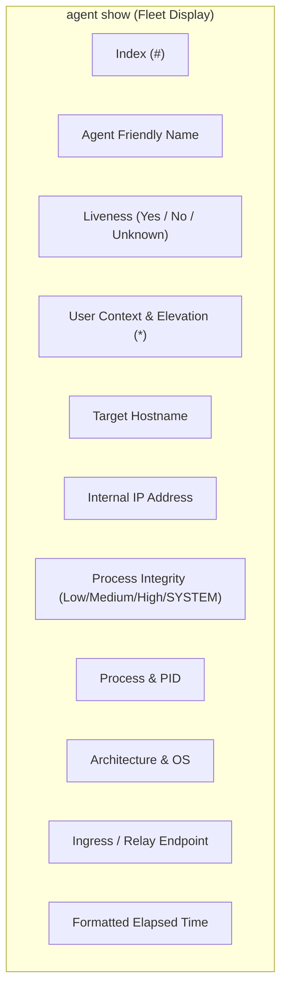
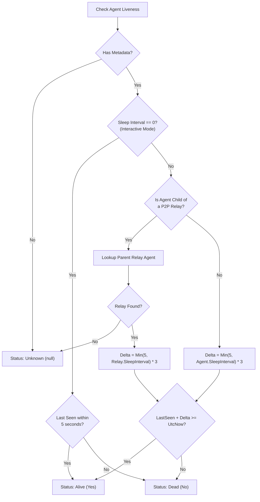

# Agent Fleet Management — Functional Guide

## Purpose and Business Value

During a red team engagement, operators deploy implants across various corporate workstations, servers, and cloud instances. Maintaining an accurate, real-time inventory of all active agents is vital for situational awareness, target coordination, and operational hygiene.

The **Agent Fleet Management** feature of Commander allows operators to:
- Monitor all checking-in implants across internal and external networks in a single unified view.
- Accurately determine whether an implant is **Alive**, **Dormant**, or **Unresponsive** using intelligent sleep-interval and peer-to-peer relay heuristics.
- Switch operational focus between agents instantly using friendly names, numeric indices, or unique identifiers.
- Inspect deep host telemetry (OS architecture, process name, process ID, user context, integrity level, internal IP address).
- Safely decommission dead or abandoned agents while safeguarding active implants against accidental deletion.

---

## Fleet Overview (`agent show` / `agents`)

Executing `agent show` (or simply `agents`) presents a comprehensive inventory table rendered with Spectre.Console:



### Visual State Highlights
- **Active Agent (Currently Interacted)**: Highlighted in **cyan** text to remind the operator which agent is currently bound to the prompt.
- **Responsive Agent**: Highlighted in standard crisp white/green text.
- **Dead / Unresponsive Agent**: Dimmed in **grey** text to clearly differentiate lost beacons from active operational channels.

---

## Liveness Heuristics Engine

Unlike simple ping-based monitoring, C2 implants often operate in asynchronous sleep cycles (e.g., sleeping 30 seconds with jitter) or communicate through multi-hop peer-to-peer relays. Commander calculates an implant's live status using an intelligent adaptive algorithm:



### Heuristic Rules:
1. **Interactive Mode (Sleep = 0s)**: If an agent is in interactive mode, it must check in at least once every 5 seconds. If `LastSeen + 5s < Now`, it is marked as dead.
2. **Standard Beacon Mode (Sleep > 0s)**: Allowance is scaled to three times the minimum check-in interval (`min(5, SleepInterval) * 3`).
3. **P2P Relay Mesh Compensation**: When an agent operates behind a peer-to-peer relay, its check-in interval is constrained by the parent relay agent's sleep schedule. Commander automatically queries the parent relay's sleep interval to evaluate child reachability.

---

## Agent Interaction (`interact` / `int`)

To issue commands to an implant, an operator "interacts" with it:
- Syntax: `int <Index | ID | Name>` (or `interact <Index | ID | Name>`)
- Resolves by:
  - Numeric index in the fleet list (e.g., `int 0`, `int 3`).
  - Friendly configured name (case-insensitive, e.g., `int Agent-Finance-01`).
  - Unique Agent GUID or ShortGuid.

Once selected, Commander updates the console prompt to reflect the agent's identity and privilege level:
```text
$> int 0
$(FinanceWorkstation) alice*@CORP-WS-09> 
```
*(The asterisk `*` denotes elevated administrative privileges).*

To return to the global Commander prompt without terminating the agent session:
```text
$(FinanceWorkstation) alice*@CORP-WS-09> back
$> 
```
*(Alternatively, the alias `home` can be used).*

---

## Agent Telemetry Inspection (`status`)

While interacting with an agent, the operator can execute `status` to inspect detailed target host telemetry formatted as a key-value grid:

| Telemetry Property | Description | Example |
| :--- | :--- | :--- |
| **Id** | Unique internal agent GUID | `8d4a9f12` |
| **Name** | Configured agent name | `Edge-Gateway` |
| **Hostname** | Target machine network name | `PROD-DC01` |
| **User Name** | Running user account | `CORP\svc_backup` |
| **IP** | Internal network IP address | `10.100.4.15` |
| **Process ID / Name** | Host process housing the implant | `svchost.exe (3412)` |
| **Architecture / OS** | Host architecture and operating system | `x64 - Windows` |
| **Integrity** | Windows token integrity level | `High` |
| **EndPoint** | Bound communication listener / relay URL | `http://192.168.1.50:8080` |
| **Version** | Implant framework build version | `2.4.0` |
| **Sleep** | Current sleep duration and jitter | `10s (Jitter 15%)` |
| **First Seen** | Local timestamp of initial implant registration | `2026-09-04 10:15:22` |
| **Last Seen** | Elapsed time since last check-in | `2.45s` |

---

## Safe Agent Decommissioning (`agent delete`)

When an assessment ends or an implant is abandoned, operators clean up the database state using `agent delete`:
- Single agent deletion: `agent delete -id 0` or `agent delete -id AgentName`
- Bulk purge: `agent delete -a` (or `--all`)

### Operational Safety Guard:
Commander enforces a strict protection rule: **Active agents cannot be deleted**.
If an operator attempts to delete an implant that is still responsive, Commander displays an alert:
```text
Agent 8d4a9f12 is still active. It will not be deleted.
```
This prevents operators from accidentally losing interactive command over active beacons. To decommission an active implant, the operator must first instruct it to terminate using an agent termination command (`destroy` or `exit`), verify that heartbeats cease, and then delete the record.

---

## Technical Cross-Reference

- Agent command handler and table renderer: [Command Handlers](../../Technical/Commander/command-handlers.md).
- State synchronization, event listeners, and API clients: [Communication & State Sync](../../Technical/Commander/communication-and-state-sync.md).
- Dynamic prompt generation and context factories: [Command Framework & Execution](../../Technical/Commander/command-framework-and-execution.md).
