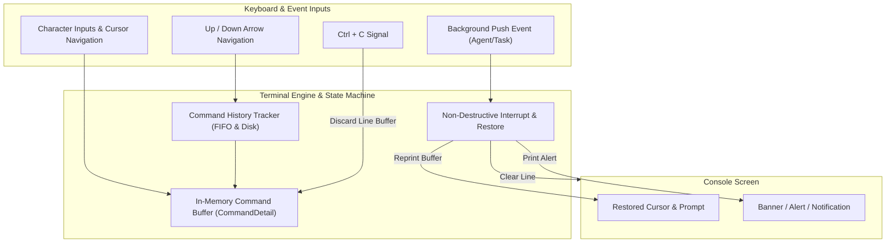

# Console & Session Management — Functional Guide

## Purpose and Business Value

During red team operations, operators face intense multitasking: reviewing incoming beacons, monitoring exfiltration jobs, inspecting newly arrived agents, and executing real-time terminal commands. A standard command-line terminal often suffers from "terminal clobbering" — asynchronous notifications from the server write over the text an operator is actively typing, corrupting command lines and causing operator frustration or operational mistakes.

The **Commander Console Subsystem** provides a specialized interactive terminal tailored for cyber operations:
- **Zero-Clobber Asynchronous Interruption**: Real-time alerts (agent check-in, task completion, connection state changes) safely interrupt the screen, render clean notifications, and restore the operator's active input buffer without losing a single keystroke.
- **Dual Operational Modes**: Contextually switches between global infrastructure management and focused single-agent interaction.
- **Context-Aware Assistance**: Dynamically filters available commands based on the active operational context and the target operating system (e.g., hiding Windows-specific token manipulation commands when interacting with a Linux implant).
- **Persistent Command History**: Retains past operational commands across sessions in a local history log.

---

## Dual Operational Modes

Commander operates in two primary operational contexts, visually signaled by prompt adjustments:

```mermaid
stateDiagram-v2
    [*] --> GlobalMode: Launch Commander & Sync
    
    state GlobalMode {
        note right of GlobalMode
            Prompt: "$> "
            Scope: Infrastructure, Listeners, Implants,
            Tools, WebHosting, Global Fleet Management
        end note
    }

    GlobalMode --> AgentInteraction: Command "interact <ID>" or "int <ID>"
    
    state AgentInteraction {
        note left of AgentInteraction
            Prompt: "$(Name) User*@Host> "
            Scope: Targeted Agent Execution, File System,
            Process Injection, Tokens, Pivoting, Local SOCKS
        end note
    }

    AgentInteraction --> GlobalMode: Command "back" or "home"
    GlobalMode --> [*]: Command "exit"
```

### 1. Global Mode (`$> `)
- **Prompt**: Defaults to `$> `.
- **Capabilities**: Access to global infrastructure commands (`agent`, `listener`, `implant`, `host`, `tool`, `map`, `lcd`, `lls`, `lpwd`, `help`, `exit`).
- **Focus**: Server orchestration, listener deployments, payload generation, and fleet-wide monitoring.

### 2. Agent Interaction Mode (`$(Name) User*@Host> `)
- **Prompt**: Dynamically reflects target environment telemetry:
  - Format: `$(<AgentName>) <UserName><ElevatedStar>@<Hostname>> `
  - Example (Standard Privilege): `$(AlphaBeacon) alice@WS01> `
  - Example (Elevated / SYSTEM): `$(AlphaBeacon) SYSTEM*@WS01> `
  - Fallback (Pre-Metadata): `$(<AgentId>)> `
- **Capabilities**: Inherits all global commands plus agent-specific post-exploitation commands (`whoami`, `ps`, `ls`, `cd`, `pwd`, `cat`, `upload`, `download`, `shell`, `powershell`, `psexec`, `capture`, `proxy`, `view`, `status`, `back`).

---

## Interactive Features & Ergonomics



### Key Bindings & Navigation
- **Character Insertion & Deletion**: Full inline editing support (`Backspace`, `Delete`).
- **Cursor Movement**: Move caret within typed text (`Left Arrow`, `Right Arrow`, `Home`, `End`).
- **Command History**: Cycle through previously executed commands using `Up Arrow` and `Down Arrow`. Commands are automatically persisted to `command_history.txt`.
- **Command Cancellation**: Pressing `Ctrl + C` discards the current line buffer without terminating Commander, opening a fresh prompt.

### Non-Destructive Asynchronous Alerts
When background telemetry arrives from the TeamServer, the terminal executes an **Interrupt & Restore** sequence:
1. Cleans the currently typed prompt and characters from the console line.
2. Writes the incoming notification (e.g., `New Agent Checking in : a1b2c3d4 (0)` or `Task shell whoami is Completed`).
3. Repositions the cursor on a fresh line and seamlessly redraws the prompt along with whatever characters the operator had typed.

---

## Context-Sensitive Help (`help`)

Typing `help` generates an intelligent table categorizing all valid commands according to the operator's current context:

1. **Global Mode Filter**: Hides agent-only commands, showing only server-level commands (`Commander` category).
2. **Agent Mode Filter**: Unhides post-exploitation commands, grouping them into operational categories:
   - `Commander`: Navigation and management commands (`agent`, `back`, `view`, `status`, `proxy`, `map`).
   - `Agent - System`: OS-level inspection and manipulation (`whoami`, `ps`, `ls`, `cd`, `cat`, `upload`, `download`, `sleep`).
   - `Agent - Execution`: Process and binary execution (`shell`, `powershell`, `execute-assembly`, `inline-assembly`, `run`).
   - `Agent - Token`: Identity and token impersonation (`make-token`, `steal-token`, `rev2self`).
   - `Agent - LateralMovement`: Remote staging and execution (`psexec`, `winrm`).
   - `Agent - Media`: Audio/visual intelligence gathering (`capture`, `keylog`).
3. **OS Compatibility Filtering**: If interacting with a Linux agent, Windows-exclusive commands (e.g., `psexec`, `powershell`, token commands) are automatically excluded from the list.

---

## Business Rules, Edge Cases, and Constraints

| Scenario / Condition | Functional Behavior | Rule / Rationale |
| :--- | :--- | :--- |
| **Executing Agent Command in Global Mode** | Commander blocks execution with an error message: `"No agent selected. Use 'interact' command to select an agent."` | Prevents ambiguous targeting when multiple agents are active. |
| **TeamServer Disconnection** | Terminal displays a red alert: `"Cannot connect to TeamServer (<Endpoint>)"`. Prompts remain responsive, and Commander automatically re-establishes connection once the TeamServer resumes. | Prevents CLI lockup during network blips or server restarts. |
| **Rapid Background Output During Fast Typing** | Interruption mechanics queue and serialize console writes so fast keyboard inputs are never lost or corrupted. | Preserves operator input integrity during high-volume beacons. |
| **Duplicate Agent Names** | Prompt uses the unique agent identifier fallback if metadata is uninitialized, or appends unique context details. | Guarantees clear target identification. |

---

## Technical Cross-Reference

- Console line editor implementation and key handling: [Terminal Subsystem](../../Technical/Commander/terminal-subsystem.md).
- Command parsing, binding, and execution engine: [Command Framework & Execution](../../Technical/Commander/command-framework-and-execution.md).
- Session lifecycle and service registration: [Architecture & DI](../../Technical/Commander/architecture-and-di.md).
