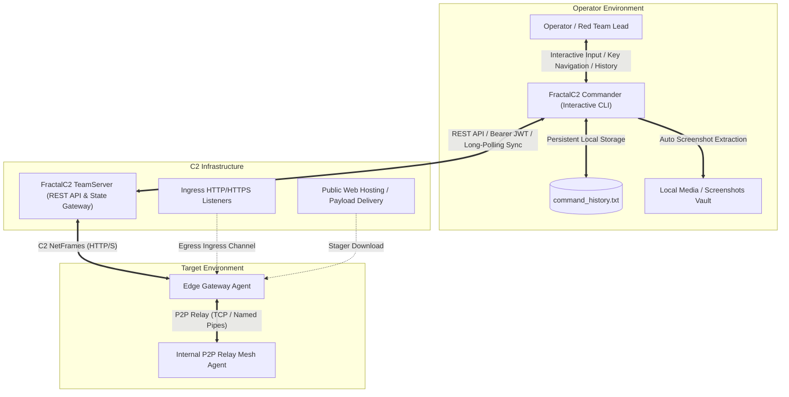
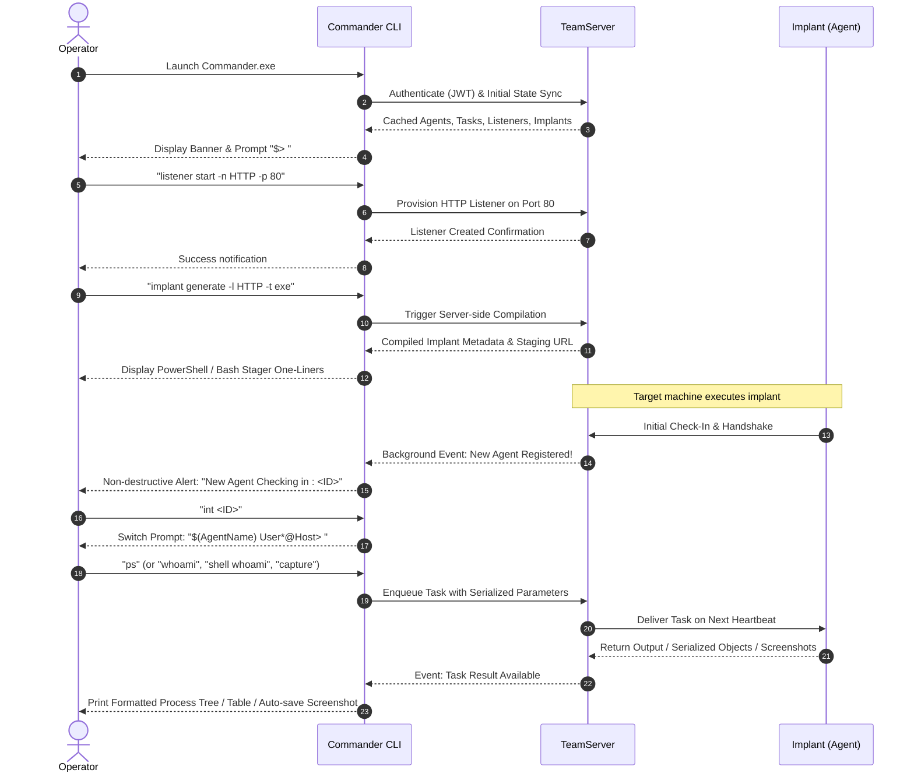

# FractalC2 Commander — Functional Documentation

## Overview

The **FractalC2 Commander** is the primary interactive command-line operations console for the FractalC2 platform. Designed specifically for red team operators, adversary simulation engineers, and assessment leads, Commander provides a consolidated, responsive operational cockpit to control all facets of offensive cyber operations.

Operating as an authenticated client against the central **FractalC2 TeamServer**, Commander translates high-level operator intent into structured commands, coordinates multi-tier agent relay meshes, manages staging and listener infrastructure, oversees implant lifecycle, and provides real-time telemetry streaming without interrupting active console typing.

---

## Core Capabilities & Functional Areas

Commander is partitioned into specialized functional capability areas that empower operators during red team engagements:

| Functional Area | Description | Functional Guide | Technical Reference |
| :--- | :--- | :--- | :--- |
| **Interactive Console & Session Management** | Dual operational modes (Global vs Agent Interaction), non-destructive event interrupting, persistent shell history, keyboard navigation, and context-sensitive help. | [Console & Session](./console-and-session.md) | [Terminal Subsystem](../../Technical/Commander/terminal-subsystem.md) |
| **Agent Fleet Management** | Real-time agent monitoring, live heartbeat delta heuristics, session binding, process integrity inspection, and safe decommissioning. | [Agent Management](./agent-management.md) | [Command Handlers](../../Technical/Commander/command-handlers.md) |
| **Task Orchestration & Loot Tracking** | Dispatching asynchronous execution tasks to implants, tabular result visualization, hierarchical process trees, automatic screenshot exfiltration, and loot creation. | [Task Execution](./task-execution.md) | [Formatters & Helpers](../../Technical/Commander/formatters-and-helpers.md) |
| **Network Pivoting & Mesh Visualization** | Interactive hierarchical tree mapping of peer-to-peer relay chains, integrated SOCKS4 proxy creation, and reverse tunnel tracking. | [Network Pivot & Mesh](./network-pivot-and-mesh.md) | [Command Handlers](../../Technical/Commander/command-handlers.md) |
| **Payload Delivery & Web Staging** | Deploying staging stubs to listener endpoints, PowerShell and Bash delivery one-liner generator, and web access logging. | [Web Hosting & Staging](./web-hosting-and-staging.md) | [Command Handlers](../../Technical/Commander/command-handlers.md) |
| **Implant Lifecycle & Script Generation** | On-demand compilation requests for PE executables, DLLs, shellcode, service binaries, and PowerShell scripts with process injection configurations. | [Implant Management](./implant-management.md) | [Command Handlers](../../Technical/Commander/command-handlers.md) |
| **Listener & Infrastructure Control** | Dynamic instantiation and shutdown of ingress HTTP and HTTPS listeners across designated ports and IP addresses. | [Listener Management](./listener-management.md) | [Command Handlers](../../Technical/Commander/command-handlers.md) |
| **Operator Toolset & Local Operations** | Central offensive tool registry management, local file system navigation (`lcd`, `lls`, `lpwd`), and session exit coordination. | [Tools & Local Commands](./tools-and-local-commands.md) | [Architecture & DI](../../Technical/Commander/architecture-and-di.md) |

---

## Operational Workflow

During an engagement, an operator typically executes the following functional workflow within Commander:

---

## Target Audience & Operational Roles

- **Red Team Operators**: Leverage Commander to interact with active agents, pivot through internal networks, deploy payloads, and conduct real-time adversary simulations.
- **Assessment Leads & Project Managers**: Review active operational scopes, inspect deployed listeners, audit agent health across client networks, and verify proper operational hygiene.
- **Security Analysts & Blue Teams**: Understand how operator-facing C2 control consoles structure command issuance, handle state synchronization, and automate post-exploitation tasks.

For developer-oriented implementation details, source class hierarchies, communication protocol specifications, and design patterns, refer to the [Technical Documentation Index](../../Technical/Commander/index.md).
