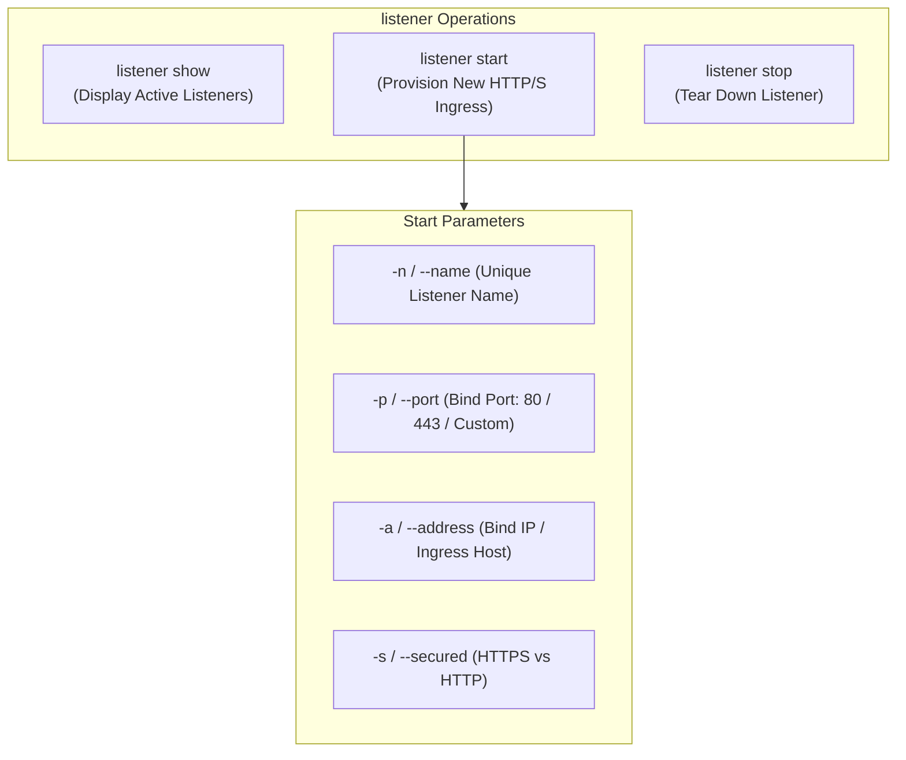

# Listener & Infrastructure Control — Functional Guide

## Purpose and Business Value

C2 listeners represent the external ingress gateways of an offensive operation. They receive incoming HTTP/HTTPS beacon check-ins from deployed implants, terminate secure TLS sessions, host staged artifacts, and deliver queued task instructions.

In a dynamic engagement, communication requirements change rapidly: egress ports might be blocked by client firewalls, new domains or redirectors may be provisioned, or existing listeners may need to be torn down during containment exercises. The **Listener Management Subsystem** enables operators to:
- Dynamically instantiate new HTTP and HTTPS listeners across designated IP addresses and ports without taking down the TeamServer or interrupting other active listeners.
- Inspect all running ingress channels in a real-time table.
- Gracefully shut down listening sockets when egress routes are retired.

---

## Listener Management Operations (`listener`)

The `listener` command supports three primary sub-action verbs:



### 1. Provisioning a Listener (`listener start`)
- Syntax:
  ```text
  listener start -n <name> [-p <port>] [-a <address>] [-s <true|false>]
  ```
- Parameters:
  - `-n, --name`: Friendly name for the listener (e.g., `External-HTTPS`, `Redir-Port80`). Must be unique.
  - `-p, --port`: The TCP port to bind. If omitted, Commander automatically assigns **`443`** if secured, or **`80`** if unsecured.
  - `-a, --address`: The network IP address or interface to listen on (defaults to `127.0.0.1`).
  - `-s, --secured`: Enables TLS/HTTPS encryption (defaults to `true`).
- Example:
  ```text
  $> listener start -n Front-Door -p 443 -a 192.168.1.100 -s true
  Listener Front-Door started on port 443.
  ```

### 2. Monitoring Active Listeners (`listener show`)
- Syntax: `listener show`
- Renders an overview table detailing every listening socket on the TeamServer:
  ```text
  ┌───────┬────────────┬──────┬───────────────┬──────────────────────────────────────┬────────┐
  │ Index │ Name       │ Port │ Host          │ Id                                   │ Secure │
  ├───────┼────────────┼──────┼───────────────┼──────────────────────────────────────┼────────┤
  │ 0     │ Front-Door │ 443  │ 192.168.1.100 │ d7c8a1b2-1111-4444-8888-0123456789ab │ Yes    │
  │ 1     │ Internal80 │ 8080 │ 127.0.0.1     │ e2b3c4d5-2222-5555-9999-abcdef012345 │ No     │
  └───────┴────────────┴──────┴───────────────┴──────────────────────────────────────┴────────┘
  ```

### 3. Tearing Down a Listener (`listener stop`)
- Syntax:
  ```text
  listener stop -n <name>
  ```
- Gracefully closes the underlying Kestrel server port, freeing the socket and stopping ingress handling for that route:
  ```text
  $> listener stop -n Internal80
  Listener Internal80 stopped.
  ```

---

## Business Rules and Operational Edge Cases

| Scenario / Condition | Operational Behavior | Rule / Constraint |
| :--- | :--- | :--- |
| **Missing Listener Name** | Commander blocks execution with: `[X] Name is required to start a listener!`. | All listeners must have a unique tracking label. |
| **Duplicate Listener Name** | Commander validates locally and errors: `A listener with the name <name> already exists !`. | Names must be unique to allow deterministic implant binding. |
| **Port Conflict on Server** | TeamServer returns HTTP 400/500 error; Commander displays the server error message and status code. | Prevents silent failure when a port is already occupied. |
| **Stopping Non-Existent Listener** | Displays error: `Cannot find listener with the name <name> !`. | Prevents invalid API calls. |

---

## Technical Cross-Reference

- Listener command verb implementation: [Command Handlers](../../Technical/Commander/command-handlers.md).
- TeamServer listener API client: [Communication & State Sync](../../Technical/Commander/communication-and-state-sync.md).
- TeamServer Kestrel hosting architecture: [TeamServer Listener Subsystem](../../Technical/TeamServer/listener-subsystem.md).
