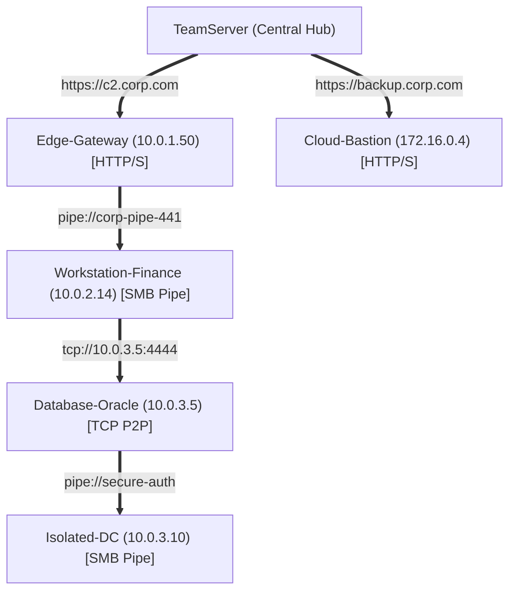

# Network Pivoting & Mesh Visualization — Functional Guide

## Purpose and Business Value

Modern enterprise networks enforce strict perimeter isolation and internal segmentation. Frequently, compromise of an initial endpoint ("Edge Gateway") does not grant direct outbound egress to deeper operational enclaves (e.g., domain controllers, database clusters, air-gapped SCADA/management zones).

FractalC2 solves segmentation through **Peer-to-Peer (P2P) Relay Meshes** and **In-Memory Tunneling**. The **Network Pivoting Subsystem** in Commander provides operators with:
- Intuitive topological visualization of the entire multi-hop C2 mesh using the `map` command.
- Integrated **SOCKS4 Proxy** management (`proxy`), allowing operators to route external offensive tooling (e.g., Metasploit, Nmap, Impacket, BloodHound, web browsers) directly through a compromised agent into internal networks.
- Real-time status indication across every hop of the relay chain.

---

## Relay Mesh Topology Mapping (`map`)

The `map` command dynamically constructs and renders a hierarchical tree representing the full topological structure of the C2 infrastructure and deployed agents:



### Visual Representation Rules in Commander
- **Root Node**: Represents the central **TeamServer**, colored green if currently connected to Commander, or grey if disconnected.
- **Node Data**: Displays the Agent's friendly name and unique identifier.
- **Link Indicators**: Highlights the transport binding used between child and parent (`[cyan]http[/]`, `[cyan]pipe[/]`, or `[cyan]tcp[/]`).
- **Liveness Coloring**: Active, responsive agents are rendered in bright **green** text; dormant, severed, or unresponsive agents are rendered in **grey** text.

This visualization allows operators to immediately determine which intermediate relay node failed if deep internal implants become unreachable.

---

## SOCKS4 Proxy Management (`proxy`)

While interacting with an agent, operators can instruct the TeamServer to open a **SOCKS4 Proxy Server** mapped directly to that agent's network stack. All traffic sent by operator tools to the listening port on the TeamServer is encapsulated into C2 frames, forwarded down the relay mesh, and dispatched out of the target implant into the target network.

```mermaid
sequenceDiagram
    autonumber
    actor Op as Operator Tool (e.g. proxychains nmap)
    participant TS as TeamServer (SOCKS Listener)
    participant Edge as Edge Relay Agent
    participant TargetAgent as Internal Pivoting Agent
    participant RemoteHost as Internal Target Server (e.g. 10.0.3.10:445)

    Op->>TS: TCP Connection to SOCKS Port (e.g. 1080)
    TS->>Edge: Encapsulate TCP Socket in C2 NetFrame
    Edge->>TargetAgent: Forward Frame over P2P Relay
    TargetAgent->>RemoteHost: Connect to Target IP & Port (10.0.3.10:445)
    RemoteHost-->>TargetAgent: Socket Data Returned
    TargetAgent-->>Edge-->>TS: Return Data Stream
    TS-->>Op: Deliver Transparent SOCKS Response
```

### 1. Starting a SOCKS Proxy (`proxy start`)
- Syntax: `proxy start [-p <port>]`
- Default Port: `1080`
- Example:
  ```text
  $(Edge-Gateway) alice*@CORP-WS-09> proxy start -p 1080
  [*] Proxy server started !
  ```
- **Operator Action**: The operator configures `/etc/proxychains4.conf` to point to the TeamServer's IP on port 1080:
  ```text
  socks4 127.0.0.1 1080
  ```
  Commands such as `proxychains crackmapexec smb 10.0.3.0/24` or `proxychains wmiexec.py ...` now route transparently through `Edge-Gateway`.

### 2. Stopping a SOCKS Proxy (`proxy stop`)
- Syntax: `proxy stop -p <port>`
- Example:
  ```text
  $(Edge-Gateway) alice*@CORP-WS-09> proxy stop -p 1080
  [*] Proxy server stopped !
  ```
- Tears down the listening socket on the TeamServer and frees the port.

### 3. Reviewing Active Proxies (`proxy show`)
- Syntax: `proxy show`
- Renders an overview table detailing every active proxy port and its associated agent GUID:
  ```text
  ┌──────────────────────────────────────┬──────┐
  │ Agent                                │ Port │
  ├──────────────────────────────────────┼──────┤
  │ 8d4a9f12-0012-44ef-82a1-128490a1bc34 │ 1080 │
  │ 3a1e7b99-9943-41bb-91bc-ff5544332211 │ 9050 │
  └──────────────────────────────────────┴──────┘
  ```

---

## Operational Constraints and Edge Cases

| Scenario / Condition | Operational Behavior | Rule / Rationale |
| :--- | :--- | :--- |
| **Port Already in Use** | TeamServer reports failure; Commander displays `[X] Cannot start proxy on the server!`. | Prevents socket collisions with existing services or previous proxy listeners. |
| **P2P Relay Agent Dies** | All child nodes in the `map` visualization shift to grey; any SOCKS connections routing through that chain close gracefully. | Accurately reflects severed internal network connectivity. |
| **No Active Agent Interaction** | Running `proxy start` without interacting with an agent results in `No active agent interaction.`. | SOCKS proxies require an established agent network context. |

---

## Technical Cross-Reference

- Proxy and map command definitions: [Command Handlers](../../Technical/Commander/command-handlers.md).
- Tree layout generation and recursive node rendering: [Formatters & Helpers](../../Technical/Commander/formatters-and-helpers.md).
- TeamServer proxy client communication: [Communication & State Sync](../../Technical/Commander/communication-and-state-sync.md).
