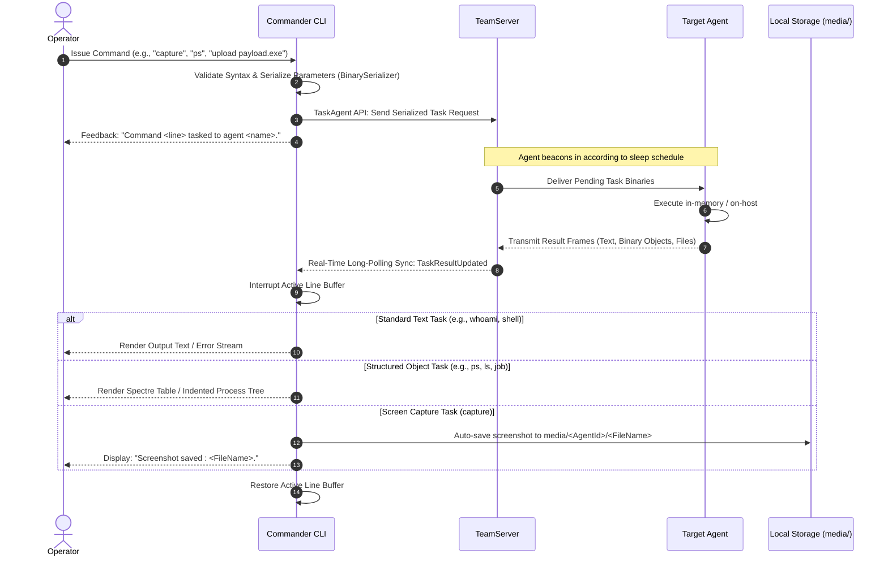

# Task Orchestration & Loot Tracking — Functional Guide

## Purpose and Business Value

The primary operational purpose of a Command and Control console is directing target implants to perform reconnaissance, execution, privilege escalation, lateral movement, and data collection. Because red team operations often run over stealthy, delayed beacon intervals, task execution in FractalC2 is inherently **asynchronous**.

The **Task Orchestration & Output Subsystem** in Commander handles:
- Packaging operator commands with serialized arguments and queuing them on the TeamServer.
- Real-time notification and structured visualization when results return from the target.
- Intelligent polymorphic rendering of complex data structures (hierarchical process trees, file tables, background jobs, network tunnels).
- Automatic exfiltration and local storage of screenshots.
- One-click archiving of task outputs directly into the central TeamServer Loot repository.

---

## Task Dispatching Lifecycle



---

## Structured Output Rendering

When an agent completes a command, Commander does not simply print raw unformatted strings. Specialized formatters deserialize binary telemetry into rich interactive visual components:

### 1. Hierarchical Process Tree (`ps`)
Instead of an unreadable flat table of PIDs, Commander constructs a parent-child process relationship tree:
- Children are automatically indented beneath their parent processes.
- Displays PID, Parent PID (PPID), Process Name, Target Architecture (x86/x64), User Owner, and Session ID.
- **Implant Identification**: The specific process currently hosting the FractalC2 implant is highlighted in **cyan**, allowing operators to immediately locate their presence in the target's process tree.

### 2. File and Directory Listing (`ls` / `dir`)
- Renders rounded Spectre.Console tables with file names, type classification (`[FILE]` vs `[DIR]`), and human-friendly file size formatting (`B`, `KB`, `MB`, `GB`).

### 3. Asynchronous Background Jobs (`job`)
- Displays background operations (e.g., keyloggers, network sniffer jobs, token watchers) with job ID, job type, thread/process ID, and associated originating task ID.

### 4. P2P Mesh Links (`link`)
- Lists established peer-to-peer child connections, including child agent IDs and binding transport protocol URLs (e.g., `pipe://...`, `tcp://...`).

### 5. Reverse Port Forwarding (`rportfwd`)
- Displays active inbound network relay bindings, indicating local listening ports, remote target hosts, and destination target ports.

---

## Automatic Screenshot Exfiltration (`capture`)

When an operator issues the `capture` command to record the target's desktop display:
1. The agent captures the current desktop framebuffer, compresses it, and returns it as a binary download object.
2. Commander intercepts the result.
3. If a local `media/` directory does not exist, Commander automatically creates it.
4. Commander establishes an agent-specific folder: `media/<agentId>/`.
5. The raw screenshot bytes are written to disk with their original timestamped filename.
6. A success alert is printed to the operator: `Screenshot saved : capture_20260904_103015.png.`

---

## Task History & Review (`view`)

Operators can inspect past command executions and their associated outputs using the `view` command:

### 1. View Recent Task Summary
```text
view [-t <count>]
```
- Lists recent tasks (defaults to the last 10 tasks) in a summary table showing Index, Task ID, Command Line, Status (`Queued`, `Running`, `Completed`, `Error`), and Submission Timestamp.

### 2. View Specific Task Output
```text
view <index>
```
- Retrieves and reprints the full output, error logs, and structured tables for the task at the specified index.

### 3. Archive Output to Loot Vault (`view <index> -l`)
Operators frequently need to preserve command outputs (e.g., active directory domain dumps, network interface maps, password policy configurations) for formal assessment reporting. Adding the `-l` (or `--loot`) flag to `view`:
1. Formats the task execution details into a formal header block:
   ```text
   ================================================================================
   TASK OUTPUT
   ================================================================================
   Agent Name:      Edge-Gateway
   Hostname:        CORP-DC01
   User:            CORP\Administrator
   IP Address:      10.10.0.5
   Process:         lsass.exe (PID: 640)
   
   Task ID:         9f3b7c2a
   Command:         ps
   Execution Date:  2026-09-04 14:15:30
   Status:          Completed
   ================================================================================
   OUTPUT
   ================================================================================
   <Formatted Process Tree or Command Output>
   ```
2. Packages the formatted text file as `task_<TaskId>.txt`.
3. Dispatches the file via API to the TeamServer's central **Loot Vault**.
4. Displays confirmation: `Task output saved to loot as task_9f3b7c2a.txt`.

---

## File Upload Orchestration (`upload`)

The `upload` command transmits files from the operator's local workstation to the remote target host:
- Syntax: `upload <localfile> [remotefile]`
- **Local Validation**: Commander verifies the local file exists prior to sending any network traffic.
- **Binary Packaging**: The file data is read into memory, paired with the designated target path (or the basename of the local file), and serialized into the task payload.
- **Asynchronous Staging**: The TeamServer buffers the file until the target agent beacons in and completes the upload.

---

## Business Rules and Edge Cases

| Scenario / Condition | Operational Behavior | Rule / Constraint |
| :--- | :--- | :--- |
| **Command Tasked While Agent is Sleeping** | Commander confirms task queuing immediately; output appears asynchronously upon beacon check-in. | Prevents console blocking while waiting for dormant implants. |
| **Missing Local File on Upload** | Commander aborts execution locally and outputs `File <path> does not exist!`. | Prevents corrupt empty tasks from reaching the TeamServer. |
| **Looting Non-Existent Task Index** | Error printed: `No task at index <index>`. | Prevents indexing out-of-bounds exceptions. |
| **Task Failure on Target** | Rendered with red error styling using the message returned from the implant's runtime environment. | Clearly signals operational or permission failures. |

---

## Technical Cross-Reference

- Deserialization and visual layout handlers: [Formatters & Helpers](../../Technical/Commander/formatters-and-helpers.md).
- Task command binding and execution: [Command Framework & Execution](../../Technical/Commander/command-framework-and-execution.md).
- Detailed command option definitions: [Command Handlers](../../Technical/Commander/command-handlers.md).
