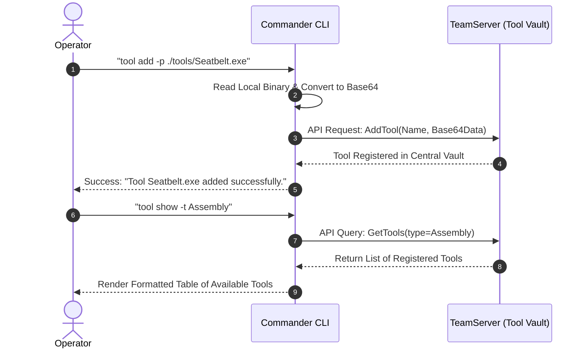

# Operator Toolset & Local Navigation — Functional Guide

## Purpose and Business Value

Red team operations rely on a rich arsenal of custom post-exploitation tools: .NET offensive assemblies (e.g., Seatbelt, Sharphound, Rubeus), native binaries, and PowerShell scripts. Maintaining these tools locally on an individual operator's laptop creates version drift and complicates multi-operator collaboration.

The **Tools & Local Navigation Subsystem** solves this by:
- Centralizing offensive tool storage on the TeamServer (`tool add` / `tool show`), enabling all operators on an engagement to leverage identical, verified tooling for in-memory execution.
- Providing local filesystem navigation commands (`lcd`, `lls`, `lpwd`) directly within the Commander CLI, allowing operators to locate payloads and examine local artifacts without switching windows.
- Ensuring clean session termination (`exit`), cleanly invalidating tokens and releasing server-side resources.

---

## Central Tool Management (`tool`)

The `tool` command allows operators to inspect and register offensive tooling into the TeamServer's central database:



### 1. Registering a Tool (`tool add`)
- Syntax: `tool add -p <file_path>`
- Reads the specified local executable or script and uploads it to the TeamServer.
- The TeamServer inspects the PE binary (distinguishing native PE vs .NET Assembly) and registers it into the global tool catalog.
- Once registered, the tool is immediately available for memory-only execution across any agent (e.g., via `execute-assembly Seatbelt.exe ...`).

### 2. Inspecting Available Tools (`tool show`)
- Syntax: `tool show [-t <type>] [-n <name>]`
- Filter options:
  - `-t, --type`: Filter by tool type (e.g., `Assembly`, `Native`, `Script`).
  - `-n, --name`: Search by tool name.
- Example Output:
  ```text
  ┌────────────────────────┬──────────┐
  │ Name                   │ Type     │
  ├────────────────────────┼──────────┤
  │ Seatbelt.exe           │ Assembly │
  │ Rubeus.exe             │ Assembly │
  │ Mimikatz.exe           │ Native   │
  │ PowerView.ps1          │ Script   │
  └────────────────────────┴──────────┘
  ```

---

## Local Filesystem Navigation

To prevent workflow interruptions caused by switching back and forth between Commander and external shell prompts, Commander includes local filesystem commands:

| Command | Syntax | Description | Example |
| :--- | :--- | :--- | :--- |
| **`lpwd`** | `lpwd` | Displays Commander's current local working directory. | `lpwd`<br/>`Current working directory = C:\Engagements\OpAlpha` |
| **`lcd`** | `lcd [path]` | Changes the local working directory of the Commander process. | `lcd ./payloads`<br/>`Current working directory = C:\Engagements\OpAlpha\payloads` |
| **`lls`** | `lls [path]` | Lists files and subdirectories in the local directory formatted as a rounded table. | `lls`<br/>Shows Name, Length, and IsFile status. |

---

## Session Termination (`exit`)

When an operator finishes their shift or concludes an assessment:
- Command: `exit`
- **Session Teardown**:
  1. If connected to the TeamServer, Commander calls the `/session/exit` endpoint, notifying the server that the operator's active JWT session is closing.
  2. Disposes the background long-polling sync service.
  3. Halts the terminal thread and gracefully returns the operator to the host operating system shell.

---

## Technical Cross-Reference

- Local navigation and tool command implementations: [Command Handlers](../../Technical/Commander/command-handlers.md).
- Session shutdown and application entry points: [Architecture & DI](../../Technical/Commander/architecture-and-di.md).
- TeamServer Tool API endpoints: [TeamServer Payload & Tools](../../Technical/TeamServer/payload-and-tools.md).
