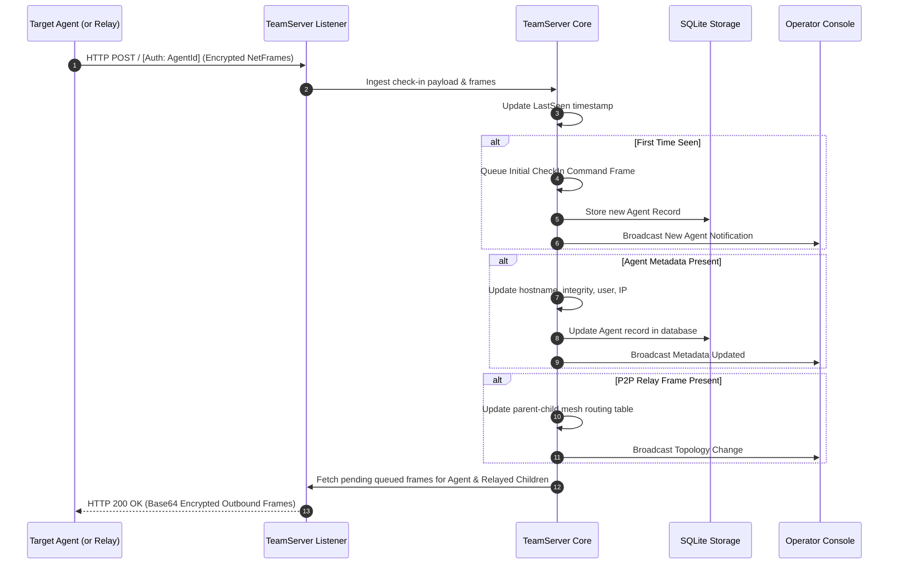

# Agent Lifecycle & Mesh Tracking — Functional Specification

## Purpose & Business Value

In distributed offensive security engagements, compromised endpoints (**Agents**) must maintain persistent, reliable connectivity back to the operators. However, in enterprise environments, most internal endpoints are cut off from direct internet egress.

The **Agent Lifecycle & Mesh Tracking** capability within TeamServer solves this challenge by providing:
1. **Centralized Agent Registry**: Continuous visibility into every deployed agent's operational health, execution context (username, process ID, integrity level, host architecture), and network endpoint.
2. **Dynamic Peer-to-Peer (P2P) Mesh Topology**: Tracking multi-hop relay chains where internal agents communicate through edge "gateway" agents over internal protocols (TCP or Named Pipes), enabling operators to control deeply isolated network enclaves.
3. **Heartbeat & Liveness Monitoring**: Timestamped check-ins to track agent responsiveness and alert operators when implants go dormant or drop offline.
4. **Clean Retirement & Hygiene**: Controlled decommissioning of retired agents and automated cleanup of operational artifacts to minimize target footprint.

---

## Actors & Triggers

| Actor / Component | Trigger / Event | Action Taken |
| :--- | :--- | :--- |
| **Edge Agent (Egress Gateway)** | Periodic check-in timer fires (sleep interval + jitter) | Sends an HTTP/HTTPS POST request containing inbound frames and metadata to a TeamServer listener. |
| **Relayed / Child Agent** | Sends check-in / task output to its parent peer | Parent forwards child frames to TeamServer; TeamServer registers or updates the relayed agent's topology. |
| **Human Operator** | Views dashboard or requests agent details | Queries agent status, metadata, relay chains, and active connections via the Commander UI. |
| **Human Operator** | Decommissions an agent | Submits a termination request via API; TeamServer removes the agent from active tracking and purges queued tasks. |

---

## Inputs & Outputs

### Inputs
- **Agent Identification**: Unique agent GUID transmitted in the HTTP `Authorization` header.
- **Agent Metadata Frame**: Hostname, logged-on user, process name, process ID, integrity level (Medium, High, System), host architecture (`x86`/`x64`), network IP address, sleep duration, and jitter percentage.
- **Topology Link Frames**: Parent-child relationship announcements (`Link`, `Links`, `Unlink`, `LinkRelay`).

### Outputs
- **Cached Outbound Frames**: Queued tasks, check-in requests, or tunneling data returned to the agent in the HTTP response.
- **Operator Dashboard Updates**: Real-time change notifications broadcasted to operator consoles reflecting newly discovered agents, metadata refreshes, or updated network links.

---

## Workflow & Process Flow

### Detailed Workflow Narrative

1. **Inbound Check-in**: An agent connects to an active TeamServer HTTP/HTTPS listener. The listener extracts the agent's identifier from the request headers.
2. **Registration & Check-in Request**: If the agent is unknown, TeamServer creates an in-memory record and automatically generates a `CheckIn` task frame. This prompts the agent to respond with a full system metadata bundle on its next turn.
3. **Heartbeat Timestamping**: Each incoming request updates the agent's `LastSeen` timestamp, keeping operator interfaces informed of active connectivity.
4. **Relay Mesh Dynamic Routing**: When an edge agent checks in, it may carry telemetry from several daisy-chained internal agents. TeamServer evaluates `Link`, `Unlink`, and `LinkRelay` frames, associating each internal agent with its current gateway (`RelayId`).
5. **Frame Aggregation & Dispatch**: When preparing the HTTP response, TeamServer bundles all queued commands for the edge agent *plus* any pending commands for all child agents currently routing through it, delivering them in a single batch.

---

## Business Rules, Constraints & Edge Cases

- **Relay Chain Resilience**: If an intermediate relay agent disconnects, child agents remain registered in the database, but their operational status reflects their last known gateway until a new route is announced via `LinkRelay`.
- **Duplicate Prevention**: Re-registering an already known agent updates its metadata and network address in-place without duplicating records.
- **Relay Route Cleaning**: When a gateway agent reports an updated list of active relay connections, any agent previously tied to that gateway but omitted from the latest report has its `RelayId` cleared.
- **Decommissioning Cascade**: Deleting an agent through the management API triggers a cascade: the agent is marked deleted in storage, its pending queued tasks are purged, and associated task results are sanitized.

---

## Feature Dependencies

- **[C2 Listeners & Ingress Channels](./listener-management.md)**: Physical network endpoints responsible for receiving agent HTTP traffic and delivering response frames.
- **[Tasking & Execution](./task-execution.md)**: The mechanism by which operators send commands to discovered agents.
- **[Multi-User Collaboration](./multi-user-and-audit.md)**: Propagates real-time agent state changes across all active operator sessions.

---

## Technical Reference

For technical implementation details including `AgentService`, `CheckinFrameHandler`, `LinkFrameHandler`, and database entity mappings, refer to [Agent Subsystem Technical Documentation](../../Technical/TeamServer/agent-and-relay-system.md).
