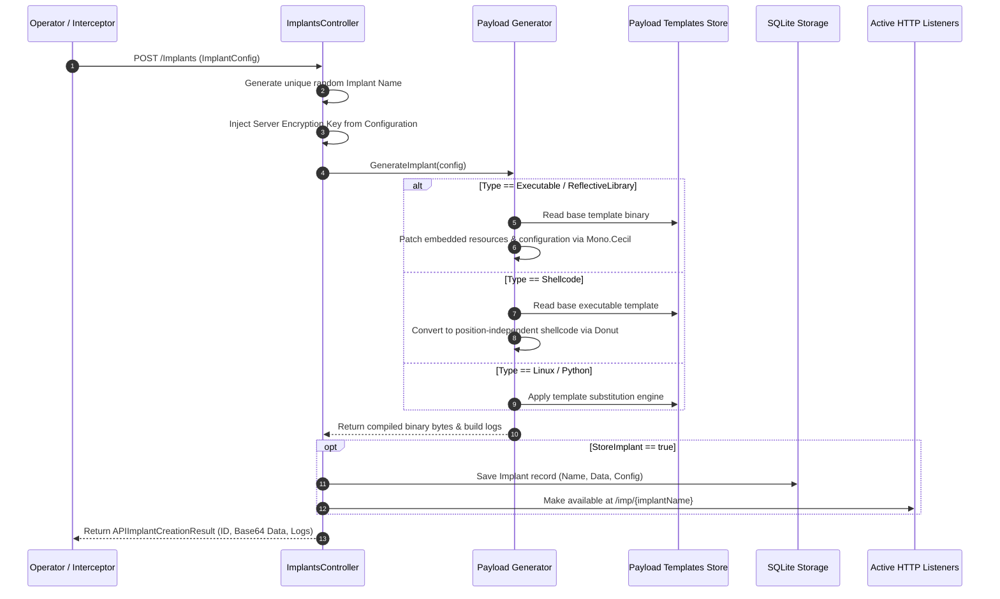

# Implant & Payload Factory — Functional Specification

## Purpose & Business Value

Deploying implants during an engagement requires generating tailored binaries that match the target environment's architecture, communication requirements, and operational constraints. Manual compiling, resource editing, and payload crafting are time-consuming and prone to configuration mistakes.

The **Implant & Payload Factory** capability within TeamServer automates the generation, customization, and staging of FractalC2 implants:
1. **On-Demand Generation**: Operators generate customized implants directly through the Commander interface or REST API without needing external development tools or compilers on their workstation.
2. **Multi-Platform & Format Support**: Generates standard Windows executables (`.exe`), Reflective Dynamic Link Libraries (`.dll`), position-independent shellcode (`.bin` via Donut), Linux implants, and Python stagers.
3. **Embedded Operational Configuration**: Automatically embeds listener URLs, encryption keys, sleep intervals, jitter settings, and target process spawn configurations directly into the generated implant.
4. **Instant Staging**: Generated payloads can be automatically registered in the TeamServer database and staged on active listeners for immediate download by delivery stagers.

---

## Actors & Triggers

| Actor / Component | Trigger / Event | Action Taken |
| :--- | :--- | :--- |
| **Operator** | Submits an implant generation request | Defines target architecture, format, listener endpoint, and operational parameters. |
| **Task Interception Engine** | Intercepts an agent process migration task (`Inject`) | Automatically requests a reflective DLL payload compiled with the target architecture and listener binding. |
| **Delivery Stager / Web Client** | Requests `GET /imp/{implantName}` on any active listener | Listener fetches the compiled implant from the factory and streams the binary to the client. |

---

## Inputs & Outputs

### Inputs
- **Implant Configuration (`ImplantConfig`)**:
  - `Architecture`: Target CPU architecture (`x86` or `x64`).
  - `Type`: Payload delivery format (e.g., `Executable`, `ReflectiveLibrary`, `Shellcode`, `Linux`, `Python`).
  - `Endpoint`: Listener connection URL (e.g., `https://c2.domain.com:443`).
  - `Listener`: Associated listener name.
  - `IsDebug`: Boolean flag enabling verbose debug console logging in the generated implant.
  - `StoreImplant`: Boolean flag indicating whether to persist the implant in the database for hosted staging.

### Outputs
- **Generated Payload**: Binary payload (raw bytes or Base64-encoded string).
- **Generation Telemetry**: Compilation and transformation logs detailing each step of the payload building process.
- **Staging URL**: Direct web path (`/imp/{implantName}`) for fetching the payload from running listeners.

---

## Workflow & Process Flow

---

## Supported Implant Formats

| Format Type | Typical Target Use Case | Technical Generation Mechanism |
| :--- | :--- | :--- |
| **Windows Executable (`Exe`)** | Initial access execution, manual payload drops, scheduled tasks. | Clones a template .NET binary and patches internal configuration blocks via `Mono.Cecil`. |
| **Reflective Library (`ReflectiveLibrary`)** | Process injection, memory-only execution, process migration. | Embeds a reflective loader header into the compiled assembly. |
| **Shellcode (`Shellcode`)** | Exploit payloads, process hollowing, custom shellcode loaders. | Converts an executable payload into position-independent code using the Donut shellcode generator. |
| **Linux Implant (`Linux`)** | Linux server operations and cross-platform simulation. | Compiles or customizes native Linux ELF binaries. |
| **Python Implant (`Python`)** | Script-based access on developer machines and cloud hosts. | Generates an obfuscated standalone Python agent script. |

---

## Business Rules, Constraints & Edge Cases

- **Cryptographic Synchronization**: The generator automatically retrieves the server's master encryption key (`ServerKey`) from `appsettings.json` and bakes it into the implant, guaranteeing seamless cryptographic handshake upon check-in.
- **Unique Implant Naming**: Every generated implant receives a cryptographically random, collision-free identifier used for web staging routes.
- **Ephemeral vs. Stored Payloads**: If `StoreImplant` is disabled (e.g., during automated task interception for process migration), the binary is transmitted directly to the caller without leaving artifacts in the database or filesystem.
- **Staging Web Route**: Any stored implant is automatically accessible via `GET /imp/{name}` on all active HTTP/HTTPS listeners, allowing download stagers to fetch it without operator intervention.

---

## Feature Dependencies

- **[C2 Listeners & Ingress Channels](./listener-management.md)**: Serves hosted implants to targets via the unified web host.
- **[Task Execution & Interception](./task-execution.md)**: Consumes reflective DLL generation dynamically for process migration (`Inject`) tasks.
- **[External Generator Engine](../../Technical/TeamServer/payload-and-tools.md)**: Relies on `Common.Payload.Generation` and external tools (Donut, Mono.Cecil).

---

## Technical Reference

For developer documentation covering `ImplantService`, `ImplantsController`, `PayloadGenerator`, and resource patching internals, see [Payload & Tools Technical Documentation](../../Technical/TeamServer/payload-and-tools.md).
