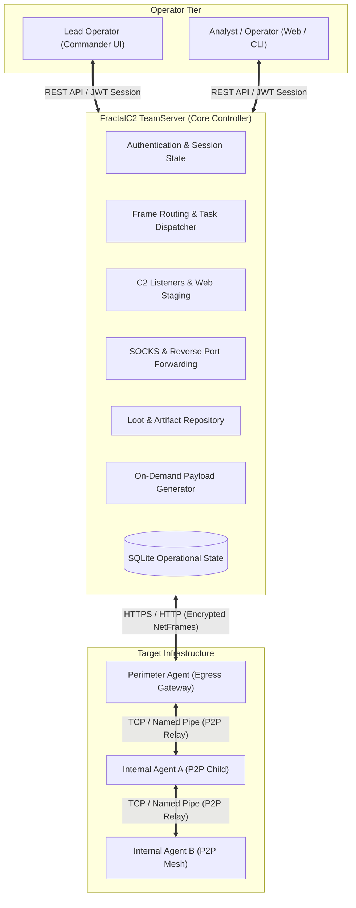

# FractalC2 TeamServer — Functional Documentation

## Overview

The **FractalC2 TeamServer** is the central command-and-control (C2) operations server of the FractalC2 platform. It serves as the master coordinator, communication gateway, intelligence clearinghouse, and orchestration engine for cyber operations, red team assessments, and authorized adversary simulation exercises.

Acting as the single source of truth, the TeamServer bridges field-deployed implants (**Agents**) operating within target network environments and human operators interacting through client interfaces (**Commander UI / CLI**). It ensures that all mission telemetry, exfiltrated files, and operational history are securely tracked, coordinated in real-time across multiple collaborating operators, and reliably persisted.

---

## Core Capabilities & Functional Areas

The capabilities of the TeamServer are organized into modular, purpose-built functional areas:

| Functional Area | Description | Functional Guide | Technical Reference |
| :--- | :--- | :--- | :--- |
| **Agent Lifecycle & Mesh Tracking** | Registration, heartbeat tracking, metadata telemetry, and multi-tier peer-to-peer relay mesh discovery. | [Read Feature Guide](./agent-management.md) | [Agent Subsystem](../../Technical/TeamServer/agent-and-relay-system.md) |
| **Tasking & Automated Interception** | Dispatching operator tasks, automated payload assembly, shellcode conversion, and result aggregation. | [Read Feature Guide](./task-execution.md) | [Tasking Engine](../../Technical/TeamServer/tasking-and-interception.md) |
| **Listener & Ingress Channels** | Dynamic HTTP/HTTPS ingress listeners, port management, TLS handling, and unified C2/staging endpoints. | [Read Feature Guide](./listener-management.md) | [Listener Architecture](../../Technical/TeamServer/listener-subsystem.md) |
| **Implant & Payload Factory** | On-demand compilation of Windows, Linux, and Python implants, shellcode generation, and DLL crafting. | [Read Feature Guide](./implant-generation.md) | [Payload & Tools](../../Technical/TeamServer/payload-and-tools.md) |
| **Network Pivoting & Tunneling** | Integrated SOCKS4 proxy servers and Reverse Port Forwarding to tunnel operator tools into target enclaves. | [Read Feature Guide](./network-pivoting.md) | [Network Forwarding](../../Technical/TeamServer/network-forwarding.md) |
| **Loot & Exfiltration Management** | File exfiltration repository, automatic screenshot capture processing, and thumbnail image preview generation. | [Read Feature Guide](./loot-and-artifacts.md) | [Loot & WebHost](../../Technical/TeamServer/loot-and-webhost.md) |
| **Operator Tool Repository** | Central repository for offensive binaries (.NET assemblies, native EXEs, PowerShell scripts) with type inspection. | [Read Feature Guide](./tools-repository.md) | [Payload & Tools](../../Technical/TeamServer/payload-and-tools.md) |
| **Web Hosting & Staging** | On-the-fly public file hosting for payloads, staging delivery stubs, and web download telemetry logging. | [Read Feature Guide](./web-hosting.md) | [Loot & WebHost](../../Technical/TeamServer/loot-and-webhost.md) |
| **Multi-User Collaboration & Auditing** | Multi-operator access control via JWT, real-time delta change sync, and time-stamped operational audit trails. | [Read Feature Guide](./multi-user-and-audit.md) | [Security & Audit](../../Technical/TeamServer/security-auth-and-audit.md) |

---

## Target Audience & Operational Roles

- **Engagement Leads & Product Owners**: Gain visibility into assessment progress, operational boundaries, security posture, and compliance telemetry.
- **Red Team Operators & Campaign Specialists**: Coordinate multi-operator actions, deploy resilient C2 infrastructure, bypass segmentation via mesh relaying, and manage target intelligence.
- **Blue Teamers & Security Analysts**: Understand the server-side architectural patterns, network transport characteristics, and behavioral indicators of modern C2 servers.

For developer-focused architectural deep dives, class diagrams, database schemas, and implementation specifics, see the [Technical Documentation Index](../../Technical/TeamServer/index.md).
