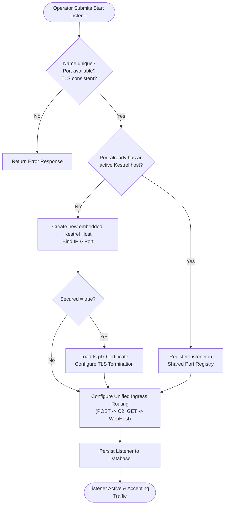
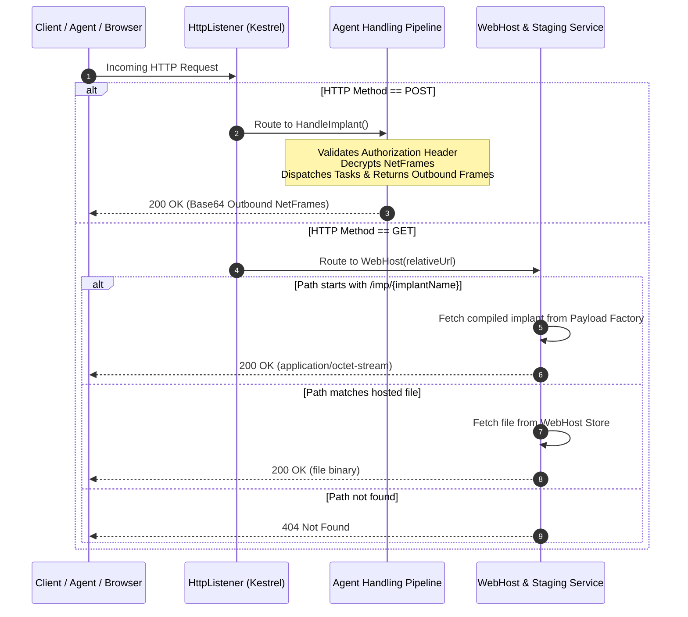

# Listener & Ingress Channels — Functional Specification

## Purpose & Business Value

Command-and-control operations rely on communication channels capable of receiving traffic from target networks while blending in with legitimate enterprise network protocols.

The **Listener & Ingress Channels** module provides operators with dynamic control over the TeamServer's network ingress endpoints:
1. **Dynamic Endpoint Provisioning**: Operators can spin up or tear down listeners on any IP address and port on the fly, without needing to restart the TeamServer application.
2. **Encrypted Transport (HTTPS & HTTP)**: Full support for both plain HTTP and TLS-encrypted HTTPS transports, terminating certificates cleanly on the server side.
3. **Dual-Role Endpoints (C2 & Web Hosting)**: Listeners serve a dual purpose: they act as ingestion gateways for agent communication (handling `POST` check-ins) and simultaneously serve as public web hosts for payload delivery and staging (handling `GET` requests).
4. **Persistent Infrastructure State**: Configured listeners are automatically saved in the TeamServer database and re-initialized across server reboots, ensuring uninterrupted C2 availability.

---

## Actors & Triggers

| Actor / Component | Trigger / Event | Action Taken |
| :--- | :--- | :--- |
| **Operator** | Starts a new listener from the console | Submits listener configuration (Name, IP, Port, Secured flag) via REST API. |
| **Operator** | Terminates an active listener | Requests listener shutdown; TeamServer stops the listening port and cleans up routing. |
| **TeamServer Startup** | Server application boots up | Queries database for persisted listeners and automatically restarts them. |
| **Deploying Agent / Target Host** | Makes network connection to listener | Listener routes request based on HTTP method (`POST` = Agent C2, `GET` = Web Hosting). |

---

## Inputs & Outputs

### Inputs
- **Start Listener Request**:
  - `Name`: Unique human-readable identifier for the listener (e.g., `External-HTTPS-443`).
  - `BindPort`: Port number on which the listener binds (e.g., `80`, `443`, `8080`).
  - `Ip`: Network interface address to bind or advertise (e.g., `0.0.0.0`, `192.168.1.50`).
  - `Secured`: Boolean flag determining whether TLS/HTTPS encryption is active.

### Outputs
- **Running Ingress Endpoint**: An active network socket accepting incoming HTTP/HTTPS connections.
- **Operator Notification**: Broadcast event confirming listener status and configuration.

---

## Workflow & Process Flow

### Ingress Traffic Disambiguation Flow

Every listener uses a unified ingress pipeline that inspects incoming HTTP requests to determine how to process them:

---

## Business Rules, Constraints & Edge Cases

- **Name Uniqueness**: No two listeners may share the same name (case-insensitive).
- **Protocol Consistency on Shared Ports**: Multiple listeners can bind to the same port to serve different routing contexts, but they **must** share the same security profile (all must be HTTP or all must be HTTPS). Mixing HTTP and HTTPS on the same port is strictly prohibited.
- **Automatic TLS Certificate Binding**: When `Secured` is set to `true`, the listener automatically provisions Kestrel with the server's TLS certificate (`certs/ts.pfx`), providing transparent HTTPS termination.
- **Multi-Port Port Sharing**: When multiple logical listeners share a physical port, stopping one listener only unregisters its specific context; the underlying Kestrel server stops only when the last listener bound to that port is terminated.
- **Server Reboot Resilience**: All active listeners implement the `IStorable` interface. Upon server restart, TeamServer automatically reloads and re-engages all previously configured listeners.

---

## Feature Dependencies

- **[Agent Lifecycle & Mesh Tracking](./agent-management.md)**: Receives agent check-ins dispatched from the listener pipeline.
- **[Web Hosting & Staging](./web-hosting.md)**: Supplies files and stagers served through listener `GET` endpoints.
- **[Multi-User Collaboration](./multi-user-and-audit.md)**: Records listener lifecycle actions in the operational audit log.

---

## Technical Reference

For technical implementation details including `ListenerService`, `HttpListener`, `HttpListenerController`, and dynamic Kestrel hosting, see [Listener Architecture Technical Documentation](../../Technical/TeamServer/listener-subsystem.md).
