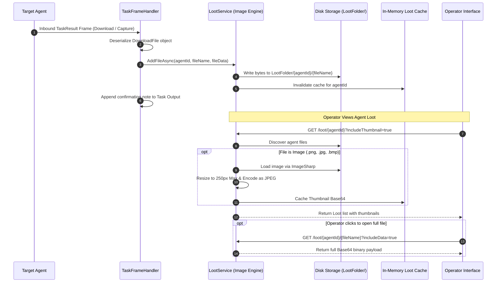

# Loot & Exfiltration Management — Functional Specification

## Purpose & Business Value

During penetration tests and red team operations, operators frequently download sensitive target files, dump credentials, capture configuration databases, and take periodic desktop screenshots. Keeping these artifacts organized, accessible across a team of operators, and ready for evidentiary reporting is critical for post-assessment deliverables.

The **Loot & Exfiltration Management** module acts as the centralized digital vault:
1. **Automated Exfiltration Processing**: Files downloaded via agent commands (`Download`) or desktop screenshots captured via surveillance tasks (`Capture`) are automatically detected and saved into an organized repository without manual file handling.
2. **Per-Agent Isolation**: Loot is neatly partitioned on disk and in the API by agent identifier, keeping operational artifacts cleanly separated across targets.
3. **High-Performance Image Thumbnails**: Automatic thumbnail generation for visual artifacts (screenshots) allows operators in GUI consoles to preview captured screens quickly without having to download multi-megabyte raw images over the network.
4. **Intelligent In-Memory Caching**: A concurrent in-memory caching system provides rapid browsing for multi-operator environments while refreshing automatically when new files land on disk.

---

## Actors & Triggers

| Actor / Component | Trigger / Event | Action Taken |
| :--- | :--- | :--- |
| **Executing Agent** | Completes a `Download` or `Capture` task | Bundles extracted file contents into serialized `DownloadFile` structures within the `TaskResult`. |
| **Task Frame Handler** | Receives inbound task result frame | Extracts the binary file data, transfers it to `LootService`, and appends an informative link to the task's console log. |
| **Operator Console (UI)** | Operator browses the Loot tab for an agent | Fetches file lists with lightweight embedded image thumbnails for fast rendering. |
| **Operator** | Clicks to download a full exfiltrated file | Server streams the raw binary payload to the operator workstation. |
| **Operator** | Deletes an artifact or manually uploads loot | Removes or adds files to the agent's loot vault via REST API. |

---

## Inputs & Outputs

### Inputs
- **Inbound Exfiltration Objects**: Agent ID, original target file name, and raw binary bytes.
- **Operator API Queries**: Filter flags (`includeData` for full file contents, `includeThumbnail` for image previews).

### Outputs
- **Loot Catalog**: List of exfiltrated artifacts containing file names, file sizes, image flags, and Base64-encoded thumbnails.
- **Raw File Downloads**: Direct binary byte streams or Base64 payloads of exfiltrated target assets.

---

## Workflow & Process Flow

---

## Business Rules, Constraints & Edge Cases

- **Supported Image Formats**: Files with extensions `.png`, `.jpg`, `.jpeg`, `.bmp`, or `.gif` are recognized as visual evidence, triggering automatic thumbnail processing.
- **Thumbnail Constraints**: Thumbnails are proportionally scaled to a maximum bounding dimension of 250 pixels and encoded as JPEG, reducing payload sizes by over 90% for operator UI responsiveness.
- **Cache Expiration**: File directory listings are cached in memory for up to 30 seconds to minimize filesystem I/O during heavy operator browsing, with immediate cache invalidation whenever a new file is added.
- **Resilient File Handling**: Corrupted image files or non-standard image formats fail gracefully without interrupting the exfiltration pipeline or crashing the loot listing endpoint.
- **File Overwriting**: Downloading a file with the same name multiple times updates the existing file in the agent's loot directory with the latest contents.

---

## Feature Dependencies

- **[Task Execution & Interception](./task-execution.md)**: Automatically feeds downloaded and captured files into the loot vault upon command completion.
- **[Storage & Configuration](../../Technical/TeamServer/storage-and-persistence.md)**: Reads storage directory paths configured in `appsettings.json` (`Folders:LootFolder`).

---

## Technical Reference

For developer documentation covering `LootService`, `LootController`, SixLabors.ImageSharp image manipulation, and concurrent caching structures, see [Loot & WebHost Technical Documentation](../../Technical/TeamServer/loot-and-webhost.md).
