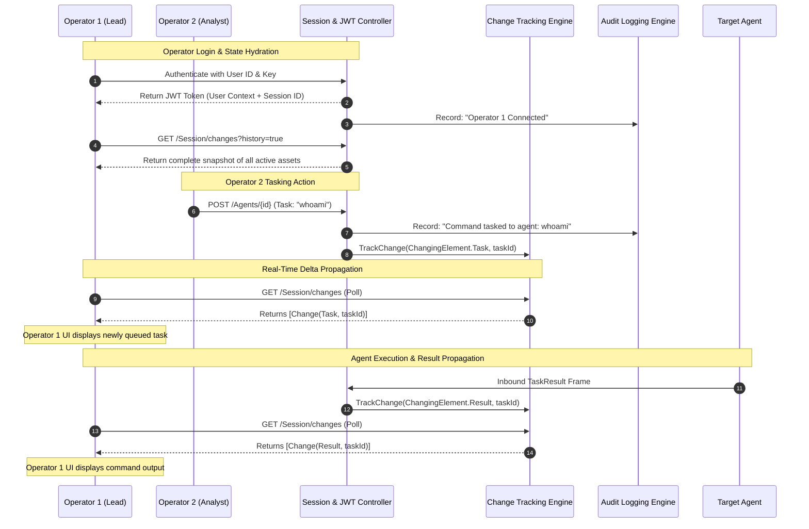

# Multi-User Collaboration & Auditing — Functional Specification

## Purpose & Business Value

Red team engagements rarely involve a single operator working in isolation. Multi-operator teams must collaborate simultaneously—sharing control of compromised agents, reviewing task outputs in real time, and monitoring ongoing pivots. Simultaneously, compliance standards and rules of engagement (RoE) demand an immutable, chronological record of all offensive actions taken against customer infrastructure.

The **Multi-User Collaboration & Auditing** subsystem provides the collaboration backbone and operational record for the platform:
1. **Multi-Operator Access Control**: Role-based operator accounts authenticated via signed JSON Web Tokens (JWT) allow multiple operators to connect concurrently.
2. **Real-Time Delta Synchronization**: A lightweight change-tracking system ensures all connected operator interfaces stay updated in real time with minimal network overhead. When an agent checks in or a task completes, only the changed elements are signaled to active client sessions.
3. **Full State Synchronization**: When an operator opens their console or reconnects after a disconnect, the system can rebuild their entire operational view (all agents, tasks, listeners, and implants) with a single snapshot query.
4. **Comprehensive Daily Audit Logging**: Automatically writes chronological records of all user actions, logins, command dispatches, and system events to rotating daily text logs, fulfilling RoE reporting and compliance obligations.

---

## Actors & Triggers

| Actor / Component | Trigger / Event | Action Taken |
| :--- | :--- | :--- |
| **Operator Console** | Operator logs in with User ID and Secret Key | Receives signed JWT token identifying the operator and establishing a unique session. |
| **Operator Console** | Active session polls for updates | Consumes pending delta changes (`/Session/changes`) to update GUI state incrementally. |
| **Operator Console** | Initial connection or refresh | Requests full historical state (`/Session/changes?history=true`) to populate the dashboard. |
| **TeamServer Subsystems** | Any operational state change (agent seen, task queued, result received) | Marks the affected entity in the `ChangeTrackingService` for all connected sessions. |
| **Audit Engine** | Any significant operator action or system transition | Appends a structured record to the day's audit log file on disk. |

---

## Inputs & Outputs

### Inputs
- **Authentication Credentials**: User ID and cryptographic authentication key configured in `appsettings.json`.
- **Session Polling Request**: HTTP `GET /Session/changes` carrying the operator's JWT bearer token.

### Outputs
- **Signed JWT Bearer Token**: Grants authenticated API access for up to 7 days.
- **Delta Changes Feed**: Ordered list of changed elements (`Agent`, `Metadata`, `Task`, `Result`, `Listener`, `Implant`) and their entity IDs.
- **Daily Audit Log Files**: Human-readable, structured text logs (`Audit/dd-MM-yyyy.txt`) documenting every operational event.

---

## Workflow & Process Flow



---

## Audit Log Record Structure

Audit logs are stored in the server's configured audit folder (`Folders:AuditFolder`) and partition automatically into daily files named `dd-MM-yyyy.txt`. Each entry is structured as a pipe-delimited line:

```text
DD/MM/YYYY HH:MM:SS | Level | Category | Source | Target | Message
```

### Log Fields
- **Date / Time**: Exact timestamp of the event.
- **Level**: Severity level (`Info`, `Warning`, `Success`, `Error`).
- **Category**: Functional origin (`User`, `Agent`, `Host`).
- **Source**: Operator ID and session identifier (e.g., `Fropops-session123`) or `System`.
- **Target**: Target agent identifier, listener name, or destination file.
- **Message**: Clear, human-readable description of the operation performed.

---

## Business Rules, Constraints & Edge Cases

- **Session Isolation**: Each connected client session maintains its own private delta change buffer. An operator consuming changes only drains their own session queue, ensuring peer operators do not miss events.
- **Atomic Change Ingestion**: Consuming changes via `/Session/changes` atomically flushes the session queue and returns only new modifications since the last poll.
- **Session Cleanup**: When an operator gracefully exits or closes their console, an exit notification cleans up their tracking buffer to prevent memory leakage.
- **Audit Resilience**: Audit log writes are wrapped in exception handlers so that filesystem write locks or disk full conditions cannot disrupt critical C2 routing or agent check-ins.

---

## Feature Dependencies

- **All Subsystems**: The `ChangeTrackingService` and `AuditService` are injected across all controllers and frame handlers in TeamServer.

---

## Technical Reference

For developer documentation covering `IChangeTrackingService`, `ChangeTrackingService`, `IAuditService`, `AuditService`, `JwtUtils`, `JwtMiddleware`, and authentication attributes, see [Security & Audit Technical Documentation](../../Technical/TeamServer/security-auth-and-audit.md).
