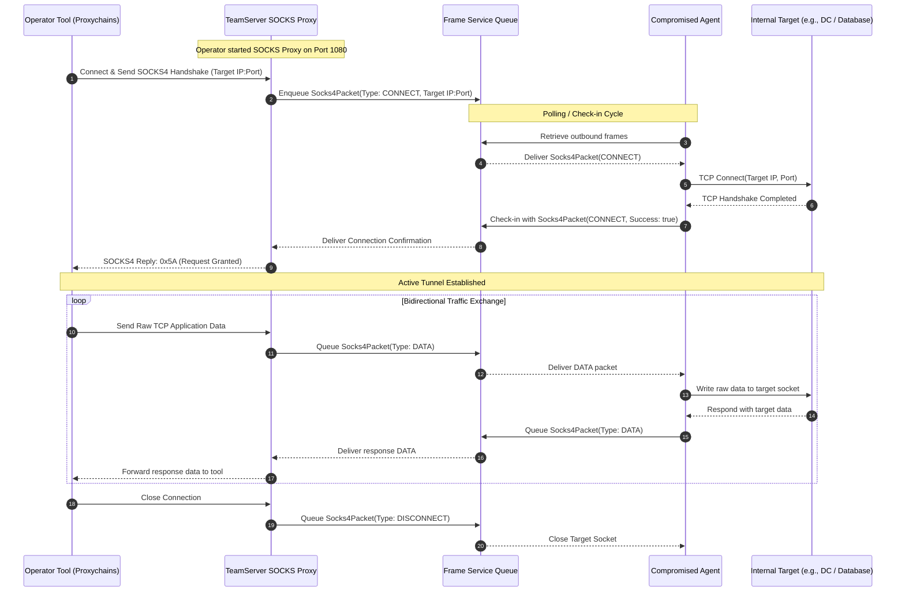

# Network Pivoting & Tunneling — Functional Specification

## Purpose & Business Value

Enterprise networks are strictly segmented into security tiers, firewalls, and DMZs. When an operator compromises a perimeter machine, reaching critical internal assets (e.g., Domain Controllers, database servers, internal web applications) requires tunneling traffic through the compromised host.

The **Network Pivoting & Tunneling** capability transforms compromised endpoints into full network gateways:
1. **Dynamic SOCKS4 Proxying**: Operators spin up a local SOCKS4 proxy on the TeamServer bound to a specific agent. Any tool run by the operator (e.g., BloodHound, Impacket, web browsers, proxychains) can route traffic through the agent directly into the internal network.
2. **Reverse Port Forwarding (RPortFwd)**: Tunnels specific connections initiated from or through the agent back to the TeamServer, bridging internal network services to designated target endpoints.
3. **Protocol Encapsulation over C2**: All network traffic is sliced, multiplexed, and encrypted inside standard FractalC2 `NetFrame` packets, passing unnoticed through inspection devices that only monitor the primary C2 channel.
4. **Multi-Client Concurrency**: Multiple simultaneous TCP connections can be routed through a single agent without interfering with normal C2 heartbeat or command execution.

---

## Actors & Triggers

| Actor / Component | Trigger / Event | Action Taken |
| :--- | :--- | :--- |
| **Operator** | Commands TeamServer to start SOCKS proxy on an agent | Allocates a local listening port on the TeamServer and binds it to the specified agent. |
| **Operator Tool (e.g. Proxychains)** | Establishes a TCP connection to the SOCKS port | SOCKS proxy server accepts the connection, parses destination IP/port, and relays a connection frame to the agent. |
| **Compromised Agent** | Receives SOCKS connection frame | Connects to the internal target host and reports connection success/failure. |
| **Internal Target Host** | Exchanges TCP data with Agent | Agent buffers data and sends it back to TeamServer via regular C2 check-in cycles. |
| **Agent or Target Service** | Initiates Reverse Port Forwarding | TeamServer's `ReversePortForwardService` establishes a connection to the destination host on behalf of the agent. |

---

## Inputs & Outputs

### Inputs
- **Start Proxy Request**: Target `agentId` and local `port` to bind on the TeamServer.
- **Client TCP Stream**: Raw socket stream containing SOCKS4 handshake and payload data.
- **Inbound Reverse Port Forward Packet**: Packet type (`CONNECT`, `DATA`, `DISCONNECT`), connection ID, and target destination (`Hostname`, `Port`).

### Outputs
- **Local SOCKS Port**: Open TCP listener on the TeamServer available for operator tools.
- **Bidirectional Network Stream**: Transparent, full-duplex TCP communication between the operator's machine and internal target servers.

---

## Workflow & Process Flow

### Dynamic SOCKS4 Proxy Flow

---

## Business Rules, Constraints & Edge Cases

- **One Proxy per Agent / Port**: An agent can only be bound to a single active SOCKS proxy at any given time, and each proxy must listen on a unique local port.
- **Latency & Polling Frequency**: Because SOCKS traffic is carried over the agent's C2 communication channel, interactive responsiveness directly depends on the agent's sleep interval. For optimal performance, operators typically set the agent's sleep interval to `0` (interactive mode) while tunneling.
- **Connection Teardown Cleanup**: If either the operator's tool or the internal destination closes the socket, a `DISCONNECT` frame is propagated to tear down the opposite side, preventing orphaned sockets and memory leaks.
- **Thread per Connection**: The server manages each active forwarded TCP stream on an independent background worker thread, ensuring high concurrency without blocking server API requests.

---

## Feature Dependencies

- **[Agent Lifecycle & Mesh Tracking](./agent-management.md)**: Network traffic frames are routed through the target agent and its parent relays.
- **[Task Execution & Delivery](./task-execution.md)**: Utilizes the underlying `FrameService` queue and `NetFrame` multiplexer.

---

## Technical Reference

For developer documentation covering `SocksService`, `SocksProxy`, `SocksClient`, `ReversePortForwardService`, and `RPortFwdClient`, see [Network Forwarding Technical Documentation](../../Technical/TeamServer/network-forwarding.md).
