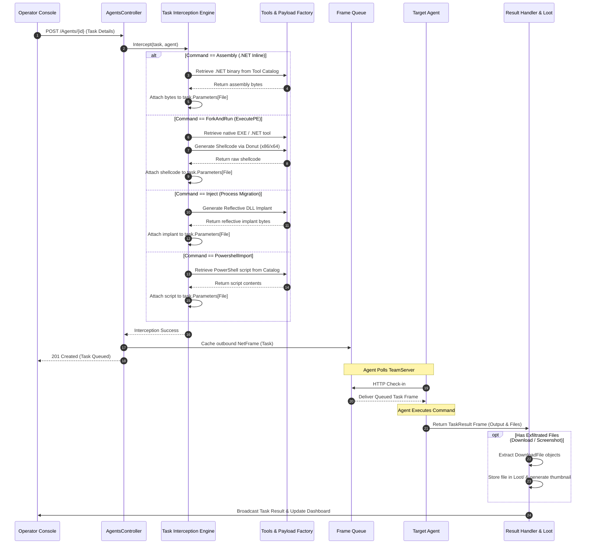

# Task Execution & Automated Interception — Functional Specification

## Purpose & Business Value

During red team operations, operators execute a wide variety of post-exploitation techniques—including executing .NET assemblies, running unmanaged executables via fork-and-run, running PowerShell scripts, downloading files, or migrating between processes. Manually compiling payloads, generating shellcode, and converting binaries on the fly creates operational friction and increases the risk of human error.

The **Task Execution & Automated Interception** capability solves this by introducing an intelligent, automated task dispatch pipeline:
1. **Seamless Operator Tasking**: Operators issue high-level commands through their interface without needing to manually package raw binary payloads.
2. **Automated Server-Side Task Interception**: The TeamServer automatically identifies complex tasks (e.g., executing a tool from the catalog, converting a PE to position-independent shellcode via Donut, or compiling an in-memory reflective DLL for process migration) and enriches the task with the required binary data before queuing it.
3. **Asynchronous Command Delivery**: Tasks are queued safely in memory and persisted in the database until the destination agent checks in.
4. **Automated Result Ingestion & Loot Harvesting**: Task results are received, parsed, and logged. If a task produced exfiltrated files or screenshots, the server automatically routes those files directly into the central Loot repository.

---

## Actors & Triggers

| Actor / Component | Trigger / Event | Action Taken |
| :--- | :--- | :--- |
| **Operator** | Submits a command targeting an agent | Sends task parameters (e.g., tool name, command line, target process) via REST API. |
| **Task Interception Engine** | Intercepts task during API submission | Resolves tool dependencies, generates shellcode or reflective DLLs, and embeds the payload directly into the task. |
| **Edge Agent** | Next scheduled check-in poll | Retrieves pending tasks from the TeamServer frame queue. |
| **Executing Agent** | Completes execution on target host | Bundles execution logs, errors, and output objects into a `TaskResult` frame. |
| **Result Processing Pipeline** | Ingests `TaskResult` frame | Updates task status, extracts exfiltrated files into Loot, and alerts active operators. |

---

## Inputs & Outputs

### Inputs
- **Task Request**: Agent ID, command ID (e.g., `Assembly`, `ForkAndRun`, `Inject`, `Download`), command text, and parameter dictionary (arguments, tool names, target architectures, destination paths).
- **Inbound Task Result**: Task ID, execution status (`Success`, `Running`, `Failed`), console stdout/stderr text, and optional serialized result objects (e.g., `DownloadFile`).

### Outputs
- **Enriched AgentTask**: A binary-serialized task object containing all required payloads, execution flags, and parameters.
- **Task Result Record**: Stored execution history visible to operators via REST API and GUI consoles.
- **Automated Loot Entries**: Captured files stored in the server's loot directory with generated preview thumbnails.

---

## Workflow & Process Flow

---

## Supported Interception Modules

The server features built-in interceptors that automatically prepare complex operations:

1. **Inline Assembly Interceptor (`CommandId.Assembly`)**:
   - Matches the requested tool name against the server's repository.
   - Verifies that the tool is a valid .NET executable.
   - Extracts the binary and injects it into the task payload for unmanaged in-memory execution by the agent.

2. **Execute-PE / Fork-and-Run Interceptor (`CommandId.ForkAndRun`)**:
   - Accepts both native Windows EXEs and .NET executables.
   - Automatically invokes the Donut shellcode generator matching the target agent's architecture (`x86` vs `x64`).
   - Packages the generated shellcode into the task, allowing the agent to spawn a sacrificial process and execute the tool via process hollowing or thread hijacking.

3. **PowerShell Script Import Interceptor (`CommandId.PowershellImport`)**:
   - Loads PowerShell scripts from the catalog and encodes them into the task.
   - Enables the agent's custom runspace to load script functions into memory without touching disk.

4. **Implant Migration Interceptor (`CommandId.Inject`)**:
   - Triggers on process migration or secondary injection tasks.
   - Automatically configures and generates a new reflective DLL implant matching the target process architecture and C2 listener configuration.
   - Embeds the compiled reflective library into the task for injection into the remote process.

---

## Business Rules, Constraints & Edge Cases

- **Architecture Compatibility**: When executing Fork-and-Run or Inject, the interceptor strictly verifies the target architecture (`x86` vs `x64`) from the agent's metadata before compiling shellcode.
- **Missing Tools**: If a referenced tool is missing from the catalog, the task is rejected immediately with an informative error message before hitting the queue.
- **Incremental Output Streaming**: For long-running commands, agents can return multiple partial result frames. TeamServer appends newly arrived output chunks to the existing result record in real time.
- **File Interception into Loot**: When task results for `Download` or `Capture` commands contain structured binary file transfers, TeamServer automatically redirects those files to the Loot service and enriches the text output with links to the captured assets.

---

## Feature Dependencies

- **[Operator Tool Repository](./tools-repository.md)**: Supplies source binaries, scripts, and assemblies inspected during task interception.
- **[Implant & Payload Factory](./implant-generation.md)**: Generates customized reflective DLL payloads for injection tasks.
- **[Loot & Exfiltration Management](./loot-and-artifacts.md)**: Receives and indexes exfiltrated files harvested from completed tasks.

---

## Technical Reference

For developer documentation, class definitions (`TaskInterceptionService`, `TaskInterceptor`, `ITaskService`, `ITaskResultService`), and controller signatures, see [Tasking Engine Technical Documentation](../../Technical/TeamServer/tasking-and-interception.md).
