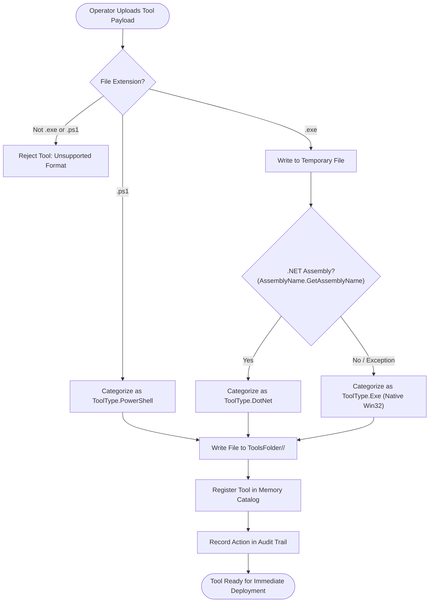

# Operator Tool Repository — Functional Specification

## Purpose & Business Value

Red team assessments require an extensive arsenal of post-exploitation utilities: situational awareness tools (e.g., Seatbelt, SharpUp), credential dumpers (e.g., Mimikatz, Rubeus), Active Directory reconnaissance tools (e.g., SharpHound), and bespoke administrative scripts. Having every operator store and manage tool binaries locally causes version mismatches and bloats operator client applications.

The **Operator Tool Repository** serves as a centralized, shared offensive tool vault hosted directly on the TeamServer:
1. **Centralized Tool Armory**: A single, organized repository where operators upload, organize, and share tools across the entire red team engagement.
2. **Automated Binary Classification**: When an operator uploads a binary (`.exe`), the server automatically inspects the internal executable headers using .NET metadata reflection to determine whether it is a managed **.NET Assembly** or an unmanaged **Native Executable**, filing it into the correct category automatically.
3. **Execution Type Categorization**: Segregates tools into three distinct operational categories:
   - **.NET Assemblies**: For in-memory inline execution (`Assembly` command).
   - **Native Windows Binaries (PE)**: For sacrificial fork-and-run execution (`ForkAndRun` command).
   - **PowerShell Scripts (`.ps1`)**: For unmanaged runspace script import (`PowershellImport` command).
4. **Direct Interceptor Feeding**: Seamlessly provides binaries and scripts to the server's automated task interception pipeline, removing the need for operators to upload tools repeatedly during tasks.

---

## Actors & Triggers

| Actor / Component | Trigger / Event | Action Taken |
| :--- | :--- | :--- |
| **Operator** | Uploads a new tool or script via API | Submits binary file data (`.exe` or `.ps1`) to the repository. |
| **TeamServer Startup** | Server initializes | Traverses the `ToolsFolder` directories and populates the in-memory tool catalog. |
| **Operator** | Queries tool catalog | Filters tools by type (`DotNet`, `Exe`, `PowerShell`) or searches by name. |
| **Task Interception Engine** | Dispatches an `Assembly`, `ForkAndRun`, or `PowershellImport` command | Fetches the binary or script data directly from the tool repository on disk. |

---

## Inputs & Outputs

### Inputs
- **Upload Tool Request**:
  - `Name`: File name (e.g., `Rubeus.exe`, `Powerview.ps1`, `whoami.exe`).
  - `Data`: Base64-encoded binary or script contents.

### Outputs
- **Tool Catalog Listing**: Name, detected category (`DotNet`, `Exe`, `PowerShell`), and availability status.
- **Binary/Script Payload**: Base64-encoded bytes or plain text script supplied to the task dispatcher.

---

## Workflow & Automated Classification Flow

---

## Tool Categories & Execution Methods

| Category | Typical Tools | Execution Technique on Agent |
| :--- | :--- | :--- |
| **DotNet** | `Rubeus`, `Seatbelt`, `SharpHound`, `Certify` | **Inline Execution**: Loaded directly into memory via CLR reflection within the current agent process, without spawning new processes. |
| **Exe (Native)** | `mimikatz.exe`, `adfind.exe`, `procdump.exe` | **Fork & Run**: Converted to shellcode via Donut, injected into a sacrificial target process (`dllhost.exe`), and captured via anonymous pipes. |
| **PowerShell** | `PowerView.ps1`, `PowerUp.ps1`, `Sherlock.ps1` | **In-Memory Runspace**: Imported into the agent's custom unmanaged PowerShell host without launching `powershell.exe`. |

---

## Business Rules, Constraints & Edge Cases

- **Duplicate Name Prevention**: Tools must have unique names across the entire catalog; attempting to upload a tool whose name already exists is rejected.
- **Automated Directory Organization**: The server maintains three physical subdirectories on disk (`ToolsFolder/DotNet`, `ToolsFolder/Exe`, and `ToolsFolder/PowerShell`). Uploaded files are written directly into their designated category folders.
- **Temporary Cleanup**: The temporary inspection file created during .NET assembly verification is guaranteed to be deleted immediately after analysis.
- **Audit Traceability**: Every tool upload is logged with the operator's user context and session ID in the daily audit log.

---

## Feature Dependencies

- **[Task Execution & Interception](./task-execution.md)**: Automatically consumes tools during task dispatch.
- **[Multi-User Collaboration & Auditing](./multi-user-and-audit.md)**: Logs operator upload activities.

---

## Technical Reference

For developer documentation covering `IToolsService`, `ToolService`, reflection-based PE inspection, and controller endpoints, see [Payload & Tools Technical Documentation](../../Technical/TeamServer/payload-and-tools.md).
