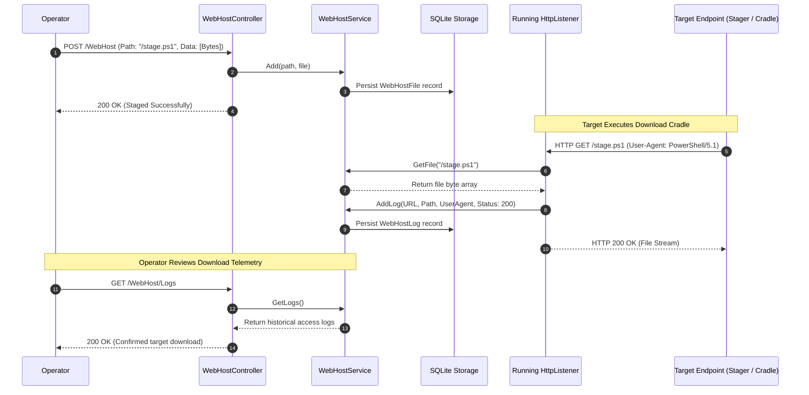

# Web Hosting & Staging — Functional Specification

## Purpose & Business Value

During red team operations, initial access stagers, cradles, and lateral movement commands need to download secondary payloads, scripts, or decoy files over HTTP/HTTPS. Setting up external web servers introduces additional infrastructure complexity and operational overhead.

The **Web Hosting & Staging** module provides an integrated public hosting service embedded directly into the TeamServer's listener network:
1. **Zero-Setup Staging**: Operators can host any file (e.g., PowerShell download cradles, compiled implants, batch scripts, configuration files) directly on active C2 listeners.
2. **Dynamic URL Paths**: Operators define arbitrary relative web paths (e.g., `/update.ps1`, `/login/cert.crt`, `/api/v2/config`) to mimic legitimate web application traffic.
3. **Comprehensive Access Logging**: Every single incoming HTTP `GET` request is captured, timestamped, and logged—including requesting IP address, User-Agent, requested path, and HTTP status code. This provides operators with instant confirmation when a target executes a download cradle.
4. **Permanent Persistence**: Hosted files and historical access logs are persisted in SQLite, surviving server restarts and network interruptions.

---

## Actors & Triggers

| Actor / Component | Trigger / Event | Action Taken |
| :--- | :--- | :--- |
| **Operator** | Stages a file via the WebHost API or GUI | Uploads file data, specifies the target web path, and sets an optional description. |
| **Target Host / Browser / Cradle** | Sends HTTP `GET` request to any active listener | Listener serves the hosted file with status `200 OK` or returns `404 Not Found`. |
| **Listener Ingress Engine** | Processes incoming `GET` request | Generates a `WebHostLog` entry recording the client's User-Agent, full request URL, timestamp, and HTTP response code. |
| **Operator** | Reviews WebHost access telemetry | Queries the live request log to verify whether a stager successfully downloaded a staged payload. |

---

## Inputs & Outputs

### Inputs
- **Host File Request**:
  - `Path`: Relative web route (e.g., `/tools/helper.ps1`).
  - `Description`: Operator notes describing the purpose of the staged file.
  - `IsPowershell`: Boolean flag indicating whether the file contains PowerShell code.
  - `Data`: Raw byte array or Base64 string of the file to host.

### Outputs
- **Publicly Staged Asset**: Downloadable file served over HTTP/HTTPS across all running listeners.
- **Access Audit Telemetry (`WebHostLog`)**: Structured log record with timestamp, client User-Agent string, full request URL, requested path, and HTTP status code.

---

## Workflow & Process Flow

---

## Business Rules, Constraints & Edge Cases

- **Unauthenticated Public Ingress**: Unlike the administrative REST API, which requires valid operator JWT tokens, the WebHost endpoints served on listeners are intentionally open to public `GET` requests so that target endpoints and download cradles can retrieve staged payloads without credentials.
- **Routing Precedence**: When an HTTP `GET` request arrives at a listener:
  1. If the URL path matches `/imp/{implantName}`, the server routes the request to the **Implant Factory** to stream a compiled implant.
  2. If the path matches an item registered in the **WebHost Store**, the server streams the hosted file.
  3. Otherwise, the listener logs a `404 Not Found` access record and returns an HTTP 404 response.
- **In-Memory & Persistent Dual-Storage**: Hosted files are held in an in-memory dictionary for rapid streaming while simultaneously mirrored in the database to survive server reboots.
- **Global Availability Across Listeners**: Files added to WebHost are instantly accessible across **all** active listeners, regardless of which port or interface the request arrives on.

---

## Feature Dependencies

- **[C2 Listeners & Ingress Channels](./listener-management.md)**: Physical web servers receiving public HTTP `GET` traffic.
- **[Implant & Payload Factory](./implant-generation.md)**: Interacts with the same route dispatcher to serve compiled implants via `/imp/`.
- **[Multi-User Collaboration & Auditing](./multi-user-and-audit.md)**: Records administrative staging and removal actions in the server audit log.

---

## Technical Reference

For developer documentation covering `IWebHostService`, `WebHostService`, `WebHostFileDao`, `WebHostLogDao`, and controller routing, see [Loot & WebHost Technical Documentation](../../Technical/TeamServer/loot-and-webhost.md).
