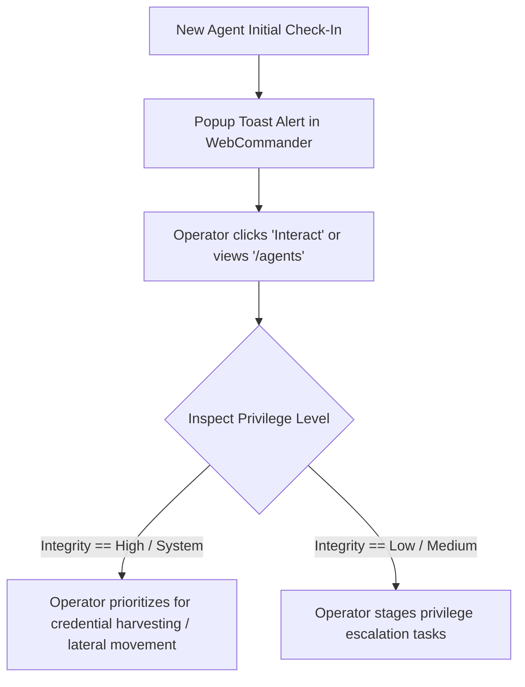

# Agent Fleet Management — Functional Documentation

## Purpose and Business Value

The **Agent Fleet Management** module provides comprehensive oversight and administration of all active, dormant, and decommissioned implants across the engagement scope. Key business benefits include:
- **Comprehensive Asset Inventory**: Real-time tabular tracking of every compromised foothold, detailing operating system, host architecture, username, and privilege level.
- **Heartbeat & Liveness Awareness**: Immediate visual identification of healthy, lagging, or lost connections through live-updating elapsed time counters.
- **Operational Hygiene & Decommissioning**: Safe termination and cleanup of decommissioned agents to leave minimal footprints after engagement completion.

---

## Actors and Triggers

- **Red Team Operator**: Navigates agent tables, selects targets for interaction, investigates privilege levels, and purges dead implants.
- **Implant (Agent)**: Sends recurring check-in beacons to the TeamServer, refreshing its `LastSeen` timestamp and operational metrics.
- **1-Second Timer**: Continuously increments and re-renders the "Last Seen" elapsed counter in the UI.

---

## Inputs and Outputs

### Inputs
- **Operator Actions**:
  - Clicking **Infos** to inspect deep process and system metadata.
  - Clicking **Tasks** to view command execution history.
  - Clicking **Loots** to inspect captured artifacts.
  - Clicking **Interact** to launch a live command shell.
  - Clicking **Delete** to terminate and remove an agent.

### Outputs
- **Agent Roster Table** (`/agents`):
  - **Name**: User-assigned or auto-generated agent identifier.
  - **Active Status**: `Yes` (healthy) or `No` (inactive/lagging, highlighted with a secondary gray row style).
  - **User & Host**: Current user identity and target hostname (e.g., `CORP\Administrator` on `DC01`).
  - **IP Address**: Target interface address in dot-decimal format.
  - **Integrity Level**: Target privilege level (`Low`, `Medium`, `High`, `System`).
  - **Process**: Hosting process executable name and Process ID (e.g., `svchost.exe (1420)`).
  - **Architecture & OS**: Target runtime platform (e.g., `x64 - Windows` or `x64 - Linux`).
  - **Endpoint**: Communication binding URI with directional indicator:
    - 🟢 *Left Arrow* (Listener Mode): The implant opened a port/pipe and is waiting for incoming connections.
    - 🔵 *Right Arrow* (Client Mode): The implant actively calls back outward to the TeamServer or relay node.
  - **Last Seen Counter**: Live elapsed time formatted dynamically (e.g., `04.20s`, `1m 12.00s`, `2h 15m`).
- **Detailed Agent Dossier** (`/agent-info/{id}`):
  - Subdivided into Agent Information, System Information, Process Information, and Connection Details.

---

## Operational Workflows

### 1. Agent Discovery & Triage

### 2. Inspecting Agent System Details
1. Operator navigates to `/agents`.
2. Locates the agent in the inventory and clicks **Infos**.
3. WebCommander renders the `/agent-info/{id}` view with complete telemetry:
   - Specific OS version and architecture.
   - Exact host PID, process path, and logon identity.
   - Configured beacon sleep interval (e.g., `5 seconds`).
   - Network address and protocol endpoint.
4. From the persistent header, the operator can switch directly to **Terminal**, **Tasks**, or **Loots** without losing context.

### 3. Decommissioning an Inactive Agent
1. If an implant becomes unreachable or the engagement scope changes, inactive agents display a **Delete** button.
2. Clicking **Delete** prompts a native confirmation dialog: `"Are you sure you want to delete agent <Name>?"`.
3. Upon operator confirmation, WebCommander issues an asynchronous termination call to the TeamServer, which cleans up server-side routing tables and removes the agent from the active list.

---

## Business Rules and Edge Cases

- **Real-Time Elapsed Time Formatting**: The `Last Seen` column uses a dedicated client-side timer updating once every second. Elapsed times automatically format into seconds, minutes, hours, or days (`1d 04h 12m 30.12s`) to give immediate situational awareness of beacon health.
- **Visual Separation of Active vs. Dormant Agents**: Inactive agents are visually shaded with the CSS class `table-secondary` to ensure operators immediately distinguish operational footholds from dormant sessions.
- **Relayed Agent Health Heuristics**: When an agent communicates through a peer-to-peer relay, its liveness status is evaluated against the relay parent's sleep interval rather than its own, accurately accounting for multi-hop communication latencies.

---

## Dependencies on Other Systems

- **TeamServer Agent Repository**: Manages active agent instances, metadata caching, and deletion endpoints (`DELETE /api/Agents/{id}`).
- **Interactive Terminal & Tasks**: Cross-linked directly from each row in the fleet table.

For technical implementation details, metadata classes, and state management, see [Technical: Services & State](../../Technical/WebCommander/services-and-state.md).
