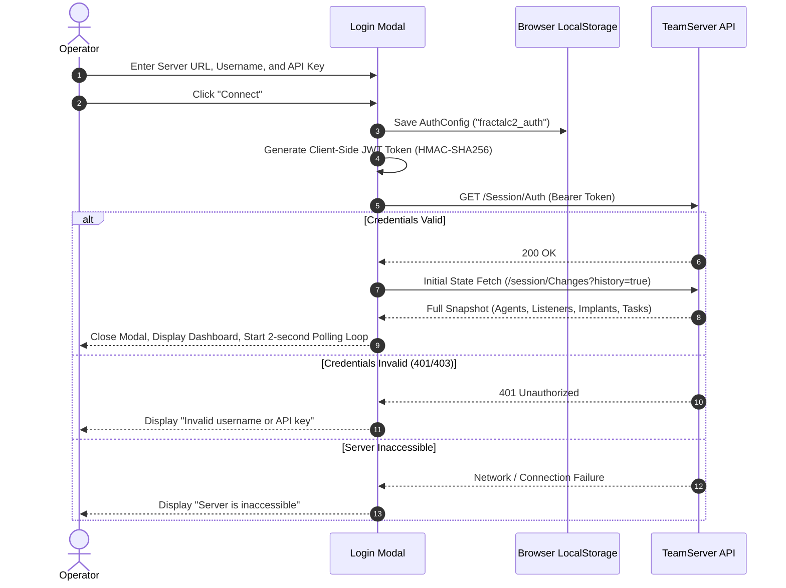

# Authentication & Connection Management — Functional Documentation

## Purpose and Business Value

In an active cyber assessment, secure and uninterrupted communication between the operator's interface and the command-and-control server (TeamServer) is critical. The **Authentication & Connection Management** module provides:
- **Zero-Installation Secure Access**: Operators can authenticate from any modern web browser without installing local CLI runtimes or operating system packages.
- **Session Continuity**: Credentials and active session identifiers are preserved in the browser's persistent storage, allowing operators to reload or close their browser without losing active state.
- **Real-Time Health Monitoring & Failover Awareness**: The system continuously tests connection viability and immediately alerts the operator when network anomalies, server restarts, or authentication expirations occur, preventing silent command failures.

---

## Actors and Triggers

- **Red Team Operator**: Launches WebCommander in the browser, enters TeamServer credentials, switches servers, or disconnects upon shift handover.
- **Automatic Background Poller**: Sends periodic status checks (every 2 seconds) to verify connectivity and synchronize operational updates.
- **TeamServer**: Accepts or rejects connection tokens, signaling invalid keys or expired sessions.

---

## Inputs and Outputs

### Inputs
- **TeamServer URL**: The HTTP/HTTPS endpoint of the central TeamServer (e.g., `http://localhost:5000` or `https://c2.internal.lab:8443`).
- **Username**: Operator's handle (used in task audit trails, logs, and token generation).
- **API Key**: The pre-shared secret key configured on the TeamServer.

### Outputs
- **Connection Status**: Visual feedback indicating whether the connection is active, connecting, re-authenticating, or disconnected.
- **User Session Display**: Logged-in username and disconnect control in the global navigation bar.
- **Error Overlays**: Full-screen modal warnings when authentication fails or the server becomes unreachable.

---

## Operational Workflows

### 1. Operator Login & Session Initialization

### 2. Disconnection & Handover
1. The operator clicks on their username in the upper-right corner of the interface.
2. The user menu expands, presenting a **Disconnect** option.
3. Clicking **Disconnect** terminates the polling timer, clears all in-memory caches (agents, tasks, listeners, implants), purges the authentication record from `localStorage`, and displays the modal login screen.

---

## Business Rules and Edge Cases

- **Client-Side Cryptographic Token Generation**: Authentication tokens are signed directly in the browser using the shared API key. If the operator enters an API key with an invalid key length (less than the HMAC-SHA256 requirement), the system gracefully catches the cryptographic error and displays an "Invalid username or API key" notice.
- **Transparent Automatic Reconnection**: If the TeamServer is temporarily restarted or network connectivity drops, WebCommander displays a non-blocking `TeamServer Unavailable` overlay and automatically retries in the background. Once the server recovers, the overlay automatically dismisses, and state synchronization resumes seamlessly.
- **Expired Credentials Lockout**: If an operator's credentials are revoked or become invalid while operating, the polling loop immediately halts to prevent log pollution and presents an **Authorization Failed** screen prompting for re-authentication.

---

## Dependencies on Other Systems

- **TeamServer Session Controller**: Relies on `/Session/Auth` and `/session/Changes` to validate operational access.
- **Browser Web Storage**: Requires `localStorage` support enabled in the operator's browser.

For technical implementation details, service registrations, and token generation algorithms, see [Technical: Services & State](../../Technical/WebCommander/services-and-state.md).
