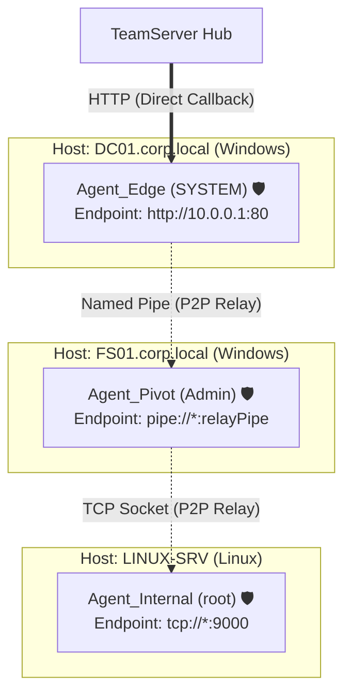

# Operational Dashboard & Network Topology — Functional Documentation

## Purpose and Business Value

During red team engagements, maintaining situational awareness of the operational perimeter is paramount. The **Operational Dashboard & Topology Mapping** module provides:
- **Instant Metric Visibility**: Real-time counters showing active vs. inactive agents, running listeners, and compiled implants.
- **Relay Mesh Understanding**: Visualizing multi-tier, peer-to-peer (P2P) agent pivoting across isolated target networks, showing how commands traverse intermediary footholds.
- **Fast Navigation & Contextual Actions**: One-click drill-down from the topology map into agent terminals, detailed telemetry cards, task histories, and harvested loot.

---

## Actors and Triggers

- **Red Team Operator / Lead**: Views the dashboard upon logging in to evaluate operational posture, identify disconnected agents, and monitor pivot chains.
- **Background Synchronization Engine**: Updates the dashboard tiles and topology node layout in real time as agents check in or drop offline.

---

## Inputs and Outputs

### Inputs
- **Agent Telemetry**: Metadata streamed from active agents including hostname, username, process ID, integrity level, OS type, and endpoint binding.
- **P2P Relay Links**: Connection URLs indicating parent-child relationships between edge agents and internal mesh nodes.
- **Operator Interaction**: Clicking KPI cards or clicking specific agent nodes on the SVG topology canvas.

### Outputs
- **High-Level KPI Tiles**:
  - **Agents**: Active count (green) vs. Inactive count (orange), plus total count.
  - **Listeners**: Active running listeners count.
  - **Implants**: Available staged payloads count.
- **Interactive SVG Topology Canvas**:
  - **TeamServer Node**: Central hub rendered with server rack styling.
  - **Host Grouping Boxes**: Distinct host containers displaying target hostnames and OS badges (Windows vs. Linux icons).
  - **Agent Nodes**: Individual agent glyphs with alive/dead badges, integrity shields (🛡️ for High/System privileges), and usernames.
  - **Direct Links**: Solid blue vector lines connecting the TeamServer to edge agents, labeled with connection protocol (`HTTP`, `HTTPS`). Arrow directions accurately convey whether the connection is a client callback or an ingress listener.
  - **Peer-to-Peer Links**: Dashed orange lines representing internal relay hops between agents (e.g., `pipe://` or `tcp://`).
- **Contextual Action Popup Menu**: Options to **Interact**, **View Info**, **Tasks**, or **Loots** for any selected agent.

---

## Operational Workflows

### 1. Monitoring Fleet Status & Pivots

### 2. Contextual Node Interaction
1. The operator navigates to `/` (Dashboard).
2. The operator locates a target agent node inside its respective host box on the diagram.
3. Clicking on the agent displays a contextual menu positioned at the mouse cursor.
4. If the agent is active, the operator clicks **Interact** to directly launch a terminal session with that agent; if offline, **Interact** is disabled while **View Info**, **Tasks**, and **Loots** remain accessible for historical review.

---

## Business Rules and Edge Cases

- **Agent Liveness Calculation**:
  - For standard agents with a sleep interval, an agent is marked inactive if its last check-in exceeds `Min(3, SleepInterval) * 3` seconds from current UTC time.
  - For relayed agents (children operating behind a P2P parent), liveness evaluates the parent relay agent's sleep interval.
  - For interactive agents (`SleepInterval == 0`), an agent is marked inactive if no heartbeat occurs within 10 seconds.
- **Directional Arrow Semantics**:
  - **Client Mode**: Arrowheads point toward the receiving server or parent (implant connects out).
  - **Listener Mode**: Arrowheads point toward the agent (implant binds local socket/pipe awaiting incoming connections).
- **Responsive Dynamic Canvas**: The SVG automatically recalculates column widths, label dimensions, and total layout height based on the maximum number of agents hosted on a single machine, ensuring no node clipping.

---

## Dependencies on Other Systems

- **Agent Management Subsystem**: Feeds agent metadata and last-seen timestamps to the layout engine.
- **TeamServer Changes API**: Pushes real-time graph updates to subscribers via the `AgentService`.

For technical implementation details, SVG coordinate calculations, and component structure, see [Technical: Components & UI](../../Technical/WebCommander/components-and-ui.md).
