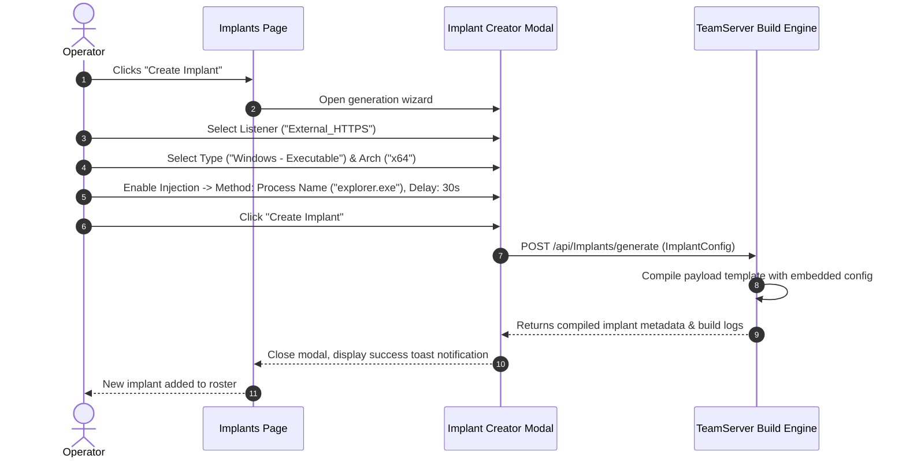

# Implant Generation & Staging — Functional Documentation

## Purpose and Business Value

To gain initial access or expand footholds across target networks, operators need payloads tailored to specific operating systems, execution constraints, and defense evasion postures. The **Implant Generation & Staging** module provides:
- **On-Demand Custom Payloads**: Generates compiled binaries, scripts, and shellcode directly through an intuitive wizard without requiring local compiler chains.
- **Process Injection & Evasion Capabilities**: Configures implants to inject into running host processes (by PID or process name) or spawn sacrificial processes with configurable execution delays.
- **Instant Deployment One-Liners**: Automatically generates ready-to-use PowerShell and Bash download-and-execute commands tailored to active listeners.

---

## Actors and Triggers

- **Red Team Operator**: Configures and compiles new implants, copies deployment one-liners, or downloads compiled files to the operator's machine.
- **TeamServer Build Subsystem**: Compiles the source template, embeds configured endpoints and keys, and hosts the generated artifact.

---

## Inputs and Outputs

### Inputs
- **Listener Selection**: Choose an existing HTTP/HTTPS listener, or select **Custom Endpoint** to configure custom P2P relay endpoints (Named Pipe or TCP).
- **Endpoint Settings**:
  - *Protocol*: `http`, `https`, `pipe`, or `tcp`.
  - *Address / Port*: Required for HTTP/HTTPS/TCP callbacks.
  - *Pipe Name*: Alphanumeric name for P2P SMB pipes (e.g., `auditPipe`).
- **Implant Parameters**:
  - *Type*: PowerShell (`.ps1`), Executable (`.exe`), Dynamic Link Library (`.dll`), Reflective DLL, Windows Service (`.exe`), Raw Shellcode (`.bin`), or Linux ELF (`.elf`).
  - *Architecture*: `x64` (64-bit) or `x86` (32-bit).
  - *Flags*: Debug mode, verbose compilation logs.
- **Process Injection Settings** (Optional):
  - *Method*: Target existing Process ID (PID), target existing Process Name (e.g., `explorer.exe`), or Spawn a new process image.
  - *Injection Delay*: Number of seconds to sleep before executing payload injection (evasion technique against sandboxes).

### Outputs
- **Implant Roster** (`/implants`):
  - Displays all compiled implants with format, target architecture, endpoint URL, listener, and injection configuration.
- **Deployment Scripts Modal**:
  - **PowerShell Clear One-Liner**: Ready-to-paste command with built-in TLS/SSL certificate validation bypass.
  - **PowerShell Base64 One-Liner**: Obfuscated command avoiding quotes and special characters.
  - **Linux Bash One-Liner**: Silent curl-and-execute memory payload staged in `/dev/shm`.
  - **PowerShell Binary Stager**: Automated download script saving executables to disk.
- **Binary Download**: Direct browser download of compiled artifacts.

---

## Operational Workflows

### 1. Generating a Windows Payload with Process Injection

### 2. Copying Delivery Scripts
1. On the `/implants` table, operator clicks **Scripts** next to any generated implant.
2. WebCommander opens the **Deployment Scripts** modal.
3. If the payload is a PowerShell script, it displays both the clear-text `IEX (New-Object Net.WebClient)...` command and the base64-encoded `powershell -noP -sta -w 1 -e ...` command.
4. If the payload is a Linux ELF binary, it displays a `curl -s -o /dev/shm/...` command.
5. The operator clicks **Copy** to place the script on the system clipboard for immediate execution.

---

## Business Rules and Edge Cases

- **Linux ELF Constraints**: Linux ELF implants only support `x64` architecture (the UI disallows `x86`), and cannot be configured with Windows `pipe://` endpoints.
- **Named Pipe Validation**: Named pipe identifiers must be strictly alphanumeric and cannot begin with a numeric digit, ensuring compliance with Windows OS named pipe naming standards.
- **TLS Bypass Stagers**: All generated PowerShell stagers automatically prepend an in-memory SSL certificate handler that ignores certificate errors, ensuring callbacks succeed even when using self-signed lab TLS certificates.

---

## Dependencies on Other Systems

- **Listeners**: Implants must target an active listener or valid P2P bind address.
- **TeamServer Compiler Subsystem**: Handles Roslyn / native binary compilation.

For technical implementation details, script helpers, and parameter serialization, see [Technical: Components & UI](../../Technical/WebCommander/components-and-ui.md).
