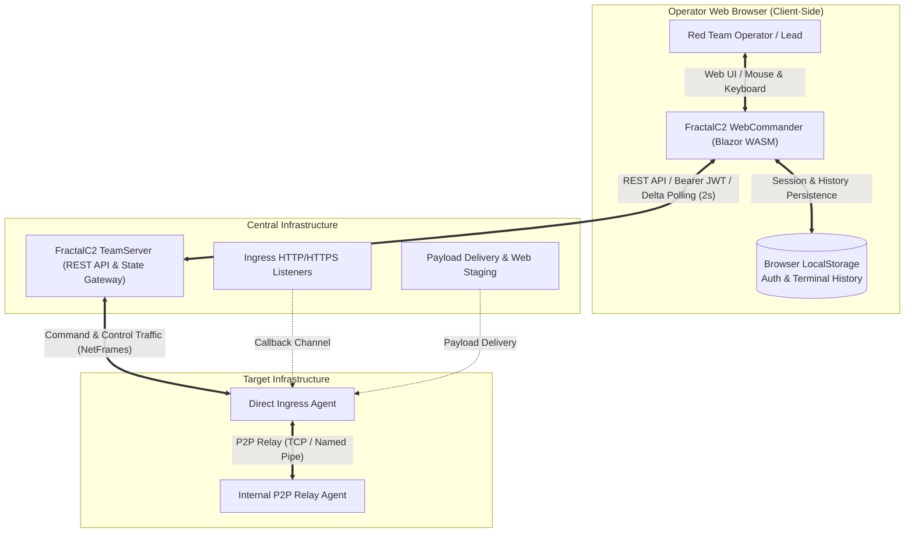
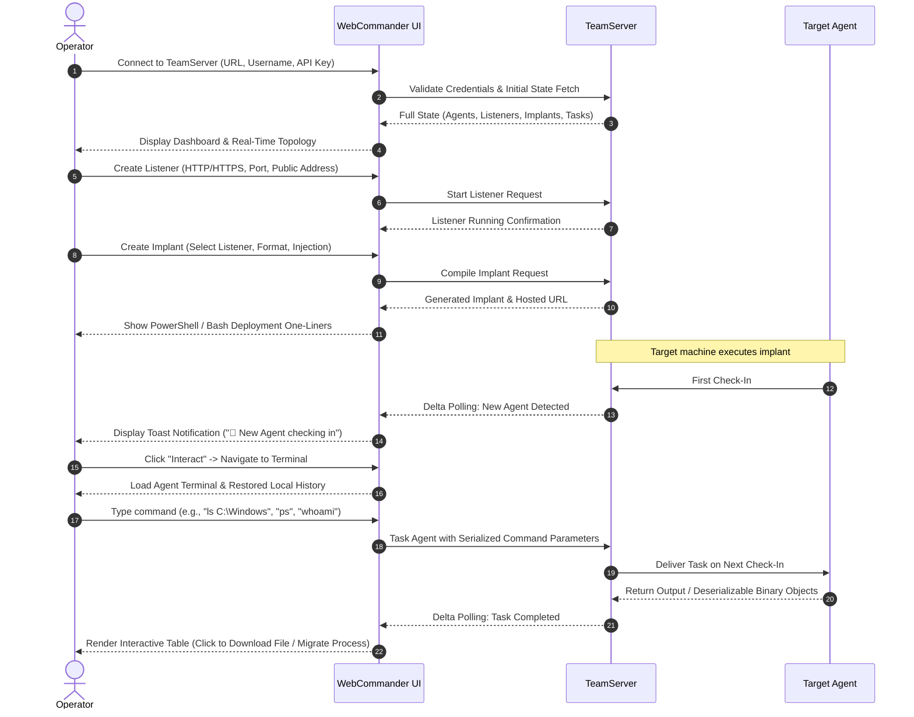

# FractalC2 WebCommander — Functional Documentation

## Overview

The **FractalC2 WebCommander** is a modern, single-page web management and operational control center for the FractalC2 platform. Designed specifically for red team operators, offensive security practitioners, and engagement leads, WebCommander provides a responsive web cockpit to control all facets of offensive cyber operations directly from a browser.

While the companion `Commander.csproj` provides a terminal-based CLI console, **WebCommander** delivers visual situational awareness, including live agent topology network diagrams, tabular telemetry monitoring, visual implant generation wizards, exfiltrated loot image galleries, and interactive terminal sessions directly inside any modern web browser.

---

## Core Capabilities & Functional Areas

WebCommander is organized into distinct functional capability modules that support all phases of offensive security testing:

| Functional Area | Description | Functional Guide | Technical Reference |
| :--- | :--- | :--- | :--- |
| **Authentication & Connection Management** | Server connection configuration, API key credential storage, automatic reconnection handling, and real-time connectivity health monitoring. | [Authentication & Connection](./authentication-and-connection.md) | [Services & State](../../Technical/WebCommander/services-and-state.md) |
| **Operational Dashboard & Topology Mapping** | Visual operational overview, active asset counters, and interactive SVG network topology diagram showing host groupings and peer-to-peer relay meshes. | [Dashboard & Topology](./dashboard-and-topology.md) | [Components & UI](../../Technical/WebCommander/components-and-ui.md) |
| **Agent Fleet Management** | Real-time agent inventory, heartbeat delta monitoring, system metadata inspection (PID, integrity, OS, architecture), and agent decommissioning. | [Agent Management](./agent-management.md) | [Components & UI](../../Technical/WebCommander/components-and-ui.md) |
| **Interactive Terminal & Interactive Results** | In-browser command line interface with local history, auto-scrolling, interactive output tables (file exploration, process migration, job termination), and direct file uploads. | [Interactive Terminal](./interactive-terminal.md) | [Command System](../../Technical/WebCommander/command-system.md) |
| **Task Orchestration & Result Inspection** | Historical timeline of tasked commands per agent, visual execution status lifecycle (Queued, Running, Completed, Error), detailed result viewer, and loot saving. | [Task Management](./task-management.md) | [Components & UI](../../Technical/WebCommander/components-and-ui.md) |
| **Listener & Infrastructure Control** | Dynamic instantiation and teardown of ingress HTTP and HTTPS listeners, port allocation, and public connection address management. | [Listener Management](./listener-management.md) | [Services & State](../../Technical/WebCommander/services-and-state.md) |
| **Implant Generation & Staging** | Multi-format payload compiler interface (PowerShell, Windows Executable, DLL, Service, Linux ELF, Shellcode), process injection settings, and deployment script generators. | [Implant Generation](./implant-generation.md) | [Components & UI](../../Technical/WebCommander/components-and-ui.md) |
| **Payload Delivery & Web Hosting** | Central web staging repository to host tools and payloads on listeners, with ready-to-use PowerShell and Bash download one-liners. | [Web Hosting](./web-hosting.md) | [Services & State](../../Technical/WebCommander/services-and-state.md) |
| **Offensive Toolset Management** | Central repository for post-exploitation tools (.exe and .ps1), fast filtering, and single-click execution via inline assembly or process execution. | [Tools Repository](./tools-repository.md) | [Command System](../../Technical/WebCommander/command-system.md) |
| **Loot & Exfiltration Management** | Gallery for captured screenshots with full-size inspection, exfiltrated file catalog with direct browser download, and manual artifact upload. | [Loot Management](./loot-management.md) | [Components & UI](../../Technical/WebCommander/components-and-ui.md) |
| **Network Pivoting & SOCKS Proxies** | SOCKS proxy instantiation and port management on compromised targets to facilitate lateral network pivoting. | [Network Pivoting](./network-pivoting.md) | [Services & State](../../Technical/WebCommander/services-and-state.md) |

---

## Standard Operator Workflow

During an engagement, an operator typically navigates through WebCommander following this lifecycle:

---

## Target Audience & Operational Roles

- **Red Team Operators**: Conduct real-time post-exploitation, issue agent commands, exfiltrate data, pivot across subnets, and monitor agent connectivity without needing local software installations.
- **Engagement Leads**: Monitor operation scope, view live agent topologies, audit task execution histories, and evaluate team progress across multi-host environments.
- **Instructors & Training Coordinators**: Provide students and trainees with an accessible, browser-based user interface for adversary emulation exercises without requiring complex local CLI setups.
- **Blue Teams & Purple Teams**: Observe C2 control workflows and operational patterns to better understand adversary methodologies and improve threat detection logic.

For in-depth developer documentation, architectural diagrams, dependency analysis, and class references, see the [Technical Documentation Index](../../Technical/WebCommander/index.md).
