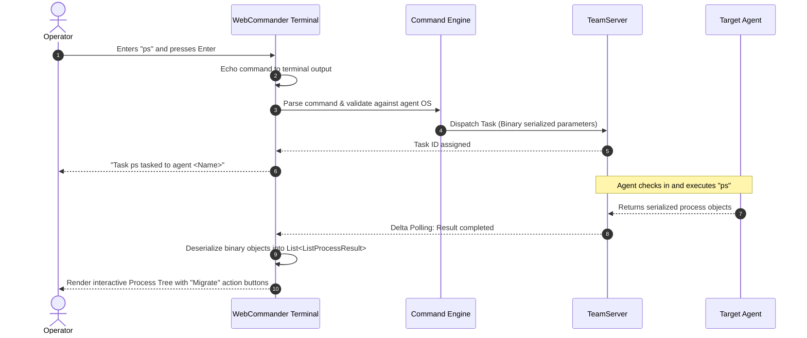

# Interactive Terminal & Interactive Results — Functional Documentation

## Purpose and Business Value

The **Interactive Terminal** is the primary operational console within WebCommander. It enables operators to directly control compromised agents through an authentic command-line experience inside the web browser. Key business benefits include:
- **Zero-Friction In-Browser Operations**: Eliminates the need to switch out of the browser to a separate desktop CLI application.
- **Interactive Actionable Outputs**: Rather than displaying static text, structured command outputs (such as file listings and process trees) become interactive widgets where operators can click to download files, navigate folders, or migrate processes.
- **Operator State Continuity**: Full terminal output lines, command history, and task-to-command mappings are preserved in the browser's local storage per agent, allowing operators to switch tabs or refresh pages without losing context.

---

## Actors and Triggers

- **Red Team Operator**: Types commands at the terminal prompt, navigates command history with keyboard arrow keys, or clicks interactive action menus in output tables.
- **Agent Service Event Dispatcher**: Receives task results from the TeamServer and asynchronously appends formatted responses into the active terminal display.
- **Tools Subsystem**: Automatically redirects to the terminal with pre-populated commands when an operator executes a tool from the Tools catalog.

---

## Inputs and Outputs

### Inputs
- **Terminal Input Line**: Shell commands entered by the operator (e.g., `whoami`, `ps`, `ls C:\`, `download secret.docx`, `upload`, `execute-pe SharpDump.exe`).
- **Keyboard Navigation**:
  - `Enter`: Submits the command for execution.
  - `Up Arrow` / `Down Arrow`: Cycles through previous commands in history.
- **Browser File Picker**: Triggered automatically when executing the `upload` command.
- **Interactive Table Clicks**: Selecting actions from contextual dropdown buttons within rendered tables.

### Outputs
- **Formatted Terminal Stream**:
  - 🔵 **Command Echo**: `AgentName > command`
  - ℹ️ **Informational Lines**: Connection details, status changes, task initiation banners.
  - 🟢 **Success Messages**: Task queued confirmations and successful execution notices.
  - 🔴 **Error Messages**: Task execution failures, invalid arguments, or agent errors.
- **Interactive Actionable Tables**:
  - **Directory Listing (`ls` / `dir`)**: Displays file/directory rows with an action dropdown:
    - *For Files*: **Download** (triggers agent file download) and **Delete** (prompts confirmation, executes `del`).
    - *For Directories*: **List** (`ls`), **Enter** (`cd`), and **Delete** (`rmdir`).
  - **Process Tree (`ps`)**: Displays a hierarchical parent-child process tree highlighting the implant's current host process. Action dropdown allows **Migrate here** (executes `migrate <PID>` on Windows agents).
  - **Background Jobs (`job`)**: Displays running background threads and services. Action dropdown allows **Kill Job** (`job kill -i <JobID>`).
  - **Peer Links (`link`)**: Displays mesh connections between agents. Action dropdown allows **Unlink** (`link stop -b <Binding>`).
  - **Reverse Port Forwards (`rportfwd`)**: Displays active reverse tunnels with port, destination host, and destination port.

---

## Operational Workflows

### 1. Command Execution & Result Streaming

### 2. Browser-Assisted File Upload
1. The operator types `upload` (or `upload C:\temp\payload.bin`) in the terminal.
2. WebCommander intercepts the command before dispatching and displays the **File Upload Modal**.
3. The operator clicks **Select Local File** and selects any file from their local computer.
4. The browser reads the file bytes directly into memory.
5. The operator clicks **Select**, and WebCommander packages the raw file bytes into the binary task payload and dispatches it to the agent.

---

## Business Rules and Edge Cases

- **Local Terminal Commands**:
  - Commands `clear` and `cls` are processed purely client-side: they wipe the terminal screen, redisplay the initial agent banner, and update `localStorage`.
- **Command History Scoping**: Each agent maintains its own isolated command history. Navigating between agents never mixes command records.
- **Operating System Command Filtering**: The `help` command queries the command registry and dynamically filters available commands based on the active agent's operating system (`Windows` vs. `Linux`), preventing operators from executing unsupported commands.
- **Automatic Scroll-To-Bottom**: As new lines or tables are streamed into the terminal, JavaScript interop smoothly scrolls the viewport to the bottom unless the operator has manually scrolled up to inspect earlier lines.

---

## Dependencies on Other Systems

- **Command Subsystem (`Common.AgentCommands`)**: Provides the command definitions, argument parsers, and execution logic.
- **Browser LocalStorage**: Retains terminal text and command history across browser refreshes.

For technical implementation details, adapter classes, and command execution pipelines, see [Technical: Command System](../../Technical/WebCommander/command-system.md).
