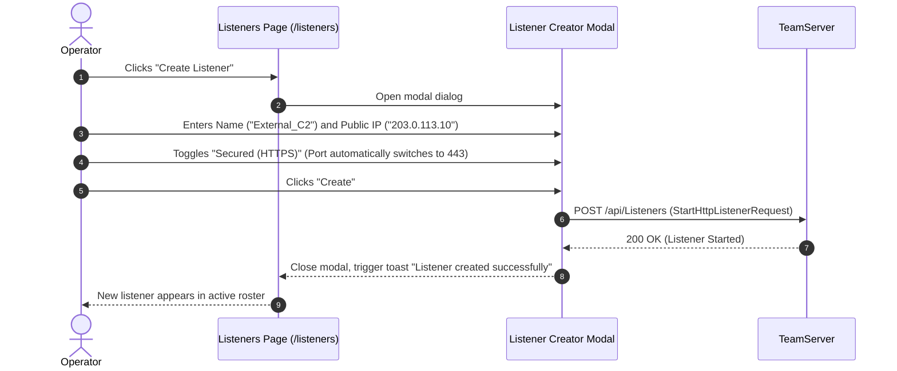

# Listener & Infrastructure Control — Functional Documentation

## Purpose and Business Value

Ingress listeners are the entry points through which implants establish communication with the FractalC2 infrastructure. The **Listener & Infrastructure Control** module provides:
- **Dynamic Ingress Provisioning**: Allows operators to spawn and terminate HTTP/HTTPS listeners on demand without restarting the TeamServer.
- **Segregation of Listening vs. Public Addressing**: Clearly differentiates the server's local bind interface (`0.0.0.0`) from the public IP/FQDN or redirector domain presented to implants.
- **Encrypted Ingress Channels**: Seamless configuration of TLS/HTTPS security to blend C2 traffic with regular web traffic and prevent inspection by perimeter network sensors.

---

## Actors and Triggers

- **Red Team Operator**: Creates new listeners to support specific operational phases, or shuts down exposed ports when an engagement concludes.
- **TeamServer**: Manages underlying web server instances (Kestrel) and binds incoming ports.

---

## Inputs and Outputs

### Inputs
- **Listener Configuration Form**:
  - **Name**: An administrative identifier for the listener (e.g., `External_HTTPS`, `Internal_HTTP`).
  - **Listening Address**: Internal binding address (fixed to `0.0.0.0` for all available interfaces).
  - **Public Address**: Public IP or domain name that implants will target during check-in (e.g., `c2.targetcorp-update.com` or `192.168.1.50`).
  - **Port**: TCP port to bind (default: `443` for HTTPS, `80` for HTTP).
  - **Secured (HTTPS)**: Checkbox toggling TLS encryption.

### Outputs
- **Listener Roster Table** (`/listeners`):
  - Displays all running listeners with their Name, Public Address, Port, and a `Yes` (green) or `No` (gray) badge for TLS status.
  - **Stop Action**: Immediately ceases listening on the specified port.

---

## Operational Workflows

### 1. Provisioning a Secure HTTPS Listener

### 2. Stopping a Listener
1. Operator navigates to `/listeners`.
2. Locates the listener and clicks **Stop**.
3. WebCommander issues a deletion call to the TeamServer.
4. The TeamServer stops the listening socket, and WebCommander displays a success confirmation toast.

---

## Business Rules and Edge Cases

- **Smart Port Defaults**: Toggling the **Secured (HTTPS)** checkbox automatically updates the default port: checking it switches port `80` to `443`, while unchecking it switches `443` to `80`. Operators may still manually customize the port (e.g., `8443` or `8080`).
- **Conflict Prevention**: If a requested port is already in use by another application or listener, the TeamServer rejects the request with an error message, which WebCommander renders in a notification toast.

---

## Dependencies on Other Systems

- **Implant Generation**: Implants reference configured listeners to determine their callback addresses and encryption protocols.
- **Web Hosting**: Hosted files are exposed through active listeners.

For technical implementation details and request models, see [Technical: Services & State](../../Technical/WebCommander/services-and-state.md).
