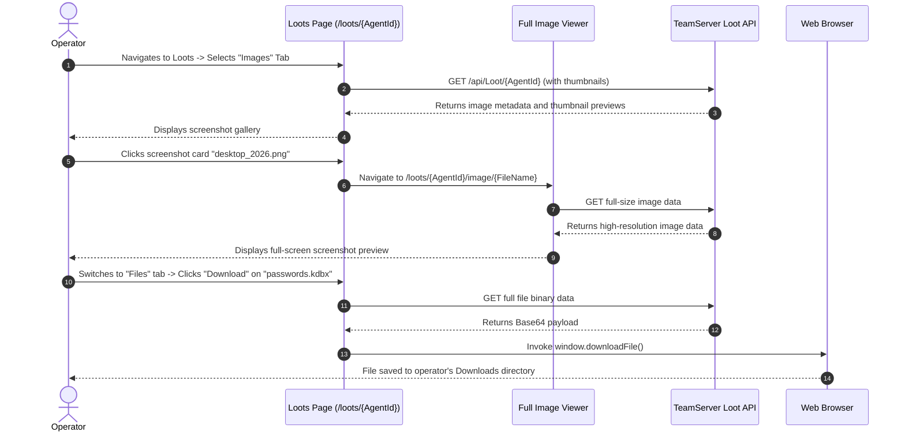

# Loot & Exfiltration Management — Functional Documentation

## Purpose and Business Value

During red team operations and penetration tests, capturing evidence (credentials, configuration files, confidential databases, desktop screenshots) demonstrates assessment impact. The **Loot & Exfiltration Management** module provides:
- **Centralized Engagement Vault**: Automatically associates exfiltrated files, screen captures, and saved task outputs with the originating compromised host.
- **Visual Screenshot Gallery**: Thumbnail grid viewer enabling rapid browsing of captured victim desktop screenshots without downloading large files.
- **Direct Browser Exfiltration & Ingestion**: One-click download of exfiltrated artifacts to the operator's machine, or manual upload of external artifacts up to 100MB.

---

## Actors and Triggers

- **Red Team Operator**: Browses captured screenshots, downloads exfiltrated files, or manually uploads evidence to the loot repository.
- **Automated Agent Tasks**: Commands such as `capture` (screenshots), `download` (file transfer), or the "Add to Loot" task button push artifacts directly into the loot vault.

---

## Inputs and Outputs

### Inputs
- **Loot Upload**: Browser file input accepting files up to 100MB.
- **Navigation**: Tab toggles between **Images** and **Files**.
- **Inspection**: Clicking on a screenshot card to inspect it in full resolution.

### Outputs
- **Loot Image Gallery** (`/loots/{AgentId}` -> Images Tab):
  - Thumbnail gallery rendering base64 image data previews with responsive card layouts and hover effects.
- **Full-Screen Image Viewer** (`/loots/{AgentId}/image/{FileName}`):
  - High-resolution modal viewer with zoom and delete controls.
- **File Catalog** (`/loots/{AgentId}` -> Files Tab):
  - Table of text logs, downloaded binaries, and database dumps with file size and **Download** / **Delete** actions.
- **Direct File Download**: JavaScript-driven binary stream download directly through the browser.

---

## Operational Workflows

### 1. Reviewing and Downloading Exfiltrated Files

---

## Business Rules and Edge Cases

- **Automatic Media Detection**: When files are uploaded or exfiltrated, WebCommander inspects file extensions (`.png`, `.jpg`, `.jpeg`, `.gif`, `.bmp`, `.webp`) and automatically categorizes them into either the image gallery or the file list.
- **Bandwidth-Optimized Gallery**: The initial gallery view fetches lightweight thumbnails rather than full image payloads, conserving network bandwidth during low-speed or mobile tethered operations.

---

## Dependencies on Other Systems

- **TeamServer Loot API**: Serves file data and thumbnail streams (`/api/Loot`).
- **JavaScript Interop (`downloadFile`)**: Manages browser blob creation and download triggers.

For technical implementation details, see [Technical: Components & UI](../../Technical/WebCommander/components-and-ui.md).
