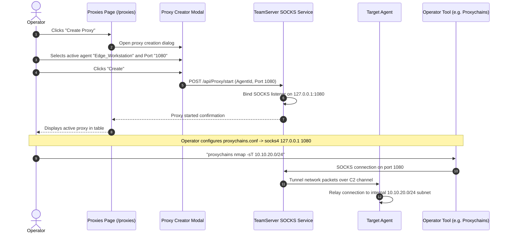

# Network Pivoting & SOCKS Proxies — Functional Documentation

## Purpose and Business Value

During complex network assessments, initial footholds reside in perimeter DMZs or restricted workstation subnets. The **Network Pivoting & SOCKS Proxies** module provides:
- **Lateral Subnet Reachability**: Spawns SOCKS proxies through compromised implants, enabling operators to route third-party security tools (e.g., Nmap, Metasploit, web browsers, crackmapexec) through the implant into segmented target networks.
- **Port Forwarding Management**: Tracks and controls reverse port forwarding rules (`rportfwd`) to route traffic from target internal hosts back to designated adversary endpoints.
- **Active Channel Administration**: Centralized dashboard to monitor and stop proxy tunnels across the entire target environment.

---

## Actors and Triggers

- **Red Team Operator**: Launches SOCKS proxies on active agents, maps internal target subnets, and terminates proxies upon assessment completion.
- **External Security Tools**: Connect via proxychains or standard SOCKS clients to the local port opened by the TeamServer.

---

## Inputs and Outputs

### Inputs
- **Create Proxy Wizard**:
  - *Target Agent*: Selection dropdown filtered to active, responsive implants.
  - *Proxy Port*: Local port on the TeamServer machine where the SOCKS server should listen (default: `1080`).

### Outputs
- **Proxy Inventory Table** (`/proxies`):
  - Displays listening port, hosting agent identity (Agent Name, Username, and Hostname), and a **Stop** action button.
- **Reverse Port Forwarding Telemetry**:
  - Live inspection of active reverse tunnels displayed within the interactive terminal and task results viewer.

---

## Operational Workflows

### 1. Establishing a SOCKS Proxy for Internal Pivoting

---

## Business Rules and Edge Cases

- **Agent Liveness Restriction**: Proxies can only be created on active, healthy agents. If an agent is lagging or dead, it is automatically excluded from the selection dropdown.
- **Port Conflict Safeguards**: If the specified SOCKS port is already bound by another service on the TeamServer host, the server rejects the request with an error message rendered in an error toast.
- **Graceful Termination**: Clicking **Stop** immediately shuts down the SOCKS listener socket on the TeamServer and signals the agent to close any active network sockets, preventing orphan sockets on target networks.

---

## Dependencies on Other Systems

- **TeamServer Proxy Subsystem**: Manages the local SOCKS listener and tunnel multiplexing (`/api/Proxy`).
- **Agent Pivoting Engine**: Underlying implant TCP connection multiplexing code.

For technical implementation details, see [Technical: Services & State](../../Technical/WebCommander/services-and-state.md).
