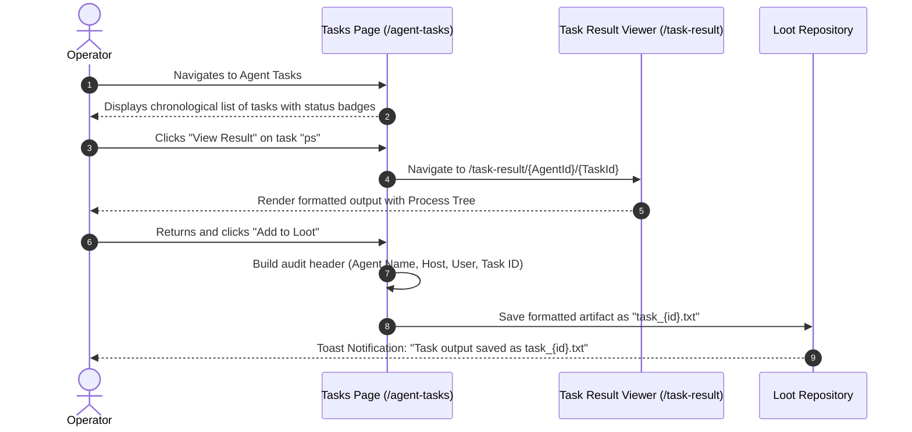

# Task Management & Result Inspection — Functional Documentation

## Purpose and Business Value

Post-exploitation operations involve dispatching dozens or hundreds of commands to distributed agents. The **Task Management & Result Inspection** module provides:
- **Asynchronous Audit Trail**: A complete, chronological historical record of every command dispatched to an agent, including timestamp, parameters, and outcome.
- **Execution Lifecycle Tracking**: Real-time status indicators (Queued, Running, Completed, Error) ensuring operators know when commands are awaiting agent check-in or execution.
- **Loot Integration**: One-click extraction of command outputs directly into the permanent operational loot repository for reporting and evidence collection.

---

## Actors and Triggers

- **Red Team Operator**: Reviews task history, investigates failed commands, views full outputs, or exports task data to loot.
- **Agent Service**: Updates task status indicators in real time as implants fetch and execute queued jobs.

---

## Inputs and Outputs

### Inputs
- **Task Selections**: Clicking **View Result** or **Add to Loot** on specific tasks.
- **Agent Selection**: Navigating to an agent's task record via `/agent-tasks/{AgentId}`.

### Outputs
- **Task History Roster** (`/agent-tasks/{AgentId}`):
  - **ID**: Unique short task identifier.
  - **Date**: Localized timestamp of when the command was issued.
  - **Command**: Full command line string dispatched to the agent.
  - **Status Badge**:
    - ⏳ **Queued**: Awaiting next implant beacon.
    - ▶️ **Running**: Currently executing on the target.
    - ✅ **Completed**: Successfully returned results.
    - ❌ **Error**: Execution failed on the target host.
- **Dedicated Task Result Viewer** (`/task-result/{AgentId}/{TaskId}`):
  - Dark-themed terminal console displaying full raw output, deserialized tables (directory listings, process trees, jobs, links, reverse port forwards), error messages, and informational logs.
- **Automated Loot Generation**:
  - Automatically formats the task result into a structured text artifact containing operational headers (Target Hostname, User, Agent ID, Task ID, Timestamp, and Output) and stores it in the agent's loot vault.

---

## Operational Workflows

### 1. Inspecting Task Results

---

## Business Rules and Edge Cases

- **Intelligent Object Deserialization in Results**: If a task output contains binary serialized data (e.g., directory listings or process lists), both the dedicated Result Viewer and the "Add to Loot" generator automatically deserialize and render formatted tables rather than raw unreadable binary bytes.
- **Preserved Status History**: Even if an implant drops offline, all completed and failed task results remain fully accessible for auditing, retrospective reporting, and debriefing.

---

## Dependencies on Other Systems

- **TeamServer Tasks API**: Supplies task records (`/api/Tasks/{id}`) and task results (`/api/Tasks/{id}/result`).
- **Loot Subsystem**: Stores exported task results as evidence files.

For technical implementation details, deserialization helpers, and result parsing logic, see [Technical: Components & UI](../../Technical/WebCommander/components-and-ui.md).
