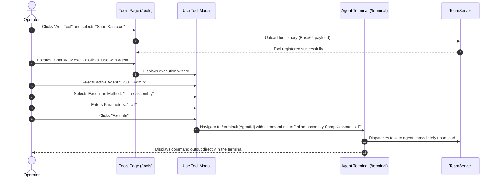

# Offensive Toolset Management — Functional Documentation

## Purpose and Business Value

Post-exploitation engagements rely on diverse specialized tooling (e.g., BloodHound collectors, Mimikatz, Seatbelt, PowerView, SharpUp). The **Offensive Toolset Management** module provides:
- **Centralized Arsenal Repository**: Upload and maintain a shared library of offensive executables (`.exe`) and PowerShell scripts (`.ps1`) on the TeamServer.
- **Fast Search & Type Filtering**: Quickly filter through large collections of operational tools by name or binary format.
- **Single-Click Agent Execution Wizard**: Execute tools directly against any active agent without manually typing long file paths or remember complex execution syntax.

---

## Actors and Triggers

- **Red Team Operator**: Uploads new offensive tools, searches the catalog, and dispatches tools against target agents.
- **Terminal Subsystem**: Receives pre-constructed execution commands via navigation state and executes them upon terminal focus.

---

## Inputs and Outputs

### Inputs
- **Tool Upload**: Browser file selector accepting `.exe` or `.ps1` files up to 50MB.
- **Search & Filters**: Text query (debounced by 300ms) and category buttons (`All`, `PowerShell`, `Exe`, `DotNet`).
- **Use Tool Wizard**:
  - *Target Agent*: Dropdown listing only healthy, active agents.
  - *Execution Method* (for .NET binaries): Choice between `inline-assembly` (executes in-process without spawning) and `execute-assembly` (spawns sacrificial process).
  - *Parameters*: Optional command-line arguments to pass to the tool.

### Outputs
- **Tools Catalog Table** (`/tools`):
  - Displays tool name, format icon/badge, and **Use with Agent** action button.
- **Automated Terminal Execution**:
  - Automatically redirects the operator to `/terminal/{AgentId}` with the full execution command pre-loaded and queued for execution.

---

## Operational Workflows

### 1. Uploading and Executing a .NET Assembly

---

## Business Rules and Edge Cases

- **Intelligent Command Mapping**: The execution wizard automatically chooses the correct command syntax based on tool type:
  - `.ps1` files map to `powershell-import <ToolName>`.
  - Native executables map to `execute-pe <ToolName> [args]`.
  - .NET assemblies map to either `inline-assembly <ToolName> [args]` or `execute-assembly <ToolName> [args]`.
- **Target Filtering**: The target agent selector strictly filters out dead or lagging agents, preventing operators from accidentally dispatching tools to unresponsive footholds.
- **URL Limit Avoidance**: Tool commands and long argument lists are passed through Blazor navigation history state rather than query strings, avoiding browser URL length limitations.

---

## Dependencies on Other Systems

- **TeamServer Tools API**: Manages tool storage and querying (`/api/Tools`).
- **Interactive Terminal**: Receives and executes tasked tool commands.

For technical implementation details, see [Technical: Command System](../../Technical/WebCommander/command-system.md).
