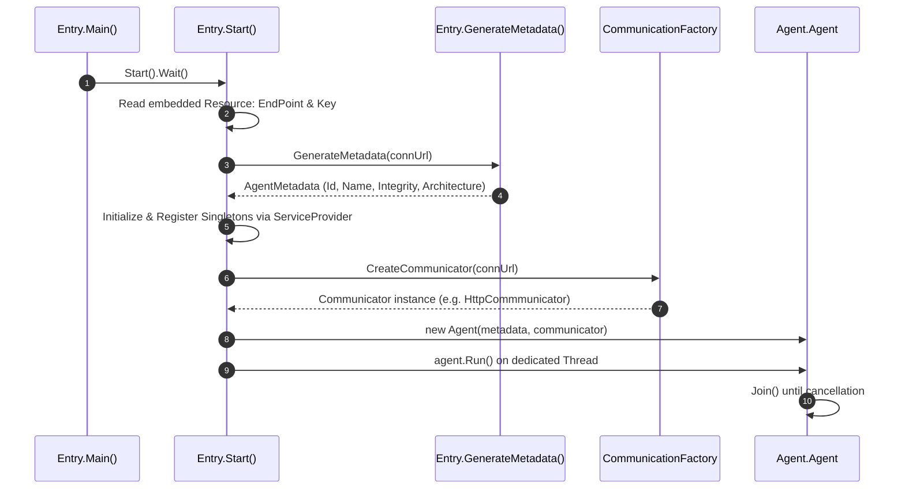
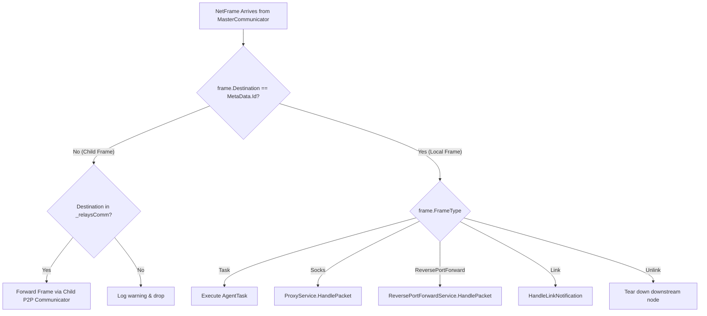

# Agent Core & Lifecycle

## Overview

The `Agent.Agent` class and the `EntryPoint.Entry` static bootstrapper form the operational hub of the implant. They manage the initial environment discovery, service initialization, communication loops, command registration, and shutdown procedures.

---

## Entry Point: `EntryPoint.Entry`

The application execution begins in `EntryPoint.Entry.Main(string[] args)`, which immediately delegates to `Entry.Start()` asynchronously:



### Configuration & Endpoint Discovery
In production builds, the connection URL and base64 server key are read from compiled embedded resources (`Agent.Properties.Resources.EndPoint` and `Agent.Properties.Resources.Key`). In `DEBUG` or `LOCAL` builds, command-line arguments or local loopback definitions override these values.

### Metadata Generation (`GenerateMetadata`)
The Agent performs environmental fingerprinting before connecting:
- **Identifier**: Generates a 22-character `ShortGuid` (e.g., `s_4Gz9V_1kW...`).
- **Name**: Combines an adjective and animal from hardcoded lists (e.g., `Brave-Falcon`).
- **Network**: Traverses `Dns.GetHostAddressesAsync` to extract IPv4 addresses.
- **Process Context**: Records current Process ID, executable image name, and machine architecture (`x86` vs `x64` via `IntPtr.Size == 8`).
- **Integrity Level**:
  - Compares `WindowsIdentity.GetCurrent().User` with `Owner` to detect administrative elevation (`High`).
  - Checks if `userName == "SYSTEM"` to classify as `System` integrity; otherwise defaults to `Medium`.
- **Sleep & Jitter**: Egress HTTP agents default to an initial 2-second sleep interval; P2P agents default to 0.

---

## The `Agent.Agent` Class Architecture

```csharp
public class Agent
{
    public Communicator MasterCommunicator { get; private set; }
    public AgentMetadata MetaData { get; protected set; }
    public CancellationTokenSource TokenSource { get; private set; }
    public readonly Dictionary<string, CancellationTokenSource> TaskTokens;
    private List<AgentCommand> _commands;
    private IntPtr _impersonationToken;
    ...
}
```

### Key Responsibilities

1. **Auto-Discovery of Commands (`LoadCommands`)**:
   - Uses reflection on the executing assembly:
   ```csharp
   foreach (var type in Assembly.GetExecutingAssembly().GetTypes())
   {
       if (type.IsSubclassOf(typeof(AgentCommand)) && !type.ContainsGenericParameters && !type.IsAbstract)
       {
           var instance = Activator.CreateInstance(type) as AgentCommand;
           _commands.Add(instance);
       }
   }
   ```
   - Automatically registers all commands inheriting from `AgentCommand` without manual registration lists.

2. **Dual-Thread Execution Loop**:
   - `Run()` spawns a dedicated worker thread `RunCommunicators()` which runs the communication module (`MasterCommunicator.Start()` and `MasterCommunicator.Run()`).
   - The main `Run()` thread loops on `TokenSource.IsCancellationRequested` with 10ms yields, polling `ShouldStop`.

3. **Impersonation Token Management**:
   ```csharp
   public IntPtr ImpersonationToken
   {
       get => _impersonationToken;
       set
       {
           if (_impersonationToken != IntPtr.Zero)
               Kernel32.CloseHandle(_impersonationToken);
           _impersonationToken = value;
       }
   }
   ```
   - Whenever an impersonation token is assigned (via `steal-token` or `make-token`), any previous token handle is automatically closed to prevent handle leaks.

4. **Task Execution Delegation**:
   - `HandleTask(AgentTask task)` resolves the target command by `CommandId`.
   - If `command.Threaded` is true, calls `ExecuteTaskThreaded(command, task)`.
   - Spawns a dedicated thread with the impersonation context applied:
   ```csharp
   using (var identity = ImpersonationToken == IntPtr.Zero
       ? WindowsIdentity.GetCurrent()
       : new WindowsIdentity(ImpersonationToken))
   {
       using (var context = identity.Impersonate())
       {
           var thread = new Thread(async () => {
               var clone = Activator.CreateInstance(command.GetType()) as AgentCommand;
               await clone.Execute(task, ctxt, tokenSource.Token);
           });
           thread.Start();
       }
   }
   ```

5. **Stop & Teardown Protocol**:
   - `AskToStop(bool force = false)`: Cancels all running task tokens. If `force` is set, immediately calls `Environment.Exit(0)`.
   - If non-force, allows `EgressCommunicator.DoCheckIn()` to flush pending task results back to the server before calling `TokenSource.Cancel()`.

---

## Frame Handling & Routing (`HandleFrame`)

All frames arriving from the master communication channel enter `HandleFrame(NetFrame frame)`:



---

## Cross-References

- [Communication Subsystem](./communication-subsystem.md)
- [Command Dispatch & Execution](./command-dispatch-and-execution.md)
- [Functional Lifecycle Guide](../../Functional/Agent/lifecycle-and-connectivity.md)
