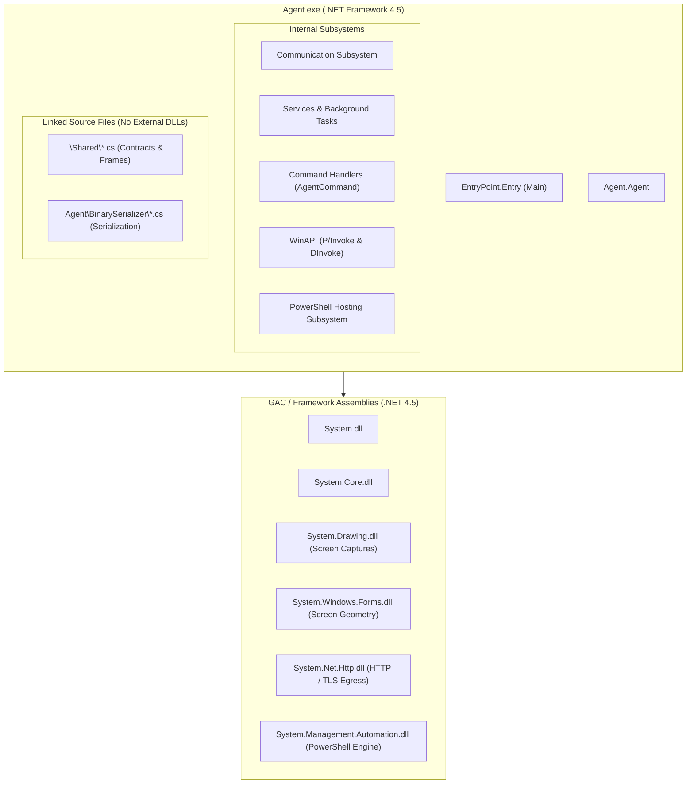

# Architecture & Dependency Map

## Project Context & Role in Solution

`Agent.csproj` is the core client-side payload executable of the **FractalC2** framework. While other projects in the solution (such as `TeamServer` and `Commander`) target modern `.NET 8.0` on developer/server systems, `Agent.csproj` is deliberately constructed against **.NET Framework 4.5**.

This architectural choice ensures execution compatibility across nearly any modern Windows workstation or server installation (Windows Vista SP2 / Windows 7 SP1 through Windows 11 and Windows Server 2022) without requiring the installation of modern .NET runtimes.

---

## Dependency Graph & Assembly References



### Reference Breakdown

| Assembly Reference | Source | Purpose in Agent |
| :--- | :--- | :--- |
| `System.dll` | GAC (.NET 4.5) | Core types, networking (`TcpClient`, `TcpListener`, `Dns`), process management, threading. |
| `System.Core.dll` | GAC (.NET 4.5) | LINQ, cryptography primitives (`Aes`, `HMACSHA256`), concurrent collections. |
| `System.Net.Http.dll` | Reference Assemblies (4.5) | Asynchronous HTTP client (`HttpClient`, `StringContent`) for egress beaconing. |
| `System.Drawing.dll` | GAC (.NET 4.5) | Desktop screenshot rasterization (`Bitmap`, `Graphics.CopyFromScreen`). |
| `System.Windows.Forms.dll` | GAC (.NET 4.5) | Display enumeration (`Screen.AllScreens`) for multi-monitor desktop capture. |
| `System.Management.Automation.dll` | GAC (.NET 4.5 / PowerShell v1.0 engine) | In-process PowerShell runspace creation (`RunspaceFactory`, `PSHost`, `Pipeline`). |
| `System.Runtime.Serialization.dll` | GAC (.NET 4.5) | Data contract support. |
| `Microsoft.CSharp.dll` | GAC (.NET 4.5) | Dynamic language runtime support. |

---

## Source Ingestion Strategy: Shared & BinarySerializer

To guarantee that the compiled payload is a **single, standalone file** without separate DLLs on disk:
1. **Linked Files (`..\Shared\`)**:
   - `Agent.csproj` links files directly from the parent `Shared/` directory:
     - `AgentMetadata.cs`, `AgentTask.cs`, `AgentTaskResult.cs`
     - `NetFrame.cs`, `NetFrameType.cs`
     - `Commands.cs`, `CommandVerbs.cs`
     - `ConnexionUrl.cs`, `LinkInfo.cs`, `Job.cs`
     - `ParameterDictionary.cs`, `ParameterId.cs`
     - `ResultObjects/*.cs`, `ReversePortForward.cs`, `Socks.cs`
   - This ensures type compatibility with `TeamServer` and `Commander` while compiling directly into `Agent.exe`.
2. **Inlined BinarySerializer (`Agent\BinarySerializer\`)**:
   - Instead of referencing `Dependencies\BinarySerializer.dll`, `Agent.csproj` includes the full serialization codebase directly.
   - Handles low-level endianness conversion (`EndianBinaryReader`/`Writer`), attribute-driven property ordering (`FieldOrderAttribute`), and binary packet packing without JSON/XML dependencies.

---

## Inversion of Control & Dependency Injection

The Agent does not use heavy DI frameworks like `Microsoft.Extensions.DependencyInjection`. Instead, it uses a lightweight static service locator in `Agent.Service.ServiceProvider`:

```csharp
public static class ServiceProvider
{
    private static Dictionary<Type, object> instances = new Dictionary<Type, object>();
    
    public static void RegisterSingleton<T>(T service)
    {
        if (instances.ContainsKey(typeof(T)))
            throw new ApplicationException($"Service Provider : {typeof(T).ToString()} is already registered!");
        instances.Add(typeof(T), service);
    }

    public static T GetService<T>()
    {
        return (T)instances[typeof(T)];
    }
}
```

### Registered Singletons at Initialization

| Interface | Implementation | Responsibility |
| :--- | :--- | :--- |
| `IConfigService` | `ConfigService` | Global runtime settings, server encryption key, sacrificial process paths, injection method preferences. |
| `INetworkService` | `NetworkService` | Thread-safe message queues for outbound and destination-multiplexed frames. |
| `IFileService` | `FileService` | State machine for segmented file uploads and chunked downloads. |
| `IWebHostService` | `WebHostService` | In-memory web server for staging payloads and files. |
| `ICryptoService` | `CryptoService` | Symmetric encryption (AES-256-CBC) and integrity verification (HMAC-SHA256). |
| `IFrameService` | `FrameService` | Creation, serialization, and decryption of `NetFrame` envelopes. |
| `IJobService` | `JobService` | Central registry for tracking and killing background jobs and child processes. |
| `IProxyService` | `ProxyService` | Multiplexed SOCKS4 dynamic proxy server handling client streams. |
| `IReversePortForwardService` | `ReversePortForwardService` | Port forwarding listener and socket management. |
| `IKeyLogService` | `KeyLogService` | Hookless background keystroke recorder with active window logging. |

---

## Directory & Namespace Organization

```
Agent/
├── Agent.cs                      # Core Agent state, routing, and task execution engine
├── Program.cs                    # EntryPoint.Entry (Startup, DI bootstrapping, metadata)
├── BinarySerializer/             # Standalone binary serialization framework
├── Commands/                     # Command handler implementations (AgentCommand subclasses)
│   ├── AgentCommand.cs           # Abstract base class & AgentCommandContext
│   ├── Core/                     # Lifecycle & basic commands (Checkin, Exit, Idle, Sleep, Whoami, Process)
│   ├── Execution/                # Execution engines (Assembly, ForkAndRun, Inject, Posh, PsExec, WinRM)
│   ├── FileSystem/               # File and Registry operations (Cat, Cd, Ls, Mkdir, Rmdir, Reg)
│   ├── Link/                     # Peer-to-peer linking commands (LinkCommand)
│   ├── CompositeCommand/         # Scripting & batch task runner (CompositeCommand)
│   ├── Server/                   # File transfer commands (Download, Upload)
│   ├── Services/                 # Service control base classes (Job, KeyLogger, RportFwd)
│   └── Token/                    # Token manipulation (MakeToken, StealToken, RevertToSelf)
├── Communication/                # Network transport modules (Http, NamedPipe, Tcp)
├── Helpers/                      # Extension methods (PipeExtensions, TcpExtensions, String extensions)
├── Service/                      # System services (Crypto, Frame, Network, File, Job, Proxy, KeyLog)
│   └── RunningService/           # Continuous background worker abstractions
└── WinAPI/                       # Native Windows API interop
    ├── APIWrapper.cs             # High-level interop facade routing to P/Invoke or DInvoke
    ├── DInvoke/                  # Dynamic Invocation engine (in-memory PE parsing & execution)
    ├── PInvoke/                  # Static P/Invoke signatures
    ├── Data/                     # Win32 structs, enums, and constants
    └── Helper/                   # ReflectiveLoaderHelper (PE export offset calculation)
```

---

## Cross-References

- [Agent Core & Lifecycle](./agent-core-and-lifecycle.md)
- [WinAPI & Native Subsystem](./winapi-and-native-subsystem.md)
- [Functional Overview](../../Functional/Agent/index.md)
