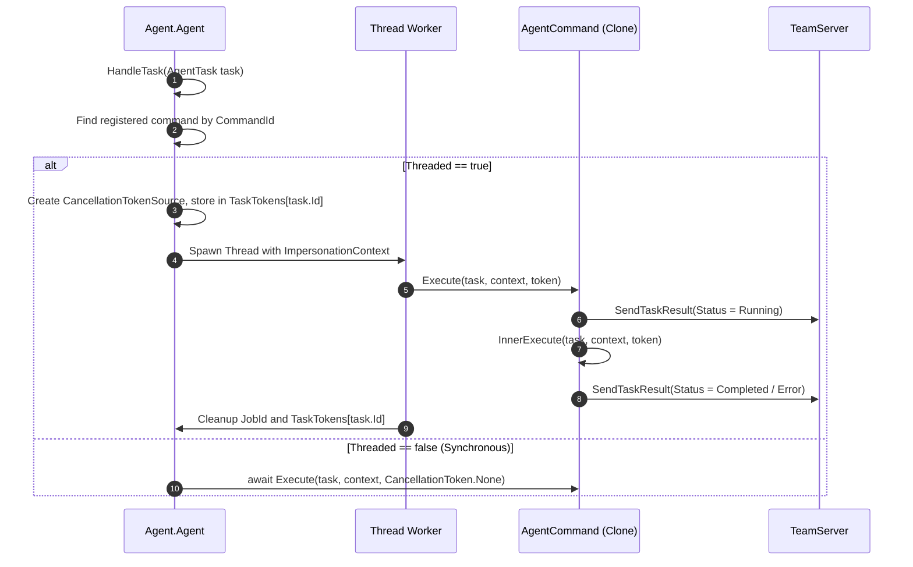

# Command Dispatch & Execution

## Overview

The Command Dispatch subsystem receives inbound `AgentTask` requests, binds parameters, resolves execution strategies, applies active security contexts (tokens), captures outputs, and returns structured `AgentTaskResult` frames.

---

## The Command Contract: `AgentCommand`

All executable commands derive from the abstract base class `AgentCommand`:

```csharp
public abstract class AgentCommand
{
    public int? JobId { get; set; }
    public AgentCommandContext Context { get; set; }
    public virtual CommandId Command { get; protected set; }
    public bool Threaded { get; protected set; } = true;
    public CancellationToken CancellationToken { get; private set; }

    public virtual async Task Execute(AgentTask task, AgentCommandContext context, CancellationToken token)
    {
        this.Context = context;
        context.Result.Id = task.Id;
        try
        {
            context.Result.Status = AgentResultStatus.Running;
            if (!context.IsScripting || this.IsScriptCommand)
                await context.Agent.SendTaskResult(context.Result);

            await this.InnerExecute(task, context, token);
        }
        catch (Exception e)
        {
            context.Result.Error = e.Message + Environment.NewLine;
        }
        finally
        {
            if (!context.IsScripting || this.IsScriptCommand)
            {
                context.Result.Status = string.IsNullOrEmpty(context.Result.Error)
                    ? AgentResultStatus.Completed
                    : AgentResultStatus.Error;
                await context.Agent.SendTaskResult(context.Result);
            }

            if (JobId.HasValue)
                ServiceProvider.GetService<IJobService>().RemoveJob(JobId.Value);

            if (context.Agent.TaskTokens.ContainsKey(task.Id))
            {
                context.Agent.TaskTokens[task.Id].Dispose();
                context.Agent.TaskTokens.Remove(task.Id);
            }
        }
    }

    public abstract Task InnerExecute(AgentTask task, AgentCommandContext context, CancellationToken token);
}
```

---

## Execution Context: `AgentCommandContext`

The `AgentCommandContext` acts as an execution envelope passed into `InnerExecute`:

```csharp
public class AgentCommandContext
{
    public bool IsScripting { get; set; }
    public Agent Agent { get; set; }
    public INetworkService NetworkService { get; set; }
    public IFileService FileService { get; set; }
    public IConfigService ConfigService { get; set; }
    public AgentTaskResult Result { get; set; }
    public CancellationTokenSource TokenSource { get; set; }

    public void AppendResult(string message, bool addEndLine = true);
    public void ClearResult();
    public void Error(string message, bool addEndLine = true);
    public void Objects(byte[] data);
    public void Objects<T>(T item);
}
```

---

## Task Lifecycle & Threading



### Key Execution Highlights:
1. **Thread Isolation**: `Activator.CreateInstance(command.GetType())` clones the command instance for each task, preventing concurrent tasks from mutating shared instance state.
2. **Cancellation Tracking**: `TaskTokens.Add(task.Id, tokenSource)` stores each task's `CancellationTokenSource`. When an operator kills a job, the token is canceled immediately.
3. **Structured Objects & Text Separation**: Commands can populate textual log output via `context.AppendResult()` and rich serialized objects (e.g. `List<ProcessInfo>`, `List<LinkInfo>`, `DownloadFile`) via `context.Objects<T>()`.

---

## Service Commands Pattern: `ServiceCommand<T>`

Commands controlling long-running services (e.g., `LinkCommand`, `JobCommand`, `RportFwdCommand`, `RegCommand`) derive from `ServiceCommand`:
- Maps sub-verbs (`CommandVerbs.Start`, `CommandVerbs.Stop`, `CommandVerbs.Show`, `CommandVerbs.Kill`, `CommandVerbs.Add`, `CommandVerbs.Remove`) directly to handler methods via an internal dictionary dispatch table (`dico.Add(verb, action)`).
- Enforces consistent sub-command semantics across the framework.

---

## Cross-References

- [WinAPI & Native Subsystem](./winapi-and-native-subsystem.md)
- [PowerShell Engine](./powershell-engine.md)
- [Services & Background Tasks](./services-and-background-tasks.md)
