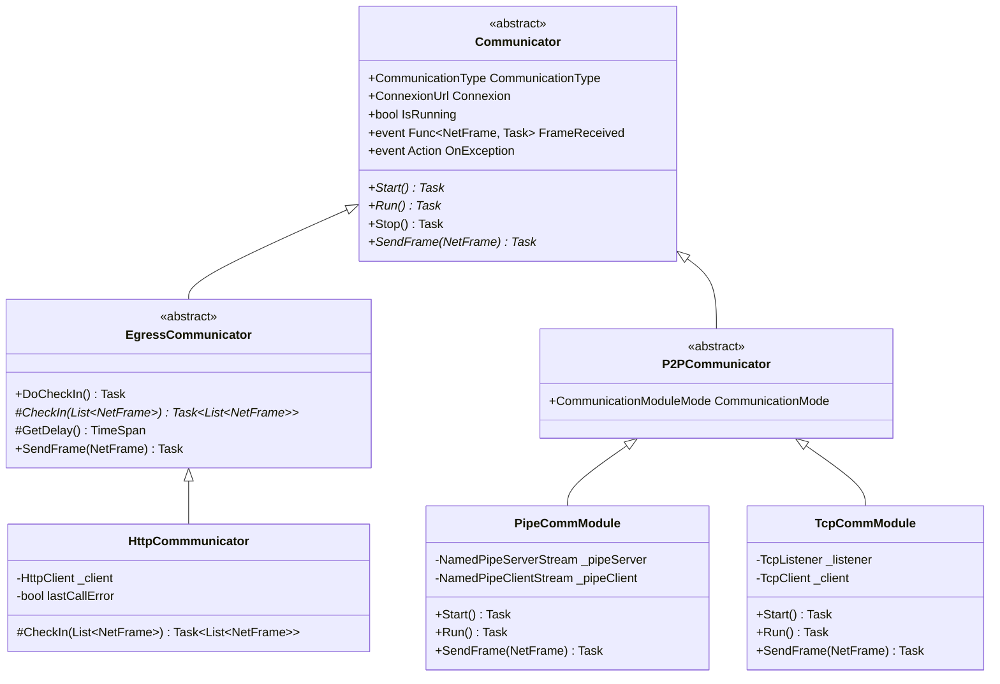

# Communication Subsystem

## Overview

The Communication Subsystem decouples high-level Agent operations (tasking, routing, tunneling) from underlying transport mechanisms. It supports both **Egress Communications** (HTTP/HTTPS to the external TeamServer) and **Peer-to-Peer (P2P) Communications** (Named Pipes and raw TCP sockets across internal network boundaries).

---

## Class Hierarchy & Inheritance Model



---

## Endpoint Parsing: `ConnexionUrl`

Connection strings are parsed into strongly typed `ConnexionUrl` models:
- **Syntax**: `<protocol>://<address>:<port_or_pipename>`
- **Listener vs. Client Detection**: If `<address>` is empty, `*`, `0.0.0.0`, or `::`, the mode is parsed as `ConnexionMode.Listener`; otherwise it is `ConnexionMode.Client`.

| URI Example | Protocol | Mode | Details |
| :--- | :--- | :--- | :--- |
| `http://10.0.0.1:8080` | `Http` | `Client` | Cleartext HTTP POST beaconing. |
| `https://c2.domain.com:443` | `Http` (Secure) | `Client` | Encrypted TLS 1.2 POST beaconing. |
| `pipe://*:FractalPipe` | `NamedPipe` | `Listener` | Named pipe server waiting for parent connection. |
| `pipe://192.168.1.50:FractalPipe` | `NamedPipe` | `Client` | Named pipe client connecting to remote SMB pipe. |
| `tcp://*:9090` | `Tcp` | `Listener` | Raw TCP socket server waiting for parent. |
| `tcp://192.168.1.50:9090` | `Tcp` | `Client` | Raw TCP socket client connecting to remote port. |

---

## Transport Implementations

### 1. HTTP / HTTPS Egress (`HttpCommmunicator`)
- **Session Configuration**:
  - Sets `ServicePointManager.SecurityProtocol = SecurityProtocolType.Tls12`.
  - Sets `ServicePointManager.ServerCertificateValidationCallback` to return `true`, completely bypassing TLS certificate trust warnings (self-signed C2 certificates).
  - Configures 10-second timeout on `HttpClient`.
  - Attaches `Authorization: <AgentId>` header to every request.
- **Beaconing Data Flow (`CheckIn`)**:
  1. Pulls all queued outbound `NetFrame` objects from `INetworkService`.
  2. Serializes the frame list into binary format using `BinarySerializer`.
  3. Base64-encodes the binary stream and transmits it via `POST /` with `StringContent`.
  4. Reads the HTTP response string, decodes base64, and deserializes inbound `List<NetFrame>`.
  5. If an error occurred on the previous check-in, the communicator automatically resends Agent metadata and relay routing tables upon re-establishing connection.

### 2. Named Pipes P2P (`PipeCommModule`)
- **Server Mode**:
  - Creates a `NamedPipeServerStream` with `PipeTransmissionMode.Byte` and asynchronous IO.
  - Grants `FullControl` to `WorldSid` (`Everyone`), allowing connections across different user or machine privileges.
- **Client Mode**:
  - Connects to remote machine's SMB named pipe: `new NamedPipeClientStream(address, pipeName)`.
- **Length-Prefixed Framing Protocol**:
  - Uses `BigEndianBitConverter` to write a 4-byte integer indicating packet length.
  - Writes data in 1024-byte chunks.
  - Reader inspects available bytes using `pipe.DataAvailable()` (implemented via native `PeekNamedPipe` in `PipeExtensions.cs`), reads the 4-byte length prefix, and reconstructs the `NetFrame`.

### 3. TCP Sockets P2P (`TcpCommModule`)
- **Server Mode**:
  - Initializes `TcpListener` binding to `IPAddress.Any` (or `Loopback`).
  - Accepts client via `AcceptTcpClientAsync()`, then stops listening (dedicated point-to-point channel).
- **Client Mode**:
  - Connects directly using `TcpClient.ConnectAsync(address, port)`.
- **Liveness & Data Availability**:
  - Uses `client.IsAlive()` (checks `IPGlobalProperties.GetActiveTcpConnections` for `TcpState.Established`).
  - Employs the identical 4-byte big-endian length prefixing protocol used by Named Pipes for framing.

---

## Factory Instantiation: `CommunicationFactory`

```csharp
internal static Communicator CreateCommunicator(ConnexionUrl conn)
{
    if (!conn.IsValid) return null;
    switch (conn.Protocol)
    {
        case ConnexionType.Http:
            return new HttpCommmunicator(conn);
        case ConnexionType.Tcp:
            return new TcpCommModule(conn);
        case ConnexionType.NamedPipe:
            return new PipeCommModule(conn);
    }
    return null;
}
```

---

## Cross-References

- [Network Framing & Cryptography](./network-framing-and-crypto.md)
- [Agent Core & Lifecycle](./agent-core-and-lifecycle.md)
- [Functional Pivoting Guide](../../Functional/Agent/pivoting-and-mesh-routing.md)
