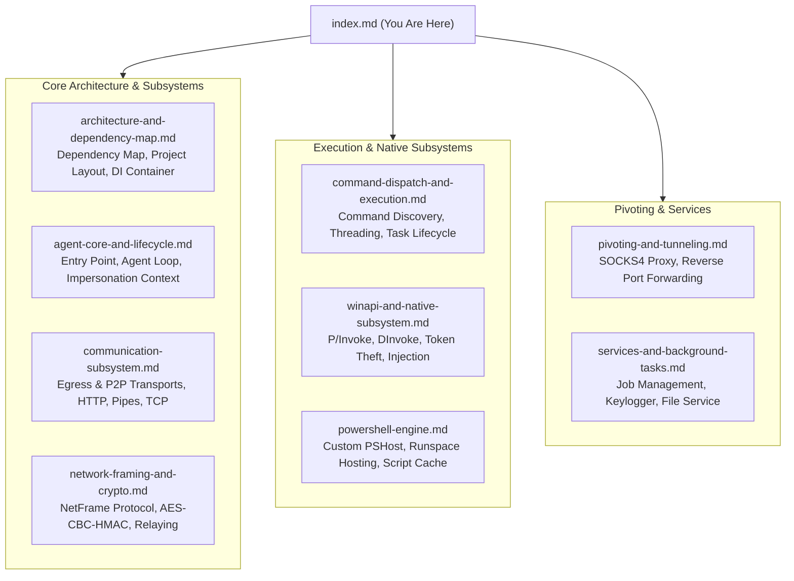

# FractalC2 Agent — Technical Documentation

## Project Overview

| Property | Value |
| :--- | :--- |
| **Project Name** | `Agent.csproj` |
| **Target Framework** | .NET Framework 4.5 (`v4.5`) |
| **Output Type** | Win32 Executable (`Exe`) / Console Application |
| **Language Version** | C# 7.3 |
| **Allow Unsafe Blocks** | `true` (Used in native PE parsing, memory mapping, pointers) |
| **Root Namespace** | `Agent` |
| **Assembly Name** | `Agent.exe` |
| **Role in Solution** | Endpoint implant/payload deployed on Windows targets; executes operator tasks, establishes secure C2 communication, and handles peer-to-peer routing. |

---

## Architectural Principles & Design Strategy

1. **Zero External Dependency Binary**:
   - The Agent project targets standard **.NET Framework 4.5**, which is pre-installed out of the box on Windows 8, Windows 10, Windows 11, and Windows Server 2012–2022.
   - It contains **no NuGet packages** or external third-party DLL dependencies at runtime.
   - The binary serialization engine (`BinarySerializer`) and shared data contracts (`Shared/`) are included as linked source files and compiled directly into the binary.
   - This produces a completely self-contained, standalone executable that can be loaded directly from memory via reflection or shellcode loaders without DLL search order dependency issues.

2. **Dual-Tier Native API Execution (P/Invoke & DInvoke)**:
   - To bypass Endpoint Detection and Response (EDR) API hooking on sensitive user-mode DLLs (`ntdll.dll`, `kernel32.dll`, `advapi32.dll`), the Agent implements a full **Dynamic Invocation (DInvoke)** engine alongside standard P/Invoke.
   - DInvoke parses process PE headers directly in memory, traverses the Export Address Table (EAT), calculates offsets, and invokes Win32/Native NT APIs without creating static import entries in the PE Import Address Table (IAT).

3. **Lightweight Inversion of Control (IoC)**:
   - Uses a purpose-built `ServiceProvider` singleton container.
   - Decouples subsystems (Network, Filesystem, Crypto, Jobs, Framing, Proxying) while keeping memory overhead minimal.

---

## Documentation Structure

---

## Technical Component Guide

| Component Page | Responsibility / Scope | Key Classes & Interfaces |
| :--- | :--- | :--- |
| [**Architecture & Dependency Map**](./architecture-and-dependency-map.md) | Compilation models, reference mapping, solution layout, custom service provider. | `ServiceProvider`, `IConfigService`, `ConfigService` |
| [**Agent Core & Lifecycle**](./agent-core-and-lifecycle.md) | Program entry point, metadata generation, main thread loops, cancellation, shutdown. | `EntryPoint.Entry`, `Agent.Agent`, `AgentMetadata` |
| [**Communication Subsystem**](./communication-subsystem.md) | Transport abstraction, HTTP egress, Named Pipe and TCP P2P modules, URL parsing. | `Communicator`, `EgressCommunicator`, `P2PCommunicator`, `HttpCommmunicator`, `PipeCommModule`, `TcpCommModule`, `ConnexionUrl` |
| [**Network Framing & Cryptography**](./network-framing-and-crypto.md) | Frame multiplexing, message serialization, AES-256-CBC with HMAC-SHA256, relay routing. | `NetFrame`, `NetFrameType`, `IFrameService`, `ICryptoService`, `BinarySerializer` |
| [**Command Dispatch & Execution**](./command-dispatch-and-execution.md) | Reflection discovery of commands, synchronous vs threaded execution, task context. | `AgentCommand`, `AgentCommandContext`, `AgentTask`, `AgentTaskResult` |
| [**WinAPI & Native Subsystem**](./winapi-and-native-subsystem.md) | DInvoke / P/Invoke abstraction, process injection, token manipulation, PE export parsing. | `APIWrapper`, `DInvoke.*`, `PInvoke.*`, `ReflectiveLoaderHelper` |
| [**PowerShell Engine**](./powershell-engine.md) | In-process PowerShell runspace hosting, custom PSHost and UI implementation. | `PowerShellRunner`, `CustomPSHost`, `CustomPSHostUserInterface` |
| [**Pivoting & Tunneling**](./pivoting-and-tunneling.md) | Multiplexed SOCKS4 proxy and asynchronous reverse port forward server/client pipelines. | `ProxyService`, `SocksClient`, `ReversePortForwardService`, `ReversePortForwardServer` |
| [**Services & Background Tasks**](./services-and-background-tasks.md) | Background job registry, hookless keylogger, chunked file transfers, web hosting. | `IJobService`, `JobService`, `RunningService`, `KeyLogService`, `FileService` |

---

## Build Configurations & Compilation Flags

The project defines several compilation configurations in `Agent.csproj`:

| Configuration | Platform | Key Constants | Description |
| :--- | :--- | :--- | :--- |
| `Debug` | x86 / x64 | `TRACE; DEBUG; WINDOWS` | Full symbols, unoptimized, console trace listener active. |
| `Release` | x86 / x64 | `WINDOWS` | Optimized, no debug output, minimal footprint. |
| `ReleaseButDebug` | x86 / x64 | `TRACE; DEBUG; WINDOWS` | Optimized IL with debug symbols and trace output. |
| `Local` | x86 / x64 | `TRACE; DEBUG; WINDOWS; LOCAL` | Hardcoded local loopback endpoint (`http://127.0.0.1:2000`) for development. |

For the functional perspective, see the [Functional Documentation Index](../../Functional/Agent/index.md).
