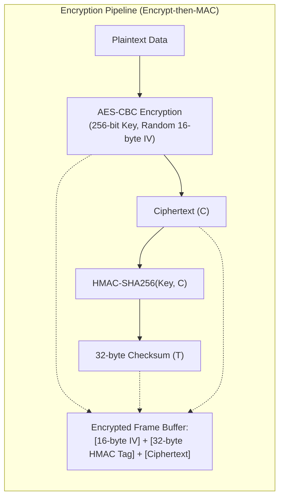

# Network Framing & Cryptography

## Overview

FractalC2 relies on an asynchronous, packetized message protocol. All higher-level messages (tasks, results, tunnels, peer updates) are encapsulated into standardized `NetFrame` envelopes.

The cryptography layer secures frame payloads using **AES-256-CBC** combined with an **HMAC-SHA256** checksum (Encrypt-then-MAC), preventing passive eavesdropping and active packet tampering.

---

## The `NetFrame` Protocol Structure

A `NetFrame` represents a discrete routable packet within the C2 mesh:

```csharp
public class NetFrame
{
    [FieldOrder(0)]
    public NetFrameType FrameType { get; set; }

    [FieldOrder(1)]
    public string Source { get; set; } = String.Empty;

    [FieldOrder(2)]
    public string Destination { get; set; } = String.Empty;

    [FieldOrder(3)]
    public byte[] Data { get; set; }
}
```

### Frame Types (`NetFrameType`)

| Enum Value | Hex | Description | Carried Payload Type |
| :--- | :--- | :--- | :--- |
| `CheckIn` | `0x00` | Agent identity registration / heartbeat. | Serialized `AgentMetadata` |
| `Task` | `0x01` | Operational command directed to an Agent. | Serialized `AgentTask` |
| `TaskResult` | `0x02` | Output, status, or error returned from a command. | Serialized `AgentTaskResult` |
| `Link` | `0x03` | P2P link establishment handshake. | Serialized `LinkInfo` |
| `Unlink` | `0x04` | Notification that a P2P child severed connection. | Serialized `LinkInfo` |
| `LinkRelay` | `0x05` | Updated list of downstream reachable agent IDs. | Serialized `List<string>` |
| `Socks` | `0x06` | Multiplexed SOCKS4 tunneling packet. | Serialized `Socks4Packet` |
| `ReversePortForward` | `0x07` | Multiplexed reverse port forwarding packet. | Serialized `ReversePortForwardPacket` |
| `Links` | `0x08` | Full snapshot of active parent-child links. | Serialized `List<LinkInfo>` |

---

## Cryptography Architecture: `CryptoService`

`CryptoService` implements symmetric authenticated encryption:



### Buffer Layout of `frame.Data`:
```
+------------------+-------------------+-----------------------------------+
|  IV (16 bytes)   | HMAC (32 bytes)   |      AES Ciphertext (N bytes)     |
+------------------+-------------------+-----------------------------------+
```

### Decryption Pipeline:
1. **Header Slicing**: Extracts the first 16 bytes as the IV, the next 32 bytes as the HMAC tag, and remaining bytes as the ciphertext.
2. **Integrity Validation**: Computes `HMACSHA256(ciphertext, ServerKey)` and compares against the tag using `SequenceEqual`. If the checksum does not match, a cryptographic exception is thrown immediately without attempting decryption (protecting against padding oracle attacks).
3. **AES Decryption**: Decrypts the ciphertext using the extracted IV and secret key.

---

## Framing Service: `FrameService`

`IFrameService` bridges raw objects, serialization, encryption, and frame wrapping:

```csharp
public NetFrame CreateFrame<T>(string source, string destination, NetFrameType typ, T item)
{
    byte[] data = item.BinarySerializeAsync().Result;
    byte[] encryptedData = _configService.EncryptFrames 
        ? _cryptoService.Encrypt(data) 
        : data;
    return new NetFrame(source, destination, typ, encryptedData);
}

public T GetData<T>(NetFrame frame)
{
    byte[] rawData = _configService.EncryptFrames 
        ? _cryptoService.Decrypt(frame.Data) 
        : frame.Data;
    return rawData.BinaryDeserializeAsync<T>().Result;
}
```

---

## Mesh Routing & Relay Propagation

When an Agent operates in a multi-hop mesh:
1. **Target Verification**: Upon receiving a frame, the Agent checks:
   - If `frame.Destination == this.MetaData.Id`, it is processed locally.
   - If `frame.Destination != this.MetaData.Id`, it looks up the destination in `_relaysComm`.
2. **Forwarding**: If an active child P2P communicator is mapped to that destination, the frame is forwarded untouched across the P2P pipe/socket without decrypting its contents.
3. **Relay Broadcasts (`SendRelays`)**: Whenever a child connects or disconnects, the parent sends a `LinkRelay` frame upstream to the TeamServer listing all IDs reachable through it.

---

## Cross-References

- [Communication Subsystem](./communication-subsystem.md)
- [Agent Core & Lifecycle](./agent-core-and-lifecycle.md)
- [Pivoting & Tunneling](./pivoting-and-tunneling.md)
