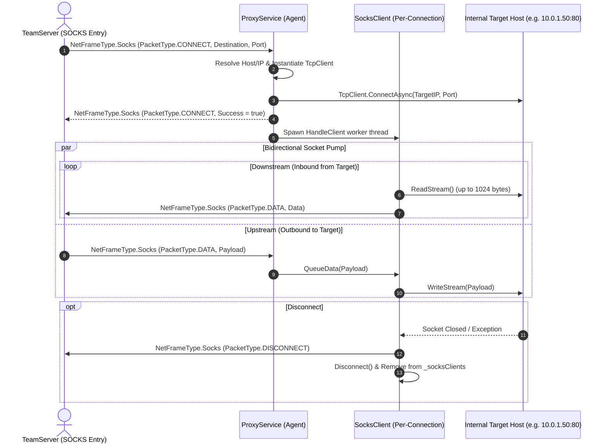
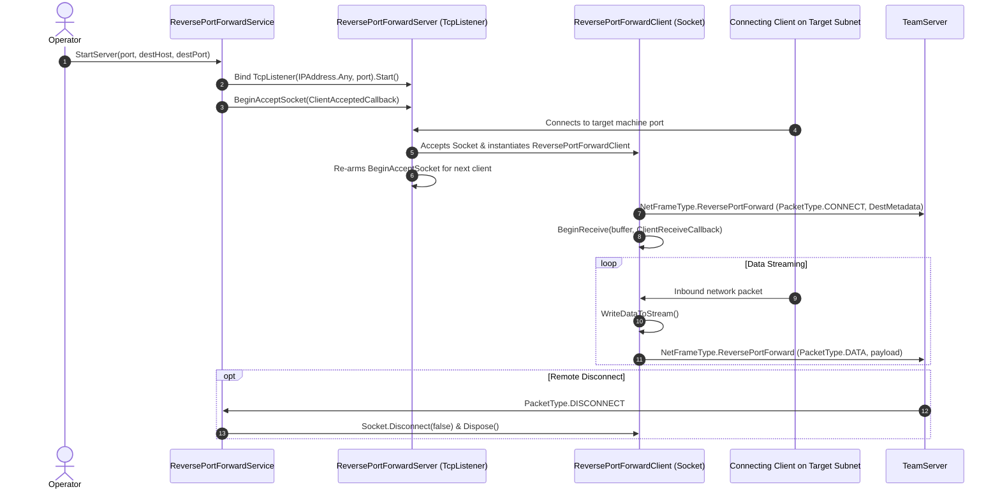

# Pivoting & Tunneling Subsystem

## Overview

The Pivoting & Tunneling subsystem provides asynchronous, multiplexed network redirection across the C2 channel. It consists of two dedicated services:
1. **`ProxyService`**: A dynamic SOCKS4 proxy that accepts connection requests from the TeamServer and establishes outbound TCP connections from the Agent to internal targets.
2. **`ReversePortForwardService`**: A reverse port forward engine that binds local listening ports on the target machine and redirects inbound connections back to the TeamServer.

Both services multiplex arbitrary TCP socket streams through standard `NetFrame` envelopes (`NetFrameType.Socks` and `NetFrameType.ReversePortForward`), avoiding the need to open separate firewall ports or dedicated communication channels.

---

## 1. SOCKS4 Dynamic Proxy Engine (`ProxyService`)

### The `SocksClient` Wrapper
Each active proxy session is encapsulated by a `SocksClient`:
- Tracks a unique session `Id` (GUID string).
- Manages an internal `ConcurrentQueue<byte[]> _dataQueue` for incoming data from the TeamServer.
- Continuously polls its socket:
  - If data is available (`client.DataAvailable()`), reads up to 1024 bytes and packages it into a `NetFrameType.Socks` frame with `PacketType.DATA`.
  - If data is queued in `_dataQueue`, dequeues and writes to the TCP stream.
- Verifies socket liveness via `_tcp.IsAlive()` (queries TCP connection table via `IPGlobalProperties`).

---

## 2. Reverse Port Forwarding Engine (`ReversePortForwardService`)

The Reverse Port Forwarding service allows the target machine to act as an ingress pivot, capturing local traffic and tunneling it back out through the C2 channel.

### Key Components:
- **`ReversePortForwardServer`**:
  - Encapsulates `TcpListener` on the specified port.
  - Keeps listening for incoming connections in a recursive `BeginAcceptSocket` loop until explicitly stopped via `StopServer(port)`.
- **`ReversePortForwardClient`**:
  - Represents a single connection into the listening port.
  - Implements asynchronous socket reading via `Socket.BeginReceive` with a fixed 1024-byte buffer.
  - Emits `PacketType.DISCONNECT` upon socket close or `ObjectDisposedException`.

---

## Concurrency & Performance Considerations

1. **Non-Blocking Socket Pumps**: Both `ProxyService` and `ReversePortForwardService` use asynchronous event-driven I/O (`BeginReceive`, `ReadAsync`, `WriteAsync`) or dedicated background polling threads (`HandleClient`), preventing network latency from impacting beaconing or task execution.
2. **Buffer Management**: Uses 1024-byte standard packet buffers to ensure balanced throughput and prevent memory exhaustion during heavy network transfers.
3. **Session Dictionary Locks**: Active connections are indexed by GUID keys in dictionaries (`_socksClients`, `_clients`, `_servers`) for thread-safe access and rapid teardown.

---

## Cross-References

- [Communication Subsystem](./communication-subsystem.md)
- [Network Framing & Cryptography](./network-framing-and-crypto.md)
- [Functional Tunneling Guide](../../Functional/Agent/network-tunneling-and-pivoting.md)
