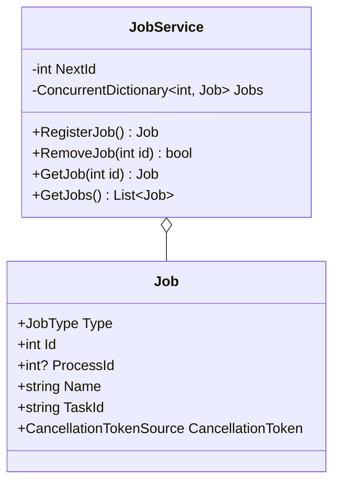
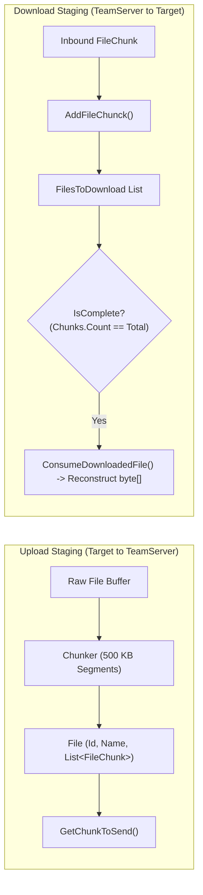

# Services & Background Tasks

## Overview

The Services and Background Tasks layer hosts managed long-running background operations, state machines, and continuous monitoring jobs. It coordinates job lifecycles, keystroke recording, chunked file transfers, and in-memory file staging.

---

## 1. Job Management Architecture (`JobService`)

`JobService` tracks long-running tasks that operate beyond the duration of an initial command dispatch:

```csharp
internal interface IJobService
{
    Job RegisterJob(JobType type, int processId, string name, string taskId = null);
    Job RegisterJob(JobType type, CancellationTokenSource token, string name, string taskId = null);
    bool RemoveJob(int id);
    Job GetJob(int id);
    List<Job> GetJobs();
}
```



### Job Registration & Teardown Protocol
- **Thread-Based Jobs (e.g. `AssemblyCommand`)**: Registered with a `CancellationTokenSource`. If an operator issues `job kill <id>`, the token is canceled and the executing thread is terminated.
- **Process-Based Jobs (e.g. `ShellCommand`, `ForkAndRunCommand`)**: Registered with an external `ProcessId`. If killed, the Agent executes a forced process tree termination (`cmd.exe /c taskkill /F /T /PID <processId>`).

---

## 2. Continuous Services: `RunningService` & `KeyLogService`

Continuous background services inherit from `RunningService`:

```csharp
public abstract class RunningService : IRunningService
{
    public abstract string ServiceName { get; }
    public RunningStatus Status { get; set; }
    public virtual int MinimumDelay { get; } = 10;
    protected CancellationTokenSource _tokenSource;

    public virtual async void Start()
    {
        _tokenSource = new CancellationTokenSource();
        this.Status = RunningStatus.Running;
        if (this.JobType.HasValue)
            this.JobId = ServiceProvider.GetService<IJobService>()
                .RegisterJob(this.JobType.Value, _tokenSource, this.ServiceName).Id;

        while (!_tokenSource.IsCancellationRequested)
        {
            await this.Process();
            await Task.Delay(this.MinimumDelay);
        }
    }
    public virtual async Task Process();
}
```

### Hookless Keystroke Logging (`KeyLogService`)
Rather than installing intrusive Win32 global keyboard hooks (`SetWindowsHookEx`) that trigger EDR heuristics:
- `KeyLogService` implements an asynchronous polling loop executing every 2ms (`MinimumDelay = 2`).
- **Foreground Window Detection**: Invokes `GetForegroundWindow` and `GetWindowThreadProcessId` via P/Invoke. Whenever the active window changes, it appends a delimiter header:
  ```
  [--chrome--]
  [--keepass2--]
  ```
- **Virtual Key Polling**: Scans virtual keys 0–254 using `GetAsyncKeyState(i)`. When the MSB / state `32769` is returned (key was pressed since last call), it maps the key code through `verifyKey(i)` into character representations, including AZERTY characters and control keys (`[Enter]`, `[Back]`, `[Tab]`, `[Ctrl]`, `[Alt]`).

---

## 3. Segmented File Transfer Pipeline (`FileService`)

To transfer large payloads safely across unreliable or latency-heavy channels, `FileService` provides a chunking state machine:



- **Segment Sizing**: Files are broken into `500,000-byte` (~500 KB) chunks.
- **Base64 Encoding**: Each `FileChunk` encapsulates its data as a base64 string, accompanied by file identifier, filename, zero-based chunk index, and total chunk count.
- **Ordered Assembly**: When writing or reading complete files, chunks are sorted by index (`Chunks.OrderBy(c => c.Index)`), converted back to bytes, and written to a `MemoryStream`.

---

## 4. In-Memory Web Staging: `WebHostService`

`WebHostService` provides an in-memory HTTP file repository:
- Stores `FileWebHost` objects (path, description, PowerShell flag, raw byte array).
- Captures `WebHostLog` entries (date, requesting URL, client User-Agent, HTTP response code).
- Used for hosting payloads, scripts, or decoy files for internal retrieval during engagements.

---

## Cross-References

- [Command Dispatch & Execution](./command-dispatch-and-execution.md)
- [Architecture & Dependency Map](./architecture-and-dependency-map.md)
- [Functional Background Jobs Guide](../../Functional/Agent/background-jobs-and-services.md)
